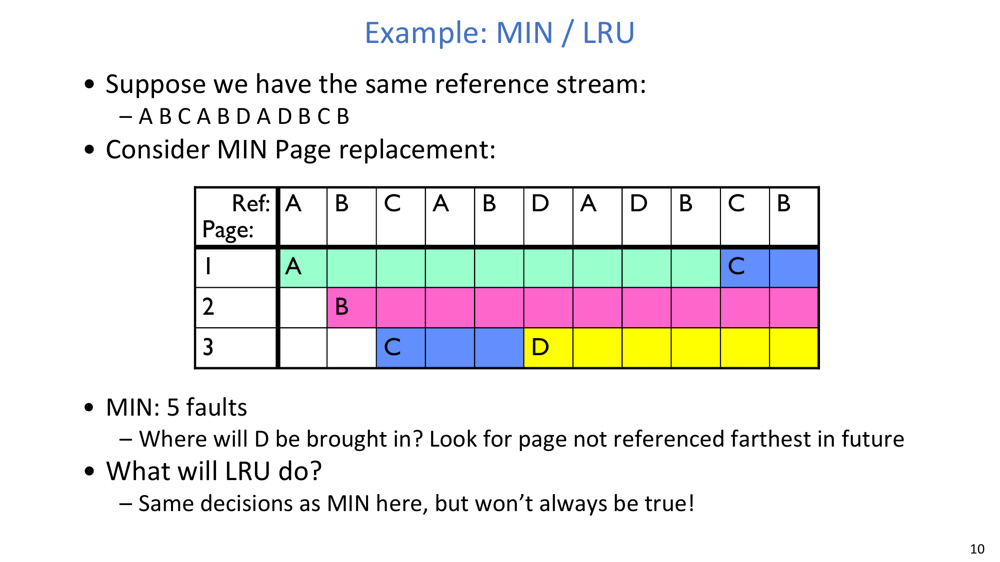
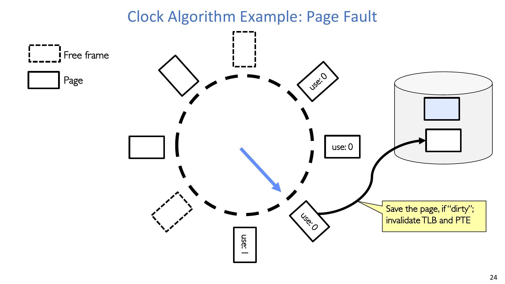
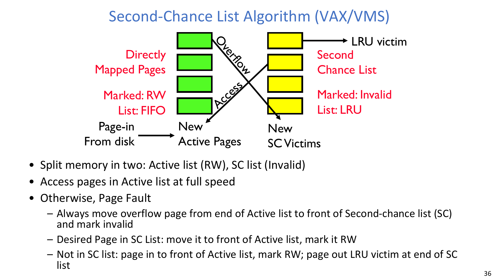
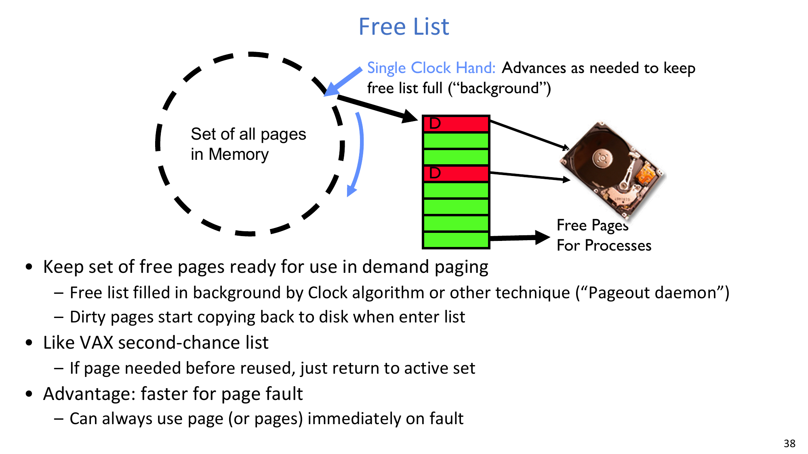
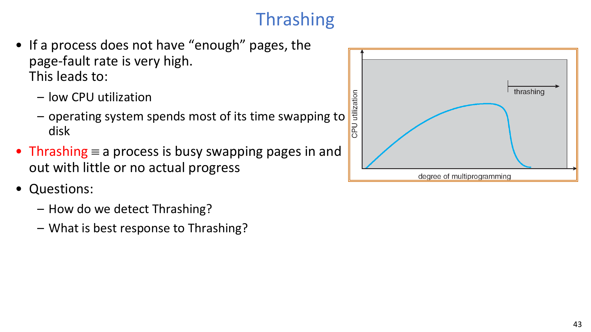

# Lecture 16: Memory 4 - Page Replacement, Working Set, and Thrashing Control

## Learning Objectives

By the end of this lecture, you should be able to:

1. Explain why replacement policy quality determines whether demand paging remains efficient.
2. Compare FIFO, MIN, and LRU on the same reference stream and interpret their fault counts.
3. Explain the stack property and why FIFO can violate it (Belady's anomaly).
4. Describe how Clock approximates LRU, including use/modified-bit emulation variants.
5. Explain second-chance list, free-list background cleaning, reverse mapping, and frame-allocation strategies.
6. Use working-set and page-fault-frequency reasoning to detect and mitigate thrashing.

## 1. From Demand Paging to Replacement Policy Design

Demand paging only works well if replacement decisions preserve locality. Once free frames are scarce, page-replacement policy becomes the main performance lever.

Core design questions:

- Which page should leave memory on a fault?
- How much hardware support do we assume (use bit, modified bit)?
- Do we optimize for theoretical optimality, implementation cost, or fault-time latency?

:::remark Key Question: Why is replacement now the central problem?
**Question (original intent): We already know how to fetch pages on demand. Why spend so much effort on victim choice?**

Answer:
- Fault service cost is dominated by disk I/O and stall time.
- A bad victim decision can trigger immediate extra faults.
- So paging performance is not only about loading pages, but about preserving the right resident set over time.
:::

## 2. FIFO, MIN, and LRU on the Same Trace

The lecture compares policies on the same reference stream with 3 frames:

`A B C A B D A D B C B`

FIFO gives **7 faults** here. The key mistake is evicting `A` when `D` arrives, even though `A` is needed again immediately.

MIN gives **5 faults** on the same trace. In this case LRU matches MIN's decisions, but this alignment is workload-dependent, not guaranteed.

:::tip Key Question: Why is MIN only a benchmark, not a deployable policy?
**Question (original intent): If MIN is best, why not just use MIN in kernels?**

Answer:
- MIN needs future knowledge (next-use distance of every page).
- Real systems do not know future references.
- Therefore MIN is a lower bound for fault count, used to evaluate practical approximations.
:::

## 3. When LRU Also Looks Bad

LRU is usually strong, but not magical. For a cyclic pattern with working set size `N+1` on `N` frames (for example `A B C D A B C D ...` on 3 frames), every access can fault.

Interpretation:

- LRU captures recency, not semantic program phase boundaries.
- If the active set systematically exceeds available frames, replacement policy alone cannot save you.

## 4. Stack Property and Belady's Anomaly

A desirable property is: adding frames should not increase fault count. This monotonicity is the stack property.

The FIFO counterexample in lecture shows:

- 3 frames: 9 faults
- 4 frames: 10 faults

So FIFO can violate monotonicity. In contrast, MIN/LRU families obey stack-style inclusion in their model assumptions.

## 5. Clock: Practical Approximation to LRU

Clock keeps pages in a circular structure and advances a single hand on faults.

Key mechanism:

- Each page has a **use bit** (accessed bit).
- Hand scans pages on fault:
- If `use=1`: clear it and skip this page for now.
- If `use=0`: choose it as replacement candidate.

This targets an old page, not necessarily the absolute oldest page.

On replacement:

- Write back if page is dirty.
- Invalidate corresponding translation state (PTE/TLB entries).
- Load incoming page and update mapping.

:::warn Key Question: What does hand speed tell us?
**Question (original intent): If the clock hand moves slowly or quickly, is that good or bad?**

Answer:
- Slow hand often means either fewer faults or easy victim finding.
- Fast hand usually signals pressure: many faults or many recently-used pages.
- So hand speed is a rough runtime health signal for memory pressure.
:::

## 6. Clock Variants and Bit Emulation

The lecture extends Clock in three directions:

1. Nth-chance Clock:
- Give a page multiple passes before replacement.
- Typical policy: clean pages replaced earlier, dirty pages given extra chances.

2. Emulated modified bit:
- Mark writable pages as read-only initially.
- First write traps; OS records software-modified state, then enables write.

3. Emulated use bit:
- Mark pages invalid (or more restrictive) in phases.
- Access traps tell OS the page was used; OS updates software-use state.

Engineering tradeoff:

- Less hardware support means more trap overhead.
- More hardware support simplifies fast-path execution.

## 7. Second-Chance List (VAX/VMS Style)

Second-chance list separates memory into two groups:

- Active list: directly mapped and fast access.
- Second-chance list: invalid-marked pages tracked in recency order.

Operational idea:

- Active-list overflow moves pages into SC list.
- Access to an SC-list page faults, then page is promoted back to active list.
- If not reused for long, it eventually becomes victim at SC tail.

This design approximates LRU while keeping active accesses fast.

## 8. Free List and Background Cleaning

Instead of selecting and cleaning a victim on every fault, systems maintain a free-page pool in the background.

Key points:

- Pageout daemon fills free list proactively.
- Dirty pages can be written back before they are urgently needed.
- Fault path latency drops because a ready frame is usually available.

## 9. Reverse Mapping and Allocation Policies

When evicting a frame, OS must quickly find all page-table entries that reference it (especially with shared pages).

Reverse mapping (coremap-style support) enables:

- invalidating all relevant PTEs on eviction,
- scanning activity for replacement/accounting.

Frame-allocation choices:

- Global replacement: a process may take a frame from another process.
- Local replacement: process replaces only within its own allocation.
- Equal/proportional/priority schemes define static baseline assignment.

From slide formulas:

$$
s_i = \text{size of process } p_i,\quad S = \sum_i s_i,\quad m = \text{total frames}
$$

$$
a_i = \frac{s_i}{S}\,m
$$

## 10. Thrashing Detection and Working-Set Control

Page-fault-frequency (PFF) control dynamically adjusts frames per process.

Policy intuition:

- Fault rate too high: grant more frames.
- Fault rate too low: reclaim frames.

But if total memory is insufficient globally, PFF alone cannot prevent collapse.

**Definition:** **Thrashing** means the system spends most of its time paging, with little useful execution progress.

Locality view:

A process behaves well only when its working set fits in memory.

Working-set model terms:

$$
\Delta \equiv \text{working-set window}
$$

$$
WS_i(t) = \{\text{pages referenced by process } P_i \text{ in recent } \Delta\}
$$

$$
D = \sum_i |WS_i|,
\quad D > m \Rightarrow \text{thrashing}
$$

Control action from lecture:

- If total demand `D` exceeds memory `m`, suspend/swap out some processes to restore fit.

:::error Key Question: What is the best response once thrashing appears?
**Question (original intent): If faults explode, should we keep all processes runnable and hope policy tuning helps?**

Answer:
- Usually no. If working sets do not fit, replacement tuning alone is insufficient.
- Reduce multiprogramming level (suspend/swap out processes).
- Rebuild free-frame headroom, then resume gradually.
:::

## 11. Compulsory Misses, Clustering, and Practical Reload

Not all misses are policy failures. Compulsory misses happen on first touch or after swap-in.

Two practical mitigations:

- Clustering: on one fault, prefetch nearby pages to exploit sequential disk bandwidth.
- Working-set-aware swap-in: bring back a process with the set it is likely to touch soon.

Both reduce repeated immediate faults after restart.

## 12. Exam Review

### 12.1 Must-Know Definitions

- **Stack property**: adding frames does not increase page-fault count.
- **Belady's anomaly**: FIFO can produce more faults with more frames.
- **Clock algorithm**: LRU approximation using a circular list and use bits.
- **Second-chance list**: two-list strategy (active + second-chance) to approximate LRU with fast active hits.
- **PFF control**: adapt frame allocation using observed fault-rate bounds.
- **Working-set model**: process needs the pages referenced in recent window `\Delta`.
- **Thrashing**: paging dominates runtime; useful work collapses.

### 12.2 High-Value Short-Answer Templates

1. **Why can FIFO be worse after adding memory?**  
   FIFO lacks stack property; resident contents can diverge across frame counts, creating Belady-type counterexamples.
2. **Why is Clock widely used?**  
   It captures recency cheaply via use-bit aging, giving near-LRU behavior with low overhead.
3. **When does PFF fail to stabilize performance?**  
   When total working-set demand exceeds physical memory, per-process tuning is not enough.
4. **What is the canonical anti-thrashing action?**  
   Lower multiprogramming pressure by suspending/swapping out some processes.

### 12.3 Common Pitfalls

- Treating LRU as universally optimal instead of workload-dependent.
- Assuming more frames always reduce faults for every policy.
- Ignoring reverse mapping costs when designing eviction paths.
- Forgetting dirty-page writeback latency in fault critical path.
- Trying to solve global memory overload with local replacement tuning only.

### 12.4 Self-Check

:::tip Self-check 1
Given the same reference stream, explain in one paragraph why MIN beats FIFO and when LRU may still tie MIN.
:::

:::tip Self-check 2
You observe a very fast-moving clock hand and rising fault rate. List two plausible causes and one immediate mitigation.
:::

:::tip Self-check 3
A system has high compulsory misses right after swap-in. Propose how clustering and working-set-aware preload change the fault pattern.
:::
