# 第 18 讲：I/O——通用 I/O、磁盘与 SSD

## 学习目标

学完本讲后，你应该能够：

1. 解释为什么在 CPU 调度与内存管理之外，I/O 仍然是操作系统的核心问题。
2. 描述 CPU 通过控制器、总线与中断机制和设备交互的路径。
3. 比较 programmed I/O、DMA，以及阻塞/非阻塞/异步三类用户接口语义。
4. 使用 seek、rotation、transfer 三部分分析 HDD 延迟。
5. 解释 SSD 写路径为何与读路径本质不同，以及 FTL、wear leveling、garbage collection 的必要性。

## 1. 为什么 I/O 是 OS 的核心主题

没有 I/O，计算机无法与存储、网络、输入输出设备交互。真实系统面对的是数量巨大、性能差异极大的设备集合。

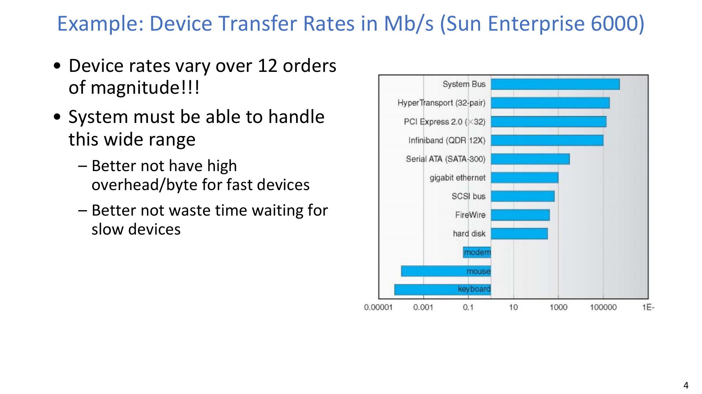

OS 的挑战不仅是“能用”，还包括“统一”：

- 如何为差异巨大的设备提供一致接口。
- 如何保证设备访问的可靠性与可诊断性。
- 如何把设备特定的时序与故障细节对应用屏蔽。

:::remark 关键问题：为什么 I/O 需要专门抽象？
**问题（原意复述）：我们已经有进程、调度、内存抽象，为什么 I/O 还要额外复杂化？**

解答：
- 设备在速度、粒度、访问模式上差异极大。
- 应用需要可移植统一 API，硬件却需要设备特定控制。
- OS 的职责就是把统一接口翻译成设备侧机制。
:::

## 2. 硬件交互路径：总线、控制器与寄存器

CPU 并不直接和设备本体对话，而是通过设备控制器交互。

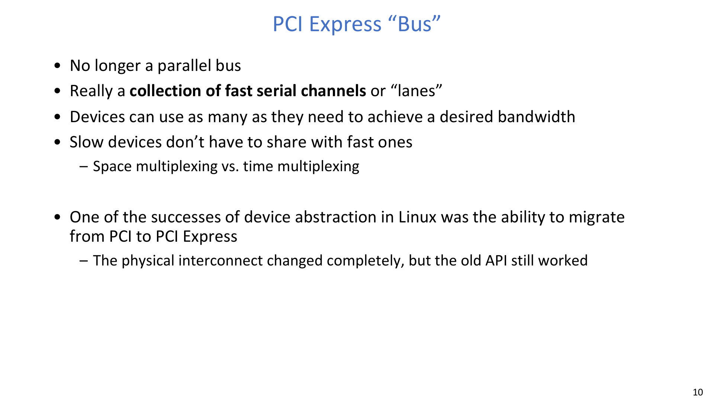

总线（或 PCIe lane 互联）提供了数据传输与控制事务的物理/协议基础。

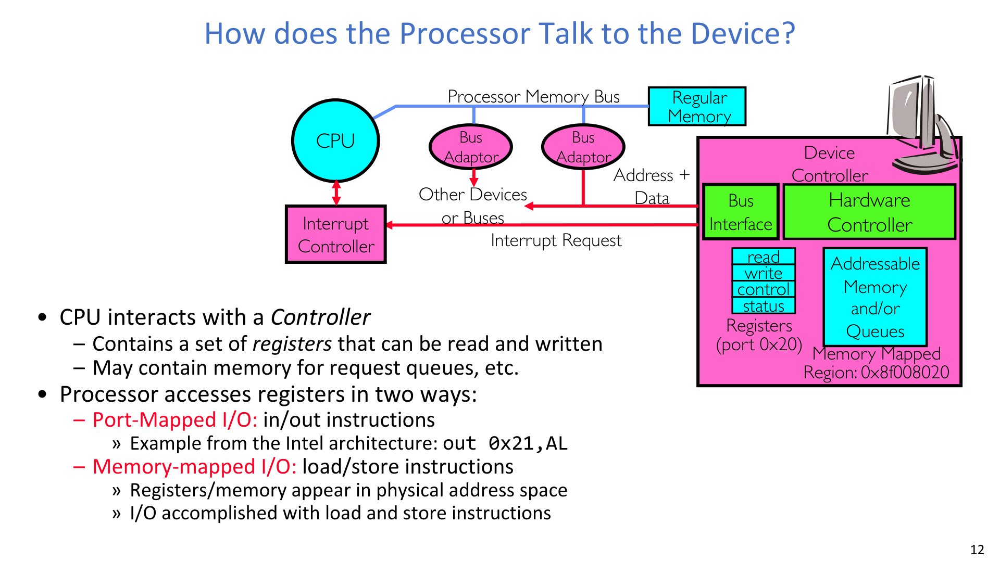

访问控制器寄存器有两种经典方式：

- Port-mapped I/O：使用专门 in/out 指令空间。
- Memory-mapped I/O（MMIO）：把寄存器映射到物理地址空间，用 load/store 访问。

关键理解：二者都暴露控制/状态寄存器；而 MMIO 与普通内存指令模型更一致，更适合现代系统集成。

## 3. 数据搬运：Programmed I/O 与 DMA

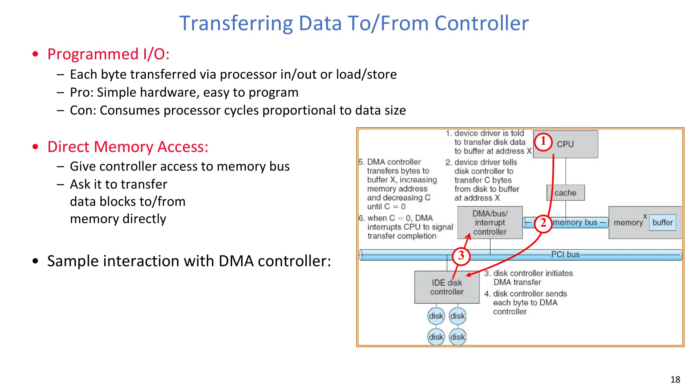

Programmed I/O（PIO）：

- 每个字节/字由 CPU 显式搬运。
- 实现简单，但 CPU 成本随数据量线性增加。

Direct Memory Access（DMA）：

- CPU 只负责配置，控制器在设备与内存之间直接搬运数据。
- 大块传输时显著降低 CPU 开销。

典型 DMA 流程：

1. 驱动设置 DMA/控制器描述符。
2. 设备或 DMA 引擎在总线上执行传输。
3. 传输完成后触发中断通知 CPU。

## 4. 完成通知与驱动结构

OS 必须知道 I/O 是否完成、是否出错。

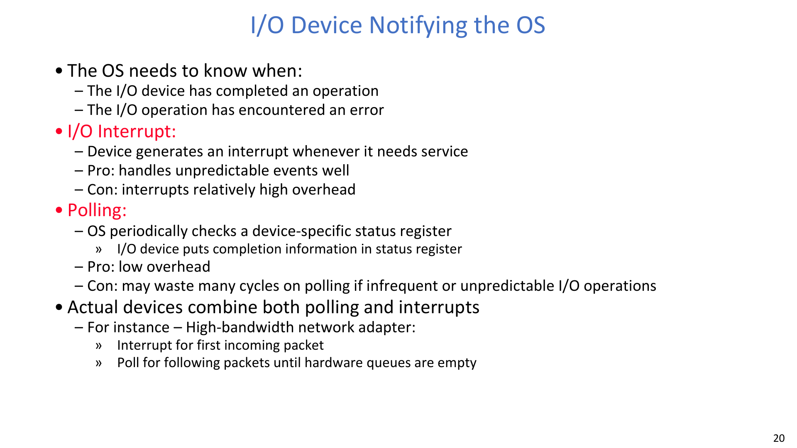

通知方式主要有：

- Polling：OS 周期性读取状态寄存器。
- Interrupt：设备完成后主动通知 CPU。

内核驱动组织通常为：

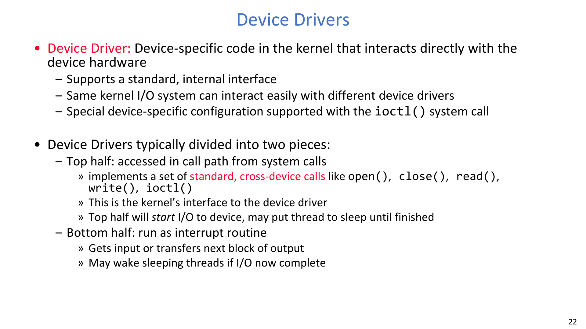
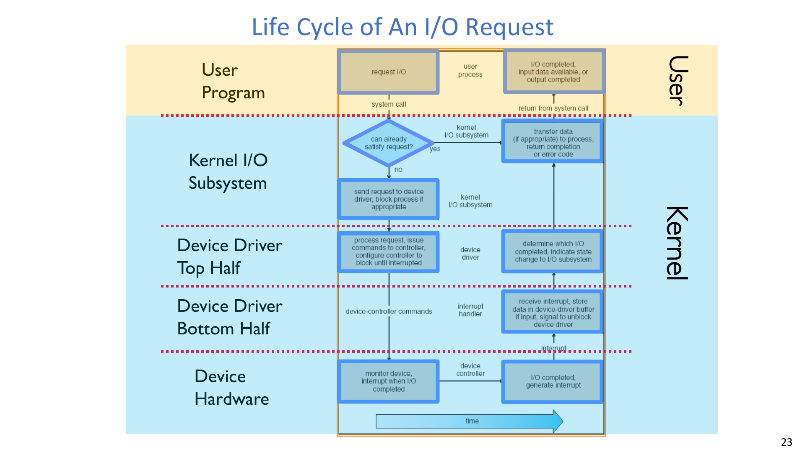

- Top half：快速提交请求、执行即时控制。
- Bottom half（延后处理）：完成处理与较重后续逻辑。

这种拆分有助于兼顾中断响应性与整体吞吐。

## 5. 面向应用的统一 I/O 接口

OS 目标是“设备多样，但接口统一”：

- Block devices：read/write/seek 语义。
- Character devices：字节流语义。
- Network devices：报文语义。

时序语义同样关键。

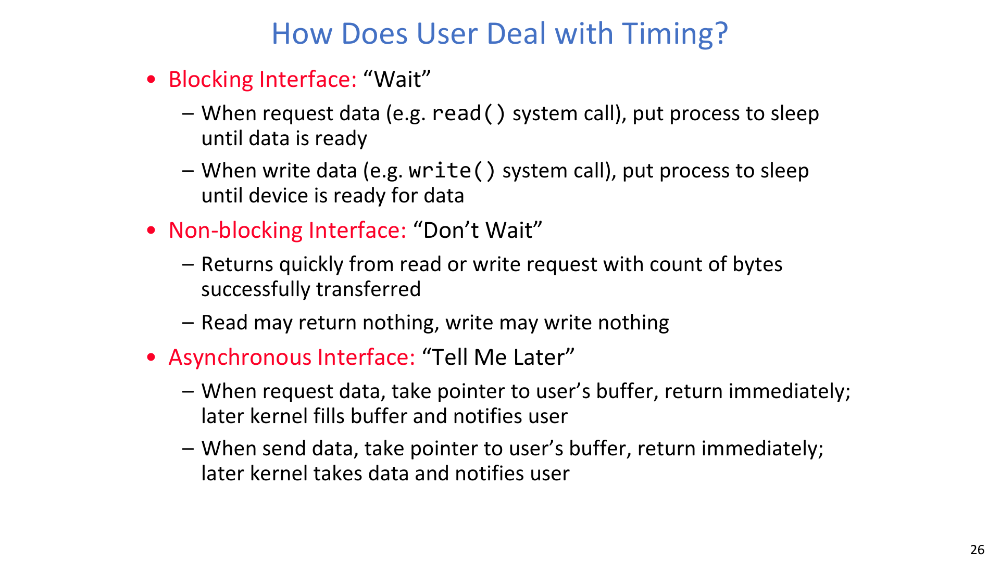

三类接口：

- Blocking：调用方睡眠，直到操作完成。
- Non-blocking：立即返回，结果可能部分成功或暂不可用。
- Asynchronous：先提交请求，稍后再收到完成通知。

:::tip 关键问题：哪种时序接口“最好”？
**问题（原意复述）：为了性能，是否应该总是优先异步接口？**

解答：
- 没有对所有场景都最优的单一接口。
- 阻塞接口更直观，易于顺序逻辑开发。
- 非阻塞/异步更利于并发和资源利用，但应用复杂度更高。
- 应根据工作负载与编程模型做选择。
:::

## 6. HDD 基础：几何结构与访问代价

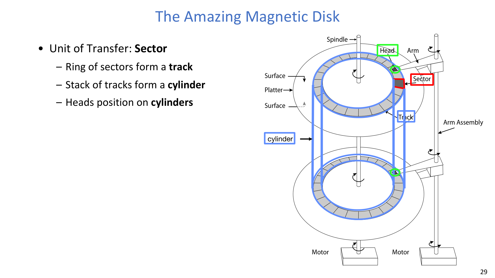

基本术语：

- Sector：传输单位。
- Track：扇区组成的环。
- Cylinder：多个盘面上对齐轨道的集合。

磁盘访问由多个时延组成。

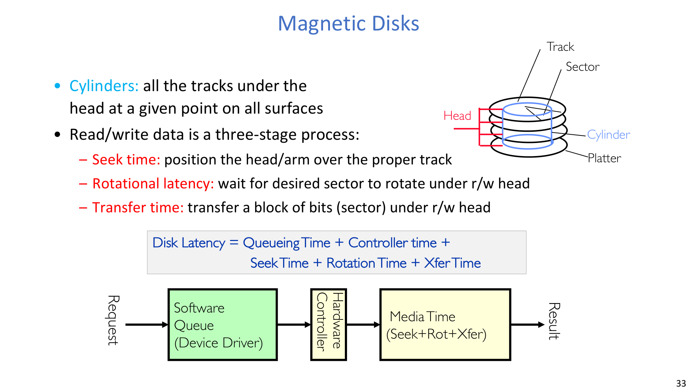

$$
T_{\text{disk}} = T_{\text{queue}} + T_{\text{controller}} + T_{\text{seek}} + T_{\text{rotation}} + T_{\text{xfer}}
$$

含义：

- Seek time：磁头臂移动到目标轨道。
- Rotational latency：等待目标扇区旋转到磁头下方。
- Transfer time：实际比特传输时间。

## 7. HDD 数值例子与局部性启示

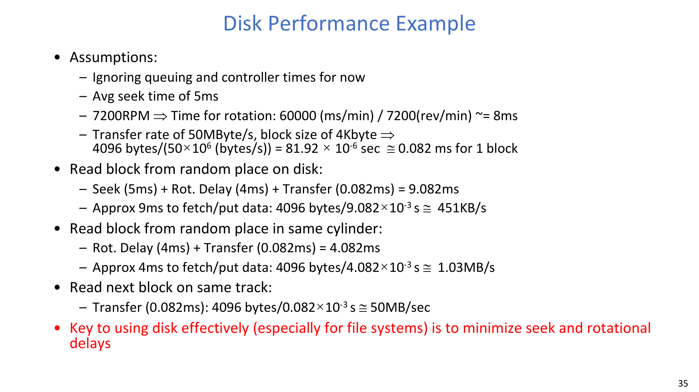

给定 7200 RPM：

$$
T_{\text{rotation}} = \frac{60000\ \text{ms/min}}{7200\ \text{rev/min}} \approx 8\ \text{ms},
\quad
\overline{T}_{\text{rotation}} \approx 4\ \text{ms}
$$

对 4KB 块、50MB/s 传输率：

$$
T_{\text{xfer}} = \frac{4096}{50\times10^6}\ \text{s}
= 81.92\times10^{-6}\ \text{s}
\approx 0.082\ \text{ms}
$$

随机块读取：

$$
T_{\text{rand}} = 5 + 4 + 0.082 = 9.082\ \text{ms}
$$

同柱面随机块读取：

$$
T_{\text{same-cyl}} = 4 + 0.082 = 4.082\ \text{ms}
$$

核心结论：对 HDD 来说，降低 seek 与 rotation 延迟通常比“纯传输优化”更关键。

:::warn 关键问题：为什么文件系统这么强调 HDD 布局局部性？
**问题（原意复述）：明明传输带宽不低，为什么随机 I/O 仍然很慢？**

解答：
- 机械定位成本（seek + rotation）在短随机 I/O 中占主导。
- 布局局部性可以减少机械重定位次数。
- 因此块放置与请求调度是 HDD 时代的一阶优化项。
:::

## 8. SSD 的读写不对称

SSD 去掉了机械 seek/rotation，但写路径引入了新的约束。

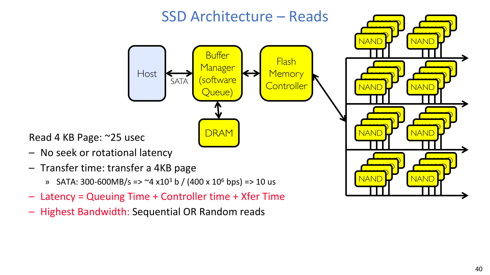

读路径可写成：

$$
T_{\text{ssd-read}} = T_{\text{queue}} + T_{\text{controller}} + T_{\text{xfer}}
$$

写路径更复杂：

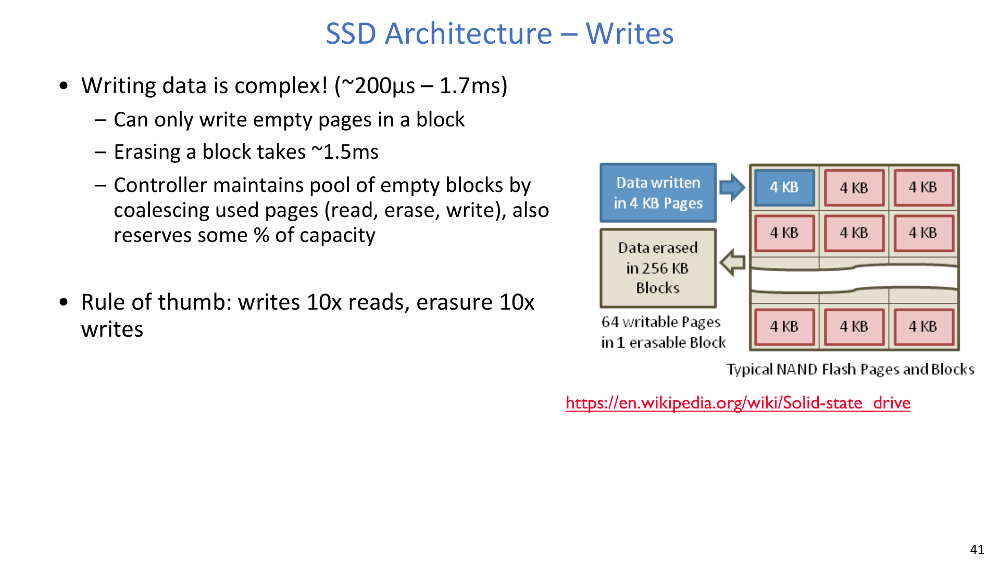

- 写入是页粒度（如 4KB），擦除是块粒度（如 256KB）。
- 擦除慢、且会消耗闪存寿命。

## 9. FTL、Copy-on-Write、磨损均衡与垃圾回收

为了在 flash 约束下对上提供“像 HDD 一样”的逻辑接口，SSD 控制器引入 FTL（Flash Translation Layer）。

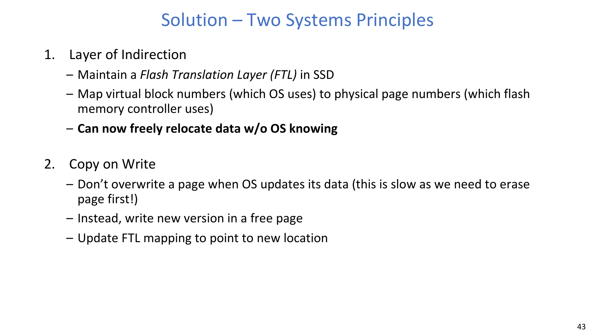
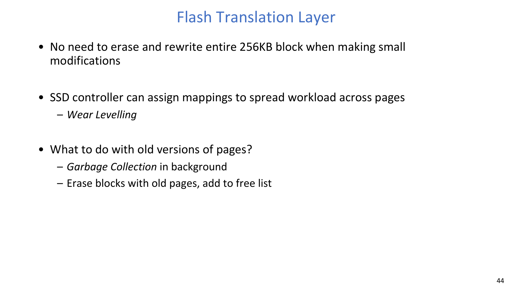

核心机制：

1. 间接映射：
- 将逻辑块/页号映射到物理 flash 位置。

2. Copy-on-Write 更新：
- 写新版本到空闲页，再更新映射。
- 避免原地覆盖触发立即擦除。

3. Wear leveling：
- 把写入分散到不同块，避免热点块过早失效。

4. Garbage collection：
- 后台回收失效页，重建空闲页池。

:::error 关键问题：为什么不直接原地重写 flash 块？
**问题（原意复述）：OS 只写 4KB，为何不能每次直接擦除并重写同一个 256KB 块？**

解答：
- 块擦除是毫秒级慢操作。
- Flash 块可擦写次数有限。
- 原地重写会显著放大延迟并加速磨损。
- FTL + COW + GC 是现实系统中的可行折中。
:::

## 10. HDD 与 SSD 对比及系统设计启示

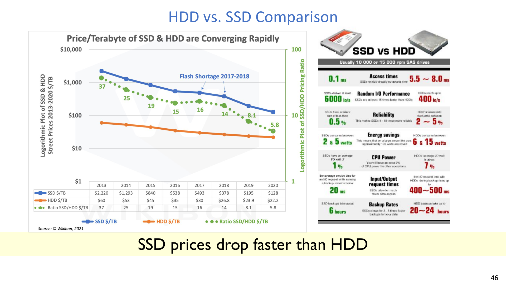
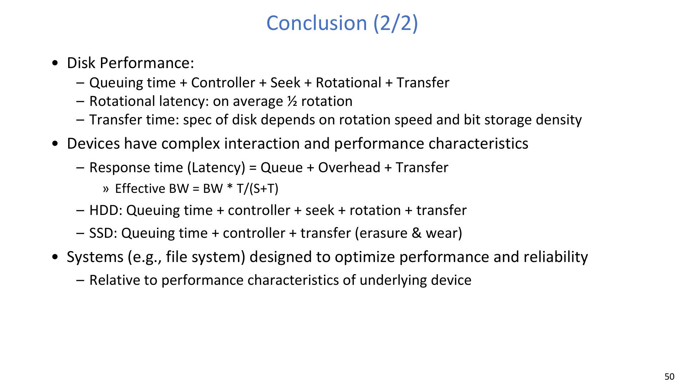

讲义给出的统一性能表达：

$$
T_{\text{resp}} = T_{\text{queue}} + T_{\text{overhead}} + T_{\text{xfer}}
$$

$$
BW_{\text{eff}} = BW \cdot \frac{T}{S+T}
$$

实践差异：

- HDD：queue + controller + seek + rotation + transfer。
- SSD：queue + controller + transfer，并在写密集场景受擦除与磨损管理影响。

系统级启示：

- 文件系统和 I/O 调度策略必须贴合底层设备特性，不能假设“设备无差别”。

## 11. Exam Review

### 11.1 必会定义

- **控制器寄存器接口**：通过 port-mapped I/O 或 MMIO 操作设备控制/状态。
- **PIO**：CPU 直接参与的数据搬运路径。
- **DMA**：控制器主导的内存直达搬运路径。
- **Blocking / Non-blocking / Asynchronous**：应用与 OS 之间三种时序契约。
- **磁盘时延分解**：queue + controller + seek + rotation + transfer。
- **FTL**：逻辑地址到物理 flash 地址的映射层。
- **Wear leveling**：延长寿命的写入均衡策略。
- **Garbage collection（SSD）**：回收无效页并恢复空闲空间。

### 11.2 简答模板

- “为什么 DMA 优于 PIO”：大块传输下 CPU 开销更低、重叠更好。
- “为什么 HDD 随机 I/O 慢”：机械定位时间主导，传输不是瓶颈。
- “为什么 SSD 写路径复杂”：擦除粒度与寿命约束要求间接映射与 GC。
- “为什么统一接口重要”：应用层可移植，底层仍可做设备特定优化。

### 11.3 常见误区

- 把 SSD 当成“纯粹更快的 HDD”，忽略写路径限制。
- 套用公式时忽略 queue/controller 等非数据搬运开销。
- 不区分场景就固定采用一种接口语义。

### 11.4 自检问题

1. 你能否在给定 RPM 与块大小时推导 HDD 延迟各项？
2. 你能否说明 DMA 在什么场景下比 PIO 更有价值？
3. 你能否解释 FTL 为什么必须支持 copy-on-write？
4. 你能否说明 wear leveling 与 garbage collection 的协同关系？
5. 你能否用 `BW_eff = BW * T/(S+T)` 解释小传输下协议/启动开销的影响？
