# Lecture 19: File System 1 - I/O Performance and File-System Design

## Learning Objectives

By the end of this lecture, you should be able to:

1. Use response-time, throughput, and utilization concepts to reason about I/O behavior.
2. Apply basic queueing models (M/M/1 and M/G/1 forms used in class) to estimate delay.
3. Explain why disk scheduling policies affect both performance and fairness.
4. Connect I/O performance principles to file-system structure design.
5. Explain how name resolution maps user-visible paths to inode-based storage metadata.

## 1. From Device I/O to File-System Performance

This lecture bridges two layers:

- Device-level I/O performance (queueing, scheduling, utilization pressure).
- File-system abstractions (names, directories, inodes, data blocks).

The key message is that file-system design cannot be separated from device performance characteristics.

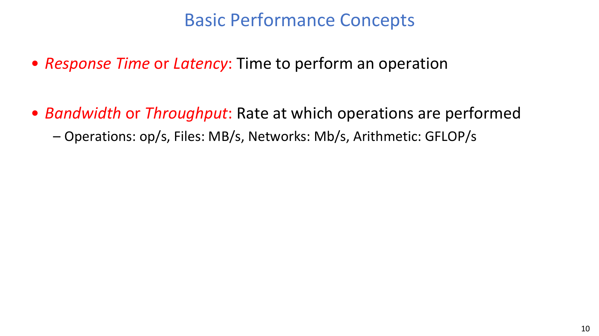

Core metrics:

- **Response time (latency):** time per operation.
- **Throughput (bandwidth):** operations or bytes per second.

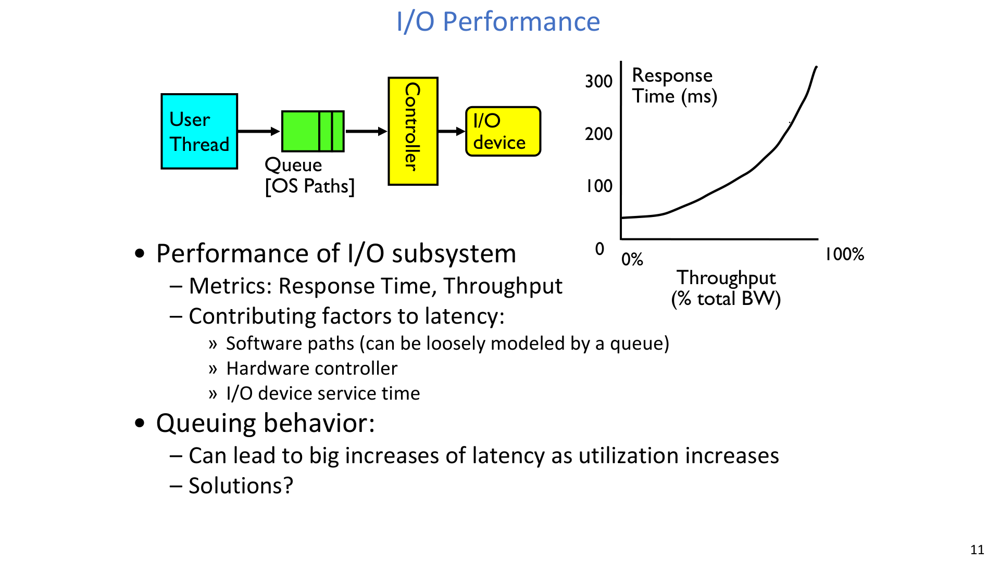

:::remark Key Question: Why does latency explode near saturation?
**Question (original intent): If hardware throughput is high, why can user-perceived response time still become very large?**

Answer:
- Queueing delay grows nonlinearly as utilization approaches 1.
- Bursty arrivals create transient backlogs even when average load looks moderate.
- So high throughput does not automatically imply low latency.
:::

## 2. Deterministic Queueing Intuition

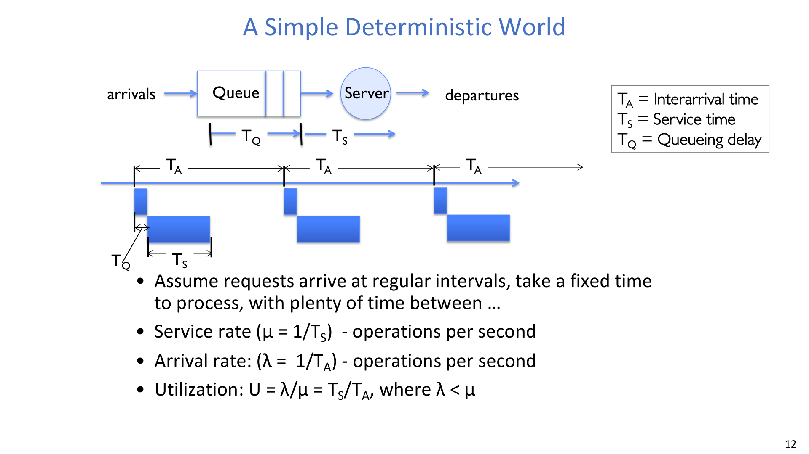

Class notation:

$$
\mu = \frac{1}{T_S}, \qquad
\lambda = \frac{1}{T_A}, \qquad
u = \frac{\lambda}{\mu} = \frac{T_S}{T_A}, \ \lambda < \mu
$$

- `T_A`: inter-arrival time.
- `T_S` (`Tser`): service time.
- `T_Q`: queueing delay.

This deterministic view builds intuition, but real systems are bursty.

## 3. Bursty Arrivals and Exponential Modeling

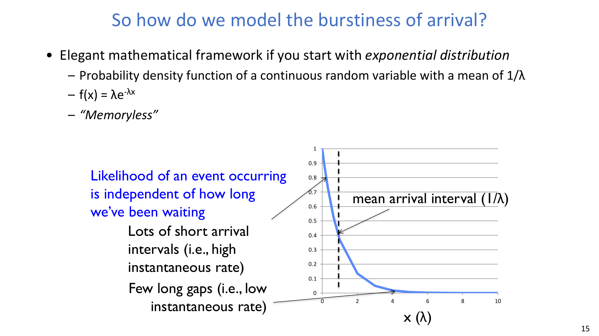

To model burstiness, the lecture introduces exponential inter-arrival time:

$$
f(x)=\lambda e^{-\lambda x}, \qquad \mathbb{E}[X]=\frac{1}{\lambda}
$$

**Key definition:** **Memoryless** means the probability of the next arrival does not depend on how long we have already waited.

This gives tractable queueing formulas and captures many practical aggregate workloads.

## 4. Queueing Results Used in Class

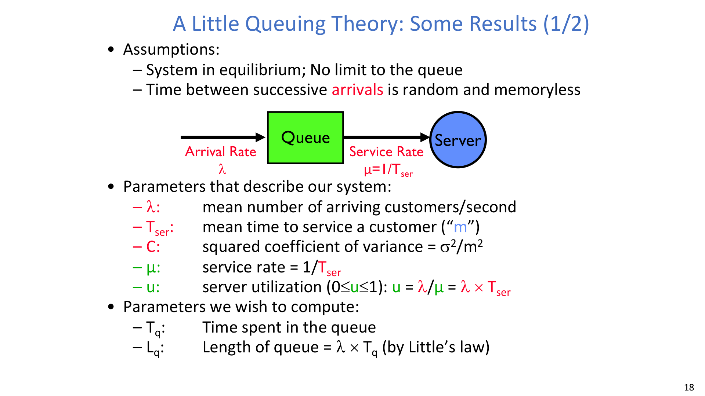

Parameter recap:

- `\lambda`: arrival rate.
- `T_{ser}`: mean service time.
- `C`: squared coefficient of variance.
- `u`: utilization.
- `T_q`, `L_q`: queue wait and queue length.

Little's law form:

$$
L_q = \lambda T_q
$$

Result forms on slides:

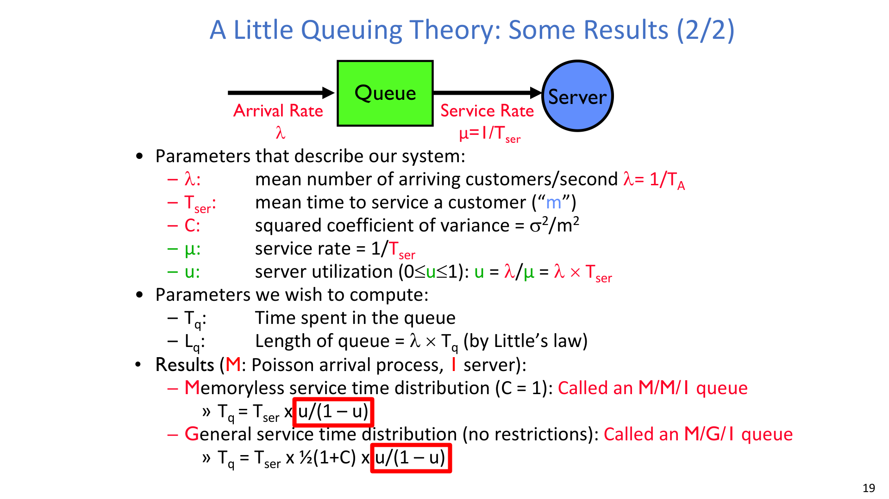

$$
\text{M/M/1 (}C=1\text{): } T_q = T_{ser}\cdot\frac{u}{1-u}
$$

$$
\text{M/G/1 (slide form): } T_q = T_{ser}\cdot\frac{1}{2}(1+C)\cdot\frac{u}{1-u}
$$

As utilization rises toward 1, queueing delay diverges.

## 5. Worked Example: Turning Statistics into Latency

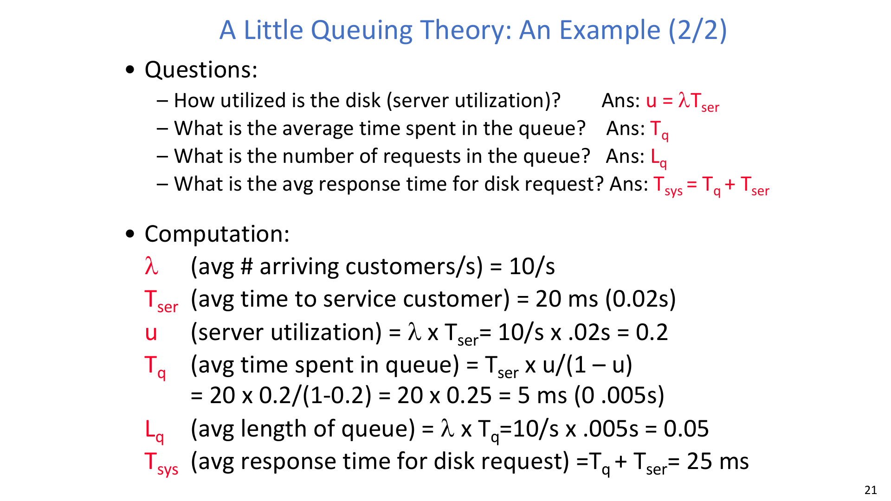

Given in lecture:

$$
\lambda=10/s,\quad T_{ser}=20\,\text{ms}=0.02\,s,\quad u=\lambda T_{ser}=0.2
$$

$$
T_q = 20\cdot\frac{0.2}{1-0.2}=5\,\text{ms}
$$

$$
L_q = \lambda T_q = 10\times0.005 = 0.05
$$

$$
T_{sys}=T_q+T_{ser}=25\,\text{ms}
$$

:::tip Key Question: Why does average queue length matter if it is less than 1?
**Question (original intent): If `L_q = 0.05`, is queueing basically negligible?**

Answer:
- Averages hide burst behavior.
- Short queues most of the time can still produce occasional high tail delays.
- Queue-sensitive systems must track distribution/tails, not only means.
:::

## 6. Practical I/O Optimization Levers

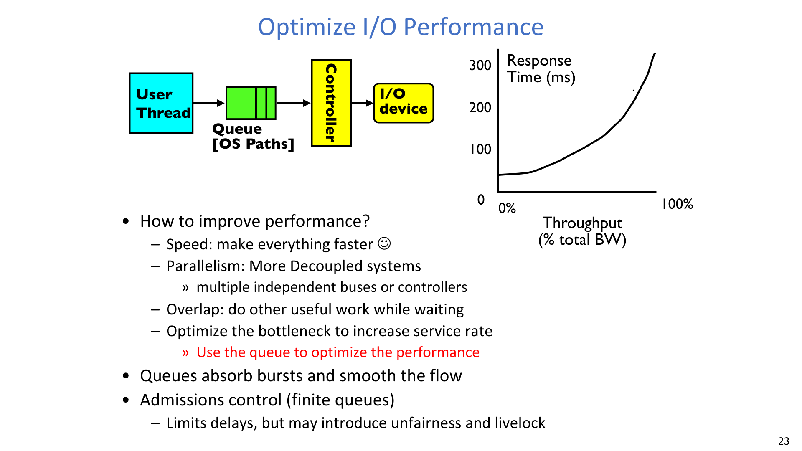

The lecture highlights four levers:

- Speed: make individual service steps faster.
- Parallelism: decouple with multiple controllers/buses/resources.
- Overlap: do useful work while waiting on I/O.
- Queue management: absorb bursts and schedule requests intelligently.

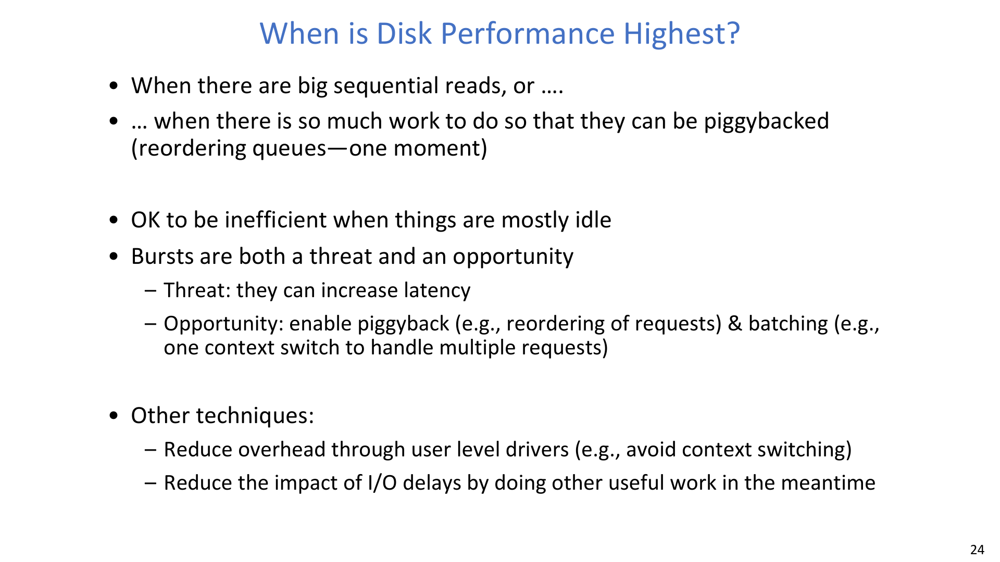

High disk performance often appears with:

- Large sequential accesses.
- Enough outstanding work for beneficial batching/reordering.

## 7. Disk Scheduling Policies and Tradeoffs

Disk can serve one request at a time, so ordering policy matters.

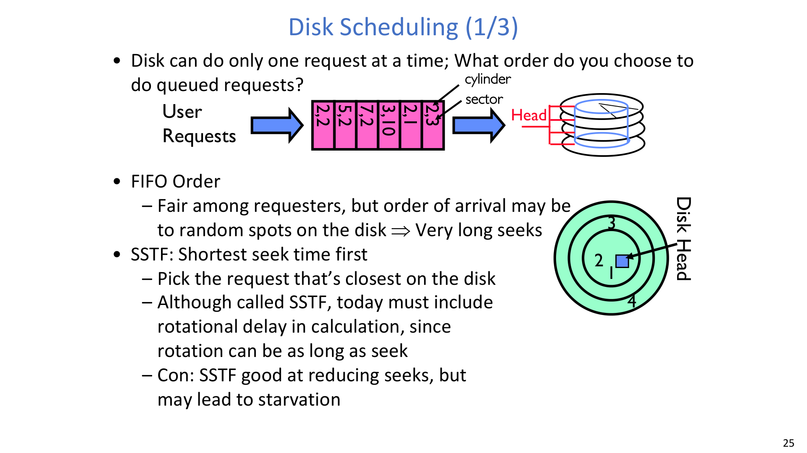

- FIFO: simple and fair by arrival order, but may cause long seeks.
- SSTF: picks nearest request to reduce seek distance, but can starve far requests.

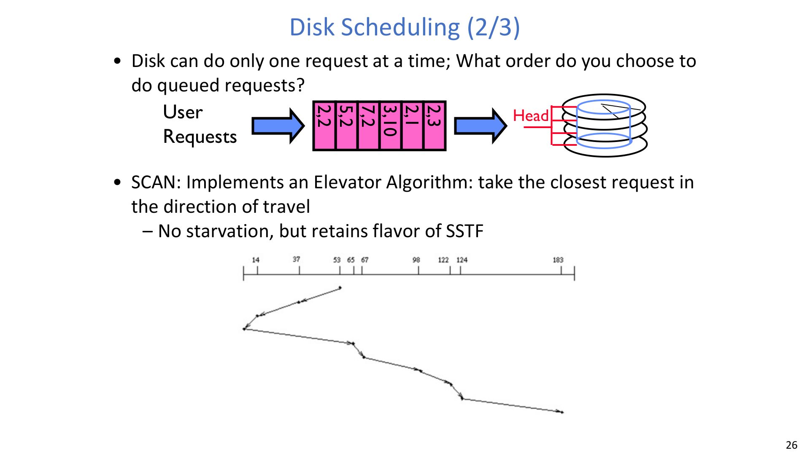

- SCAN (elevator): serve requests in current direction, then reverse.
- Reduces starvation risk compared with pure SSTF.

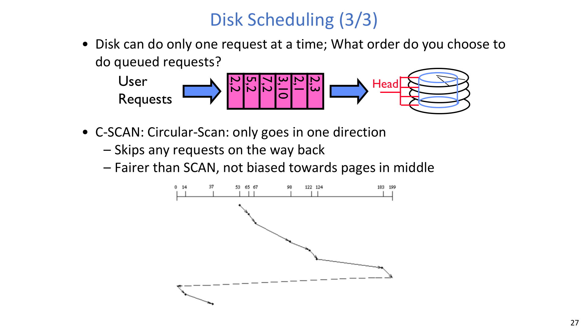

- C-SCAN: one-direction service with wrap-around jump.
- More uniform waiting-time fairness across cylinder positions.

:::warn Key Question: Why not always pick SSTF if it minimizes local seek?
**Question (original intent): If SSTF improves mechanical efficiency, why not use it as the default everywhere?**

Answer:
- Local seek minimization can hurt fairness and cause starvation.
- Systems need predictable service, not only greedy local optimization.
- SCAN/C-SCAN often offer better global behavior under mixed loads.
:::

## 8. Network I/O Perspective in Modern Systems

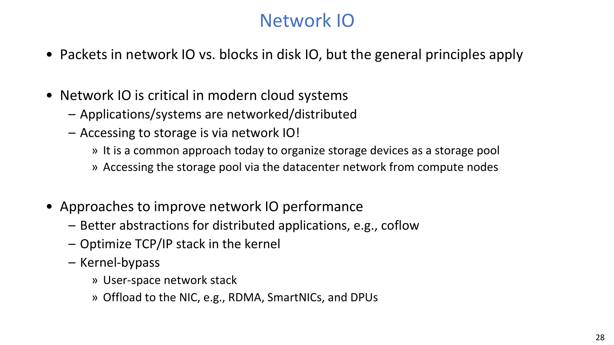

The same principles extend beyond disks:

- Queueing and scheduling still govern latency/throughput tradeoffs.
- Modern stacks increasingly use user-space networking, RDMA, SmartNICs, and DPUs to reduce overhead and increase overlap.

## 9. From Block Storage to File-System Abstractions

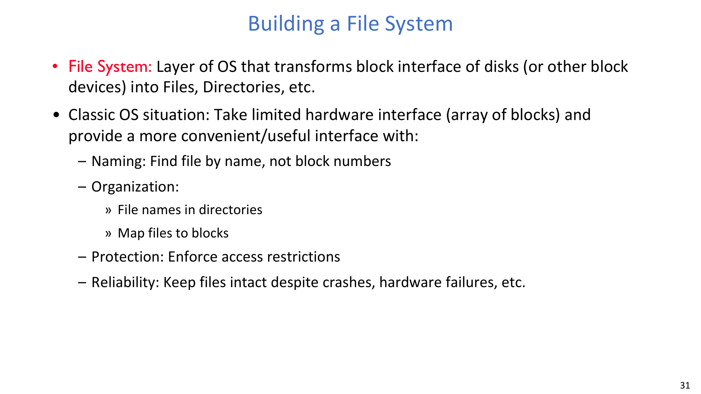

**Key definition:** **A file system transforms a block-device interface into files, directories, naming, protection, and reliability semantics.**

User view vs system view:

- User thinks in byte streams and path names.
- System maps to fixed-size blocks and metadata structures.

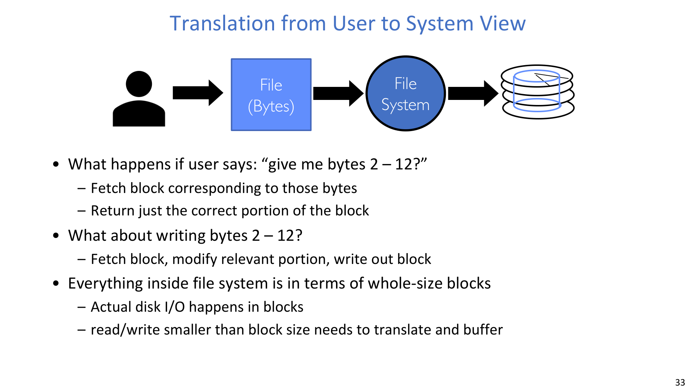

Partial-byte-range accesses require block-level read/modify/write logic inside the file system.

## 10. Core File-System Structures: Directory, Inode, Blocks

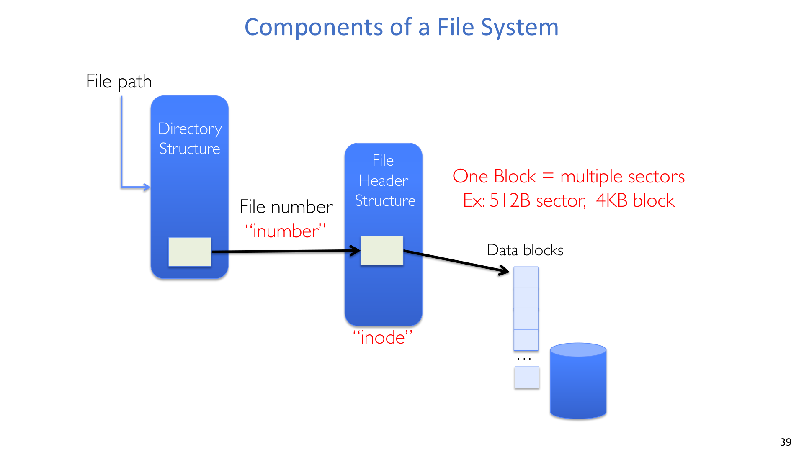

Name-resolution model:

- Directory maps `<file_name, file_number>`.
- File number indexes inode-like metadata.
- Inode maps to data blocks.

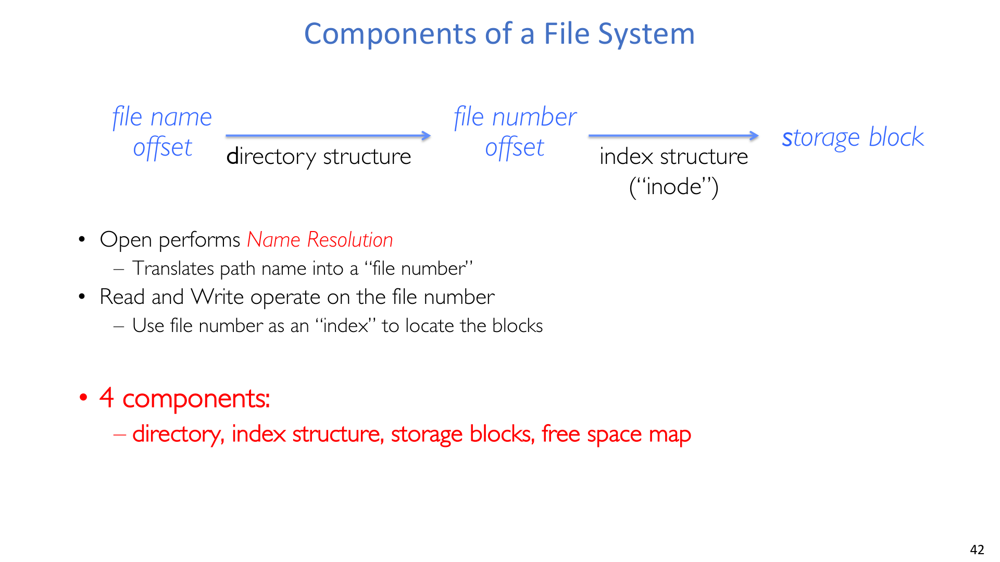

Slide summary of major components:

1. Directory structure.
2. Index structure (inode/file header).
3. Storage blocks.
4. Free-space map.

Directory semantics and protection:

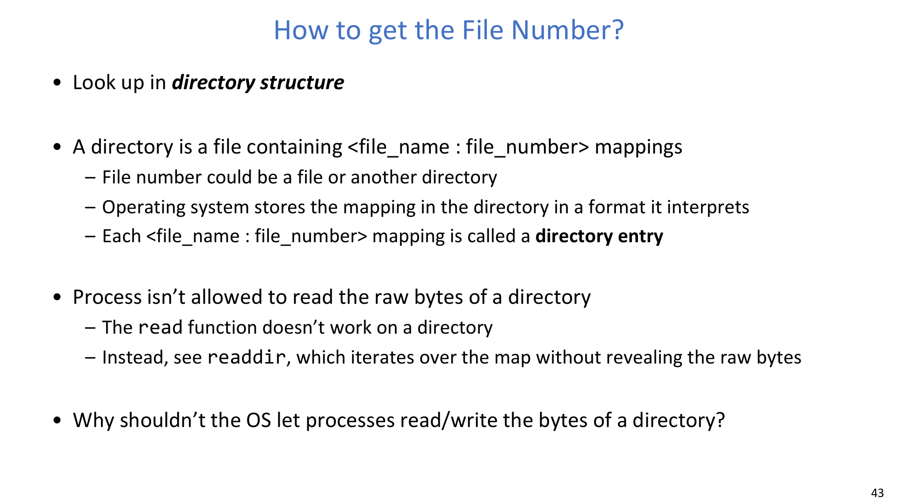

- Directory entries are structured mappings, not arbitrary user-editable raw bytes.
- APIs like `readdir` expose controlled iteration over entries.

Path-resolution cost example:

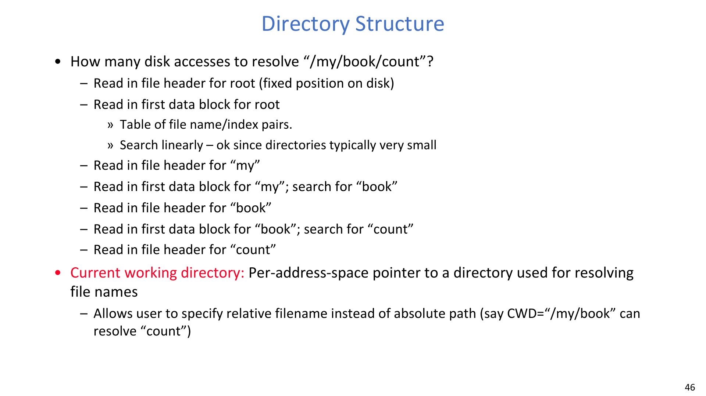

Resolving `/my/book/count` requires multiple metadata/data reads across each directory level plus target file metadata.

In-memory acceleration structures:

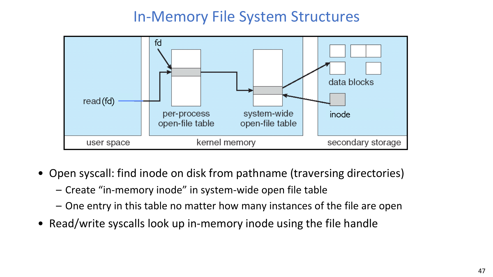

- Per-process open-file table: fd-level handles.
- System-wide open-file table: shared open-file state.
- In-memory inode/object metadata links handles to storage blocks.

## 11. Workload Reality and Design Implications

Empirical file-size observations from lecture:

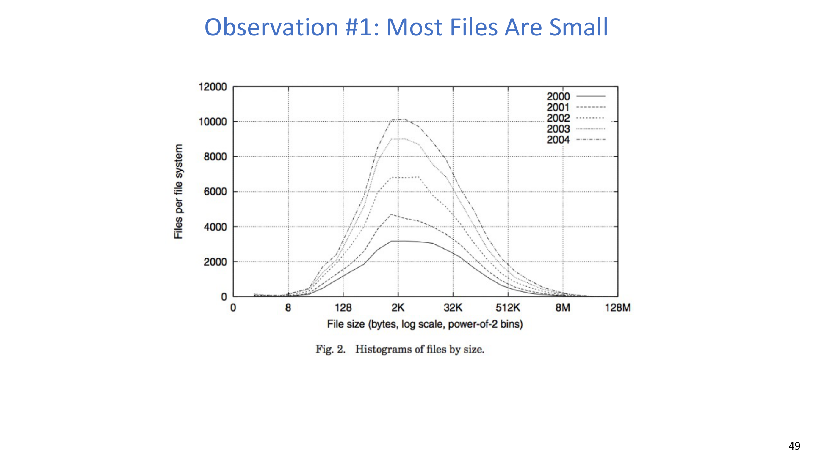
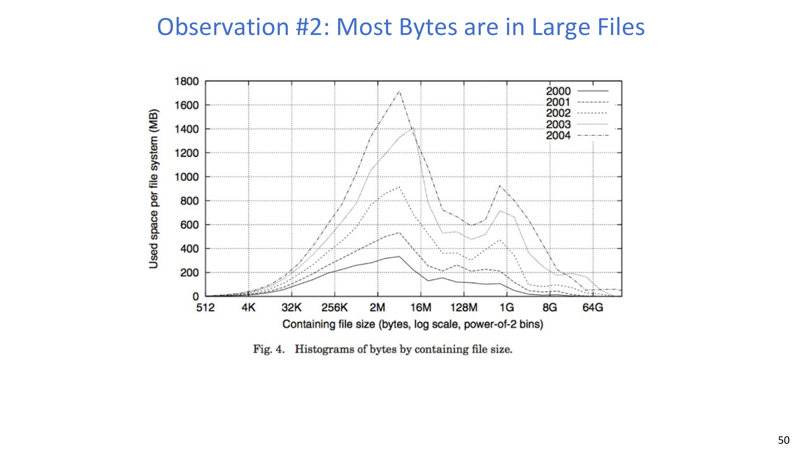

Design implication:

- Metadata/path operations dominate many operations (many small files).
- Bulk throughput optimizations still matter (most bytes in large files).

Final summary formula perspective:

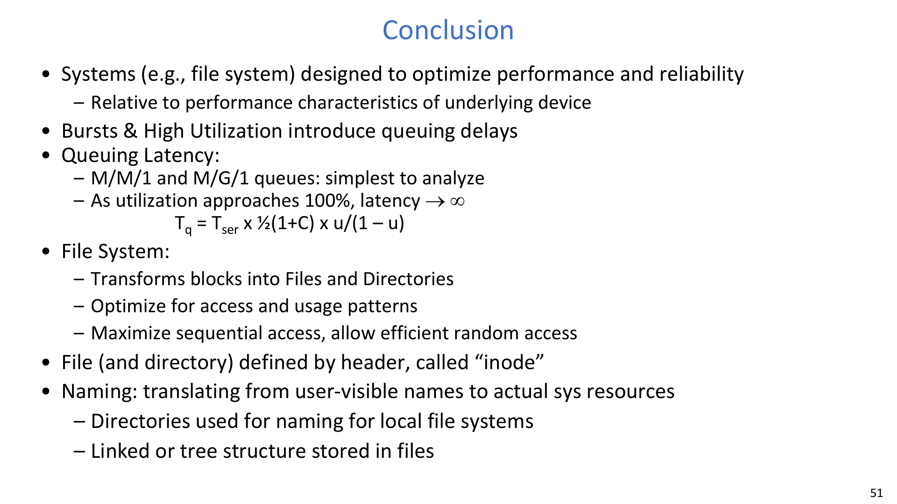

$$
T_q = T_{ser}\cdot\frac{1}{2}(1+C)\cdot\frac{u}{1-u},
\quad u\to 1^- \Rightarrow T_q\to\infty
$$

So file-system and I/O-stack design should optimize both structure-level semantics and queue-aware performance behavior.

## 12. Exam Review

### 12.1 Must-Know Definitions

- **Utilization (`u`)**: fraction of service capacity being consumed.
- **M/M/1 vs M/G/1**: queue models with memoryless vs general service-time assumptions.
- **SSTF/SCAN/C-SCAN**: disk scheduling policies with different fairness-performance tradeoffs.
- **Name resolution**: translating a user path to internal file number/inode.
- **Directory entry**: `<file_name, file_number>` mapping.
- **Inode**: metadata object describing file blocks and attributes.

### 12.2 Short-Answer Templates

- "Why latency rises near saturation?": queueing nonlinearity in `u/(1-u)` term.
- "Why not use only SSTF?": starvation/fairness tradeoff.
- "Why file system needs inode/directory separation?": names are user-facing; block mapping is system-facing.
- "Why directory bytes are protected?": preserve metadata invariants and consistency.

### 12.3 Common Pitfalls

- Confusing average queue size with tail-latency risk.
- Treating disk scheduling as a pure seek-minimization problem.
- Ignoring metadata/path traversal cost when discussing file-system performance.

### 12.4 Self-Check

1. Can you derive `u`, `T_q`, `L_q`, and `T_sys` from arrival/service statistics?
2. Can you explain when SCAN or C-SCAN should be preferred over SSTF?
3. Can you trace the steps from pathname to inode to data blocks?
4. Can you explain why small-file workloads stress metadata performance?
5. Can you justify why queue-aware design is essential even for high-bandwidth devices?
