# 第 2 讲：抽象 1——线程与进程（程序员视角）

## 学习目标

学完本讲后，你应该能够：

1. 解释为什么 OS 和应用都需要线程来同时处理多项任务。
2. 区分并发与并行，并基于调度交错分析程序行为。
3. 说明线程状态、线程私有状态与进程共享状态，以及执行栈的作用。
4. 解释非确定性如何导致竞态，以及为什么必须做同步。
5. 理解锁与信号量 API 的语义，包括 `pthread` 与 `P/V` 模式。
6. 解释 `fork`、`exec`、`wait`、signal 相关接口如何管理进程生命周期。
7. 从系统设计角度比较线程 API 与进程 API 的差异。

## 1. 快速回顾：本讲复用的 OS 基础

本讲默认你已经熟悉四个基础概念：

- **Thread（线程）**：单个执行上下文（PC、寄存器、标志位、栈）。
- **Address Space（地址空间）**：带翻译与保护语义的程序可见内存。
- **Process（进程）**：一个运行中程序实例，包含地址空间与一个或多个线程。
- **Dual Mode + Protection（双态与保护）**：特权操作仅内核可做，并隔离不同执行体。

课件先回顾 Base-and-Bound，是为了把“执行抽象”和“内存保护抽象”连起来。

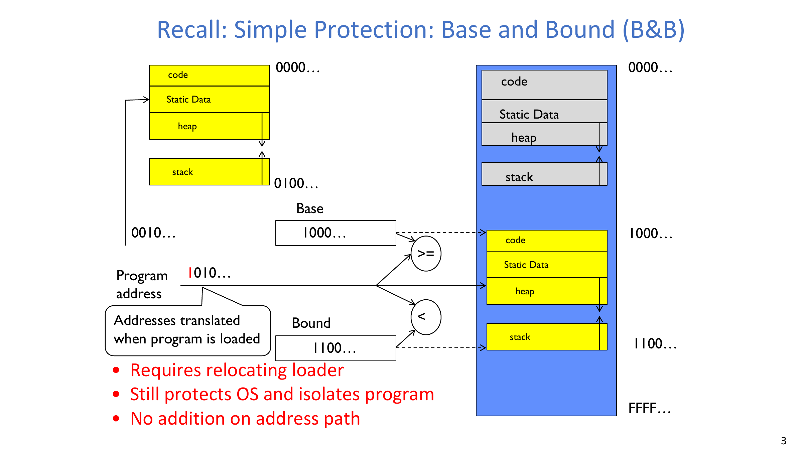

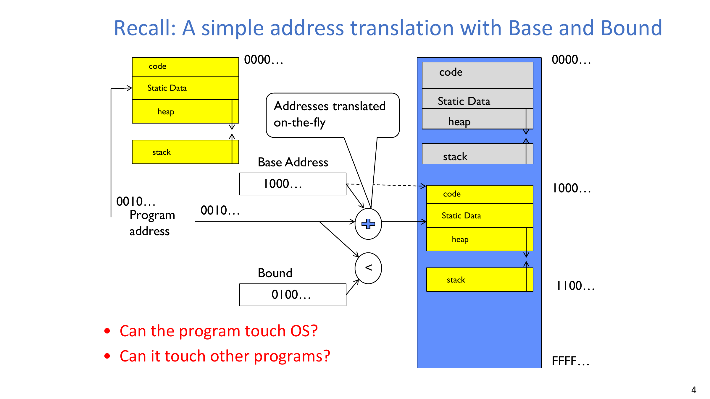

核心形式可写为：

$$
0 \le \text{Offset} < \text{Bound},\qquad \text{PhysicalAddress} = \text{Base} + \text{Offset}
$$

:::remark 关键问题：为什么线程课要先回顾内存保护？
**问题（原意复述）：Base-and-Bound 和线程/进程有什么关系？**

解答：
- 线程是执行实体，但执行一定发生在某个地址空间与保护模型中。
- 进程/线程抽象与内存抽象在真实系统里是耦合的。
- 没有保护，多线程/多进程程序在 bug 下会快速失控。
:::

## 2. 为什么需要线程：同时处理多件事

最直接动机是 **MTAO（multiple things at once）**：

- OS 内部要同时处理中断、进程工作、后台维护。
- 网络服务要并发处理多连接。
- UI 程序要在计算时保持交互响应。
- I/O 密集程序要隐藏网络/磁盘等待。

对应的 OS 抽象是：

- **线程是并发的基本执行单位**。

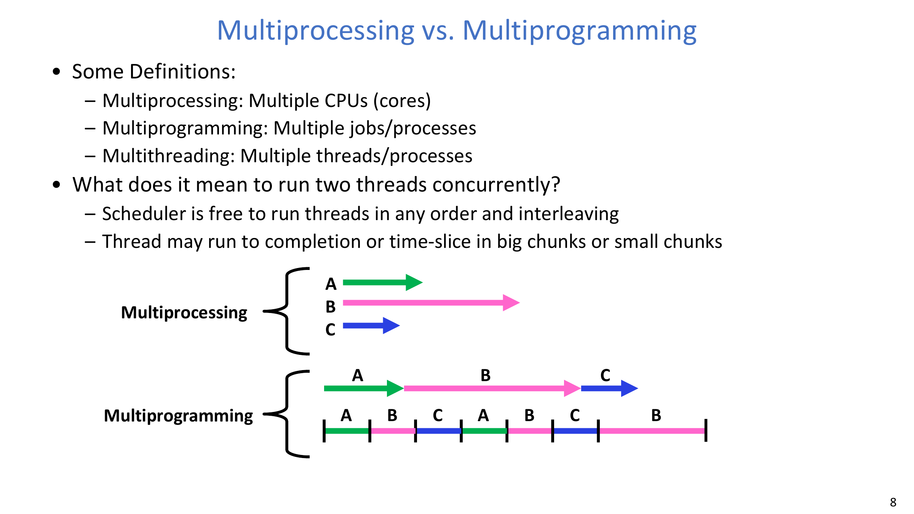

### 2.1 并发与并行

- **并发（Concurrency）**：把多个活动组织成可交错推进。
- **并行（Parallelism）**：在硬件上真正同时执行多个活动。

单核系统可以有并发，但不会有真正并行。

:::tip 关键问题：为什么这个区分在设计上重要？
**问题（原意复述）：既然不一定同时执行，为什么还要并发建模？**

解答：
- 因为正确性与响应性取决于交错行为，而不只取决于 CPU 核数。
- 并发首先是软件结构问题，并行只是硬件带来的加速能力。
:::

## 3. 从单执行流到多线程程序

单执行流程序可能被一个长任务“卡死”：

- 例如无限 `ComputePI()` 会让后续打印/UI逻辑无法推进。

改成线程后：

- `create_thread(taskA)` 与 `create_thread(taskB)` 可独立推进。
- 一个线程等待 I/O 时，另一个线程仍可保持交互或继续计算。

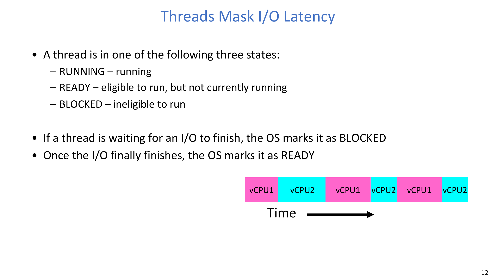

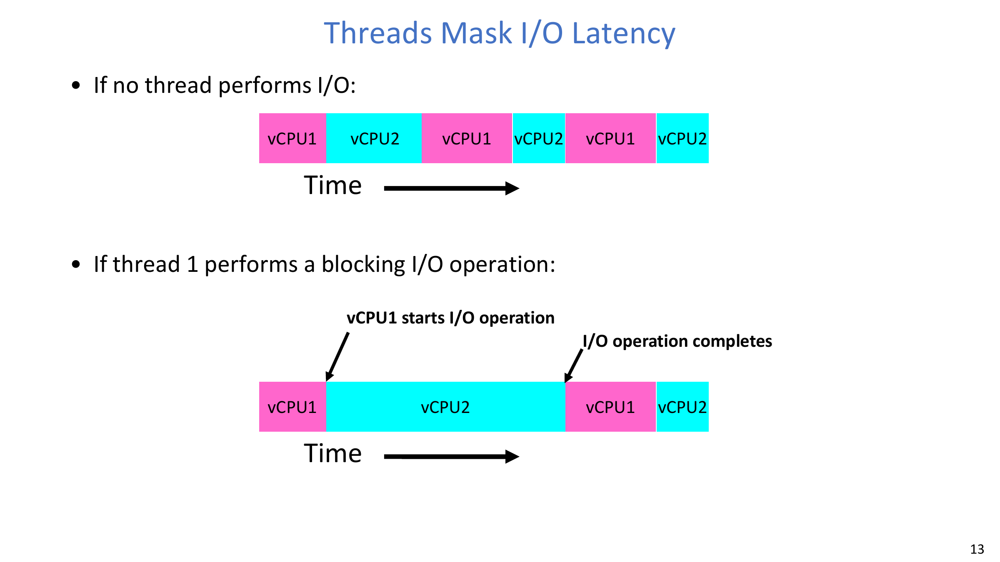

## 4. 线程 API 到内核机制的路径

程序员看到的是 `pthread_create` 这类 API。

实际发生的流程是：

1. 用户态库函数整理参数与元数据。
2. 通过 syscall trap 进入内核态。
3. 内核分配线程控制结构并交给调度器管理。
4. 返回用户态并把结果暴露给调用者。

本讲重点 API：

- `pthread_create(...)`
- `pthread_exit(...)`
- `pthread_join(...)`

典型并行分工骨架是 fork-join：

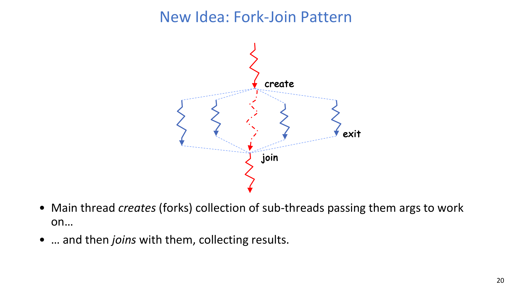

:::remark 关键问题：既然线程会结束，为什么还要 `pthread_join()`？
**问题（原意复述）：让子线程自己结束不就行了吗？**

解答：
- `join` 提供了同步点和生命周期归属。
- 它能稳定回收线程结束信息与返回值。
- 没有 `join`（或等价机制）时，顺序与资源回收更容易出错。
:::

## 5. 线程状态与执行栈

进程内共享状态包括：

- 代码段/全局数据/堆，
- 文件描述符与连接状态等 I/O 资源。

线程私有状态包括：

- 寄存器与程序计数器，
- 执行栈，
- 线程控制元数据（TCB）。

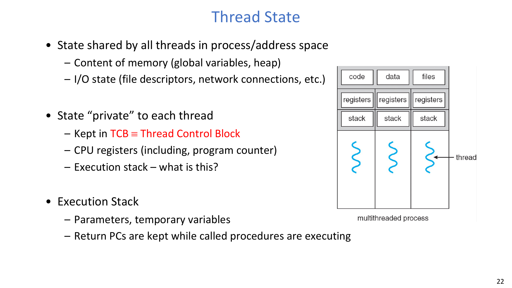

### 5.1 执行栈示例

递归示例展示了栈帧保存：

- 参数，
- 临时变量，
- 返回地址。

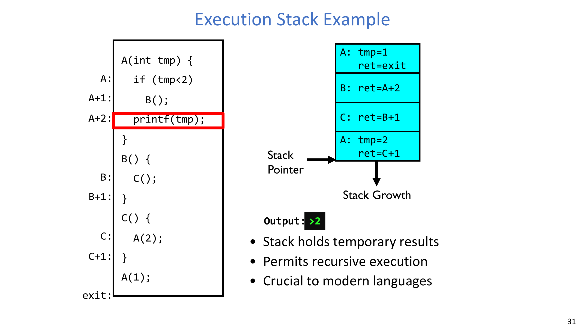

在示例交错下，输出按顺序变为：

- 先 `2`，再 `1`。

### 5.2 多线程进程内存布局

每个线程有自己的栈；堆/全局数据/代码由同一进程内线程共享。

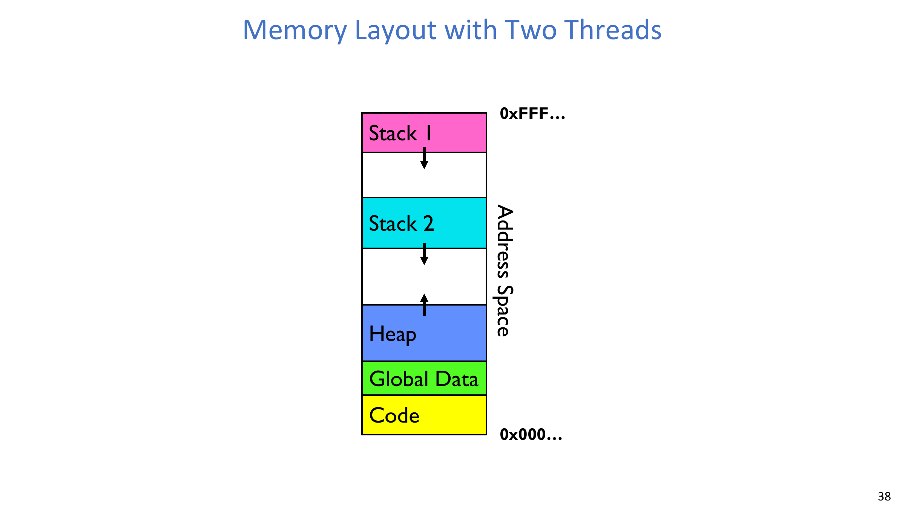

## 6. 交错执行、非确定性与正确性

线程抽象给程序员“好像有很多处理器”的错觉，但实际执行顺序由调度器决定。

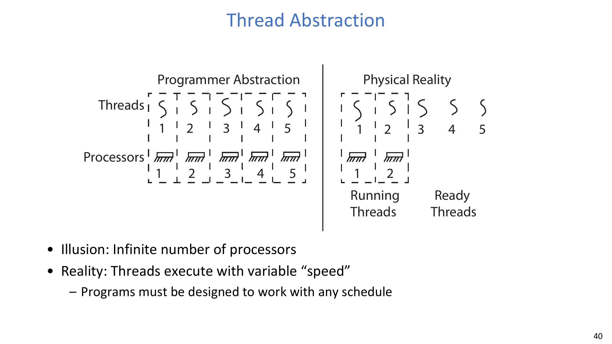

直接后果：

- 不同运行可能有不同执行顺序，
- 线程切换可能发生在许多指令边界，
- 测试偶尔通过并不代表线程安全。

独立线程与协作线程：

- 独立线程：无共享可变状态，可复现性更好。
- 协作线程：共享状态，必须显式设计正确性。

## 7. 竞态条件：交错改变结果

示例初始状态：

$$
x_0=0,\quad y_0=0
$$

线程更新：

$$
\text{Thread A: }x\leftarrow y+1
$$

$$
\text{Thread B: }y\leftarrow 2;\ \ y\leftarrow 2y
$$

`x` 的可能结果：

$$
x\in\{1,3,5\}
$$

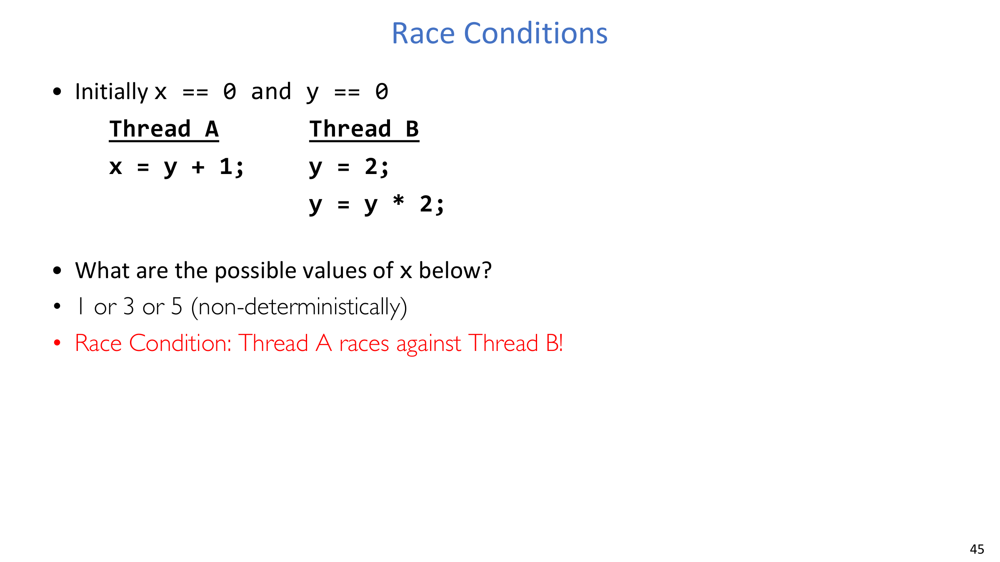

这类“所有调度都合法，但结果不稳定”的现象就是竞态。

:::warn 关键问题：为什么竞态不是“只是性能问题”？
**问题（原意复述）：调度本来就会变，为什么这算 bug？**

解答：
- 程序语义不应在未声明的情况下依赖偶然时序。
- 竞态破坏语义稳定性：同输入可能得不同输出。
- 它本质是正确性缺陷，不只是效率波动。
:::

## 8. 同步、互斥与锁

本讲同步术语：

- **Synchronization**：围绕共享状态进行协调。
- **Mutual Exclusion**：同一时刻只允许一个线程进入关键区。
- **Critical Section**：必须互斥执行的代码区段。
- **Lock**：表示互斥所有权的对象。

锁接口语义：

- `acquire`：等待并持有锁。
- `release`：释放锁。

在共享树结构插入/查询中使用锁保护：

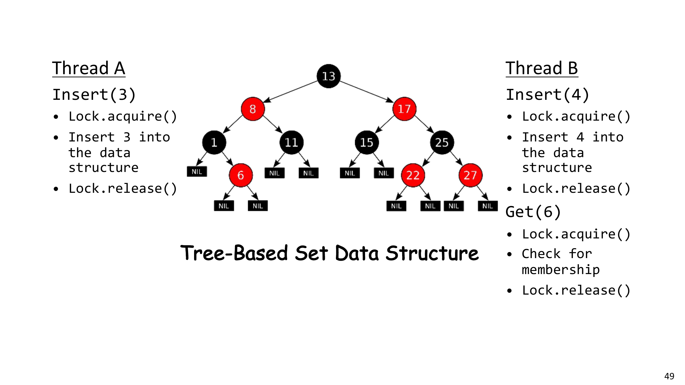

## 9. 信号量：更一般化的同步原语

信号量是非负整数，支持两个原子操作：

$$
P(S):\ \text{wait until }S>0,\ \text{then }S\leftarrow S-1
$$

$$
V(S):\ S\leftarrow S+1
$$

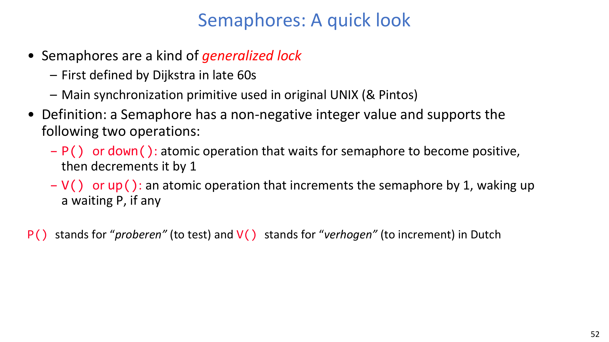

两类常见模式：

1. 二值信号量做互斥：

$$
S_{mutex}=1
$$

2. 线程完成通知（join/signal）：

$$
S_{join}=0
$$

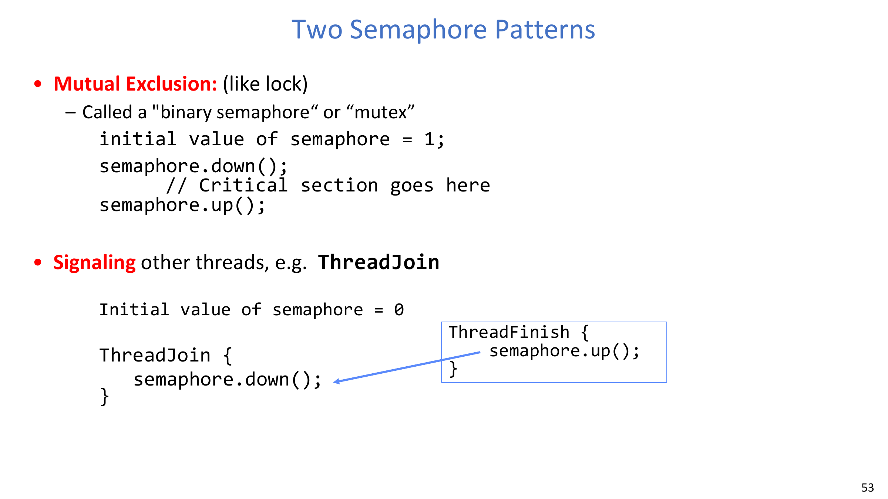

:::tip 关键问题：什么时候用信号量，什么时候用互斥锁？
**问题（原意复述）：二者都能做临界区保护，为什么要保留两个抽象？**

解答：
- 互斥锁最适合表达“独占所有权”。
- 信号量既能表达互斥，也能表达事件计数与线程通知。
- 选择应由协调语义决定，而不是只看表面 API。
:::

## 10. 进程抽象与进程管理 API

进程是受限权限的执行环境：

- 一到多个线程，
- 一个地址空间，
- 自身资源（FD、连接等），
- 与其他进程隔离。

### 10.1 `fork()` 语义

`fork()` 复制当前进程状态，形成 parent/child 两条执行路径。

$$
\text{fork()} > 0\Rightarrow\text{parent},\quad
\text{fork()} = 0\Rightarrow\text{child},\quad
\text{fork()} < 0\Rightarrow\text{error}
$$

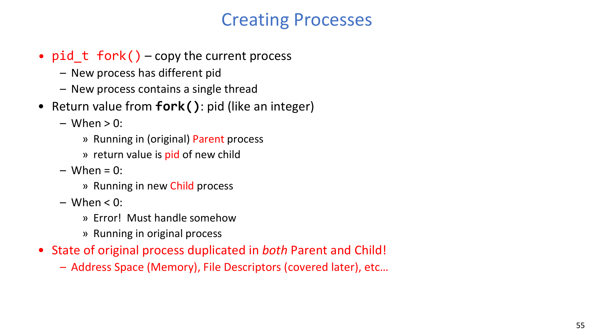

### 10.2 `fork` + `exec` + `wait`

典型 shell 启动流程：

- parent `fork`，
- child `exec` 替换程序映像，
- parent `wait` 同步子进程结束。

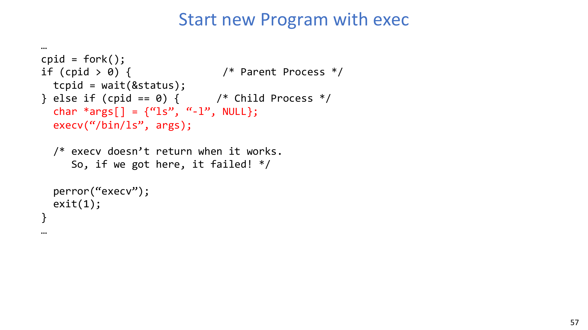

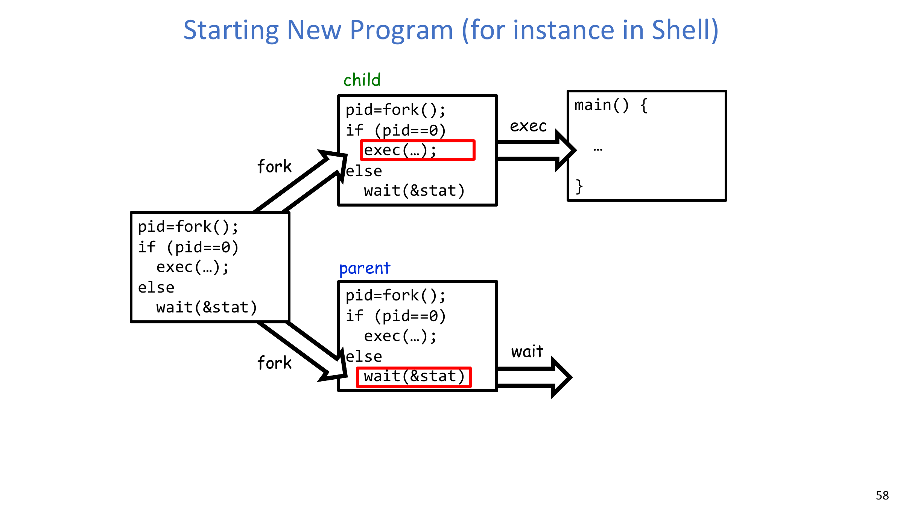

本讲总结 API：

- `exit`, `fork`, `exec`, `wait`, `kill`, `sigaction`。

:::remark 关键问题：为什么 `fork` 和 `exec` 要拆成两个步骤？
**问题（原意复述）：合并成一个系统调用不是更简单吗？**

解答：
- 拆分后，子进程可在 `exec` 前做定制准备（如重定向 FD、设置环境）。
- 同时支持“只 fork 不 exec”和“fork 后 exec”两类工作流。
- 这种组合式设计让 UNIX 进程控制更灵活。
:::

## 11. 为什么进程 API 和线程 API 长得不同

线程创建通常是库接口（如 `pthread_create`），运行在同一地址空间内。

进程管理则依赖系统调用（`fork/exec/wait`），因为它涉及地址空间边界与保护域变化。

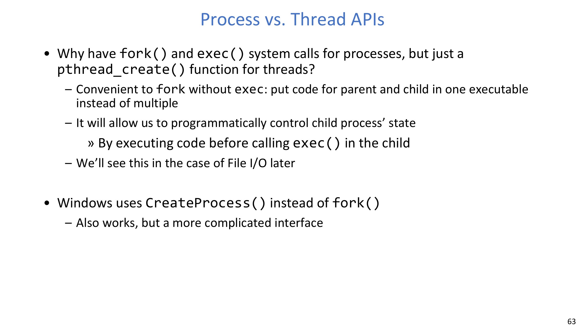

Windows 的 `CreateProcess` 是另一种封装，但本质任务仍是创建、装载、同步与隔离。

## 12. 讲义结论

- 线程是 OS 的并发执行单位；进程是带保护边界的执行环境。
- 非确定性交错是常态，正确性必须通过设计保证。
- 共享可变状态必须配合同步机制（锁/信号量）。
- 进程 API 决定程序生命周期与隔离边界的转换方式。

## 13. Exam Review

### 13.1 Must-Know Definitions

- **Thread**：进程内可被调度的执行上下文。
- **Process**：隔离的执行环境，包含资源与一个或多个线程。
- **Concurrency**：通过交错方式管理多个活动。
- **Parallelism**：多个活动在硬件上同时执行。
- **Race Condition**：结果依赖未同步的执行时序。
- **Critical Section**：必须互斥执行的代码。
- **Semaphore**：支持 `P/down` 与 `V/up` 的整数同步原语。

### 13.2 High-Value Short-Answer Templates

1. **为什么单核系统仍然需要线程？**  
   因为线程提供并发结构：可隐藏 I/O 等待、保持响应性，并在单核上通过交错推进多任务。
2. **为什么 `x = y + 1` 会和 `y = 2; y = y*2` 形成竞态？**  
   Thread A 读到的 `y` 取决于交错时机，导致 `x` 成为调度相关结果。
3. **为什么 shell 启动命令通常是 `fork` 后 `exec`？**  
   `fork` 先创建子上下文，子进程可做准备，再用 `exec` 装载目标程序，父进程可继续并 `wait` 同步。

### 13.3 Common Pitfalls

- 把“并发”误当作“必然并行”。
- 误以为某次测试通过就代表线程安全。
- 锁粒度过大导致无谓串行化。
- 在所有场景下把信号量和互斥锁混用。
- 忘记处理 `fork()<0` 或 `exec()` 失败路径。

### 13.4 Self-Check

:::tip 自检 1
给定两个线程和一个共享整数，构造一个结果可复现的交错，以及一个会导致竞态结果的交错。
:::

:::tip 自检 2
解释为什么同一进程中的线程必须有私有栈，但可以共享堆和全局数据。
:::

:::tip 自检 3
描述 shell 启动命令时 `fork`、`exec`、`wait` 的执行顺序，并说明 parent 与 child 各自执行什么。
:::
