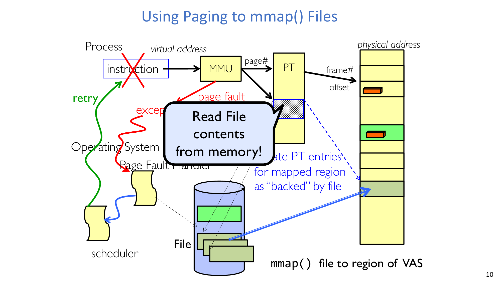
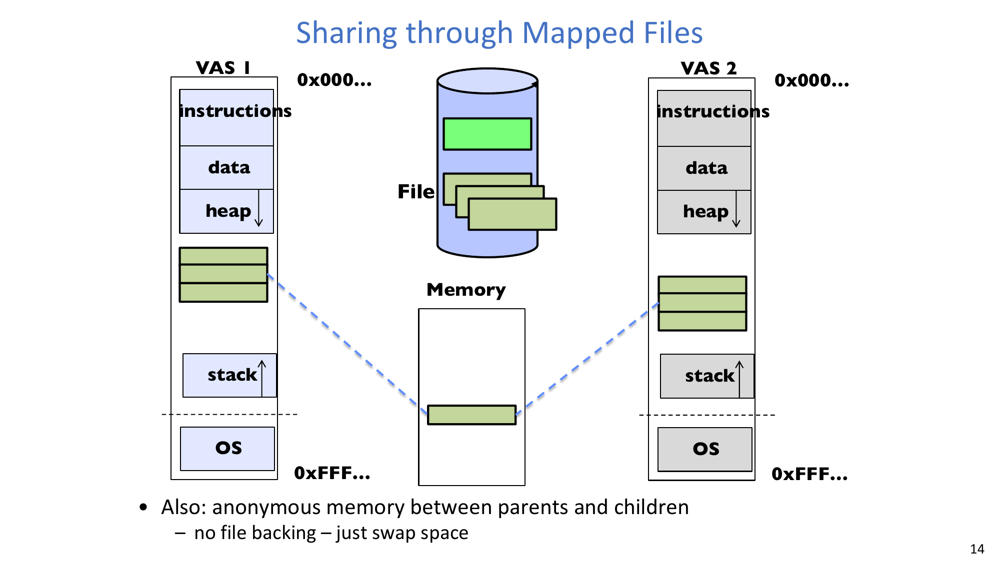
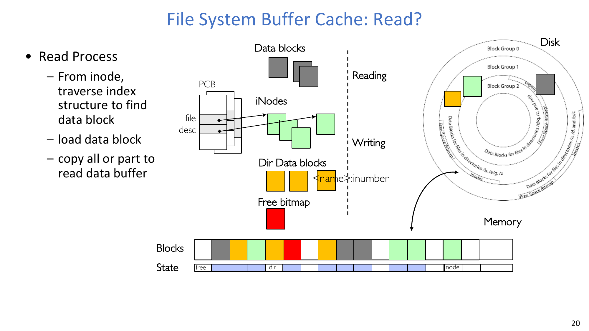
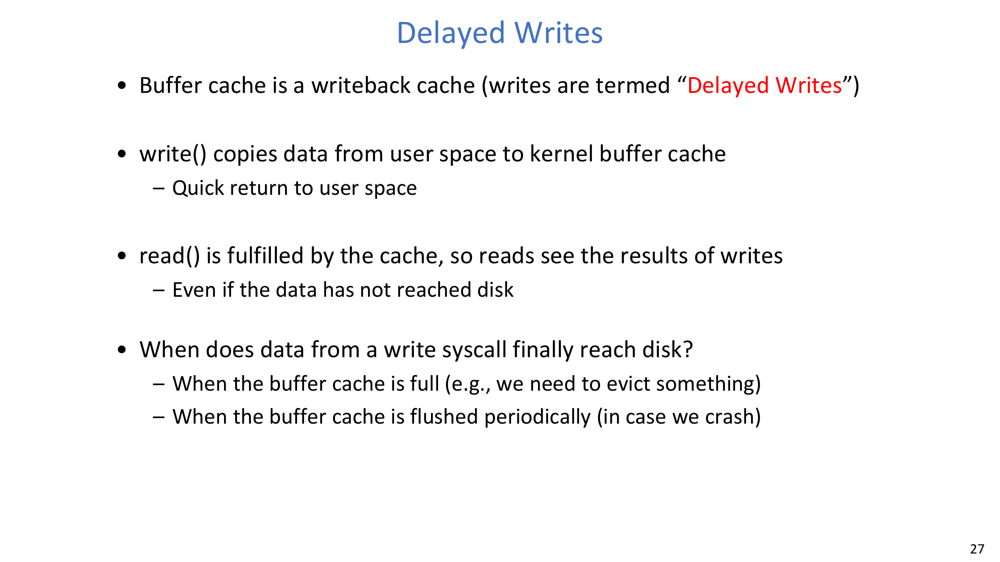
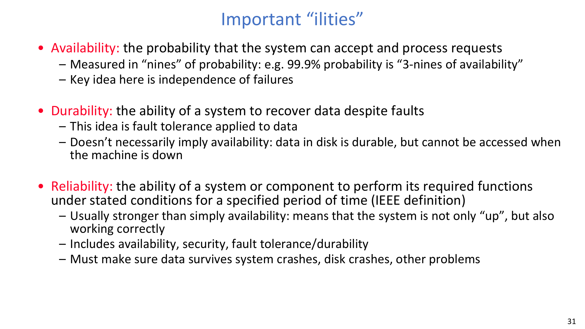
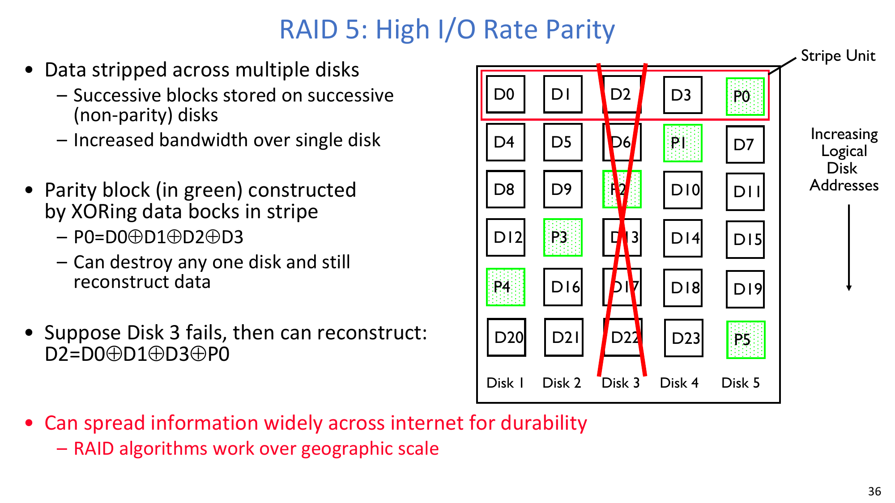
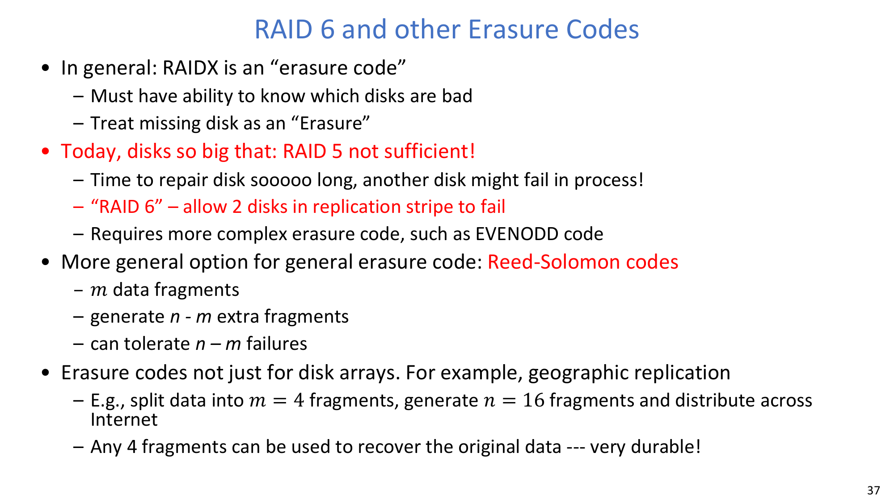
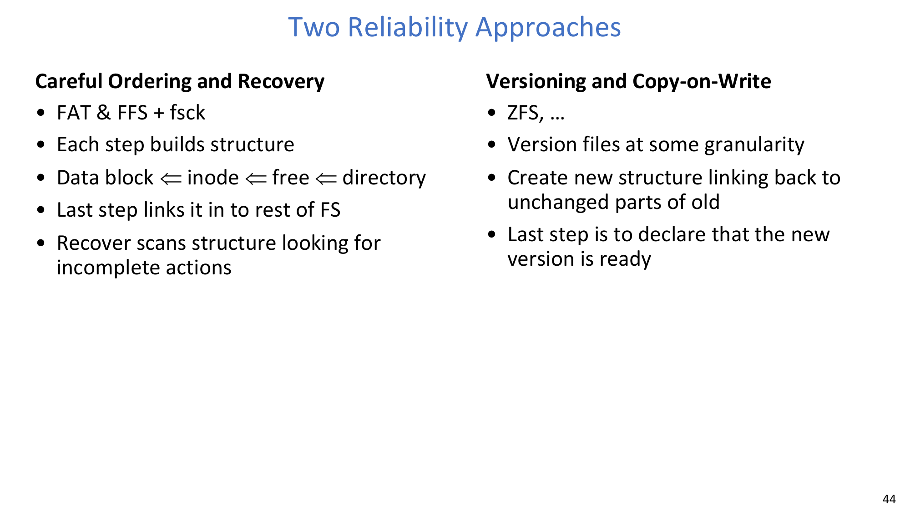
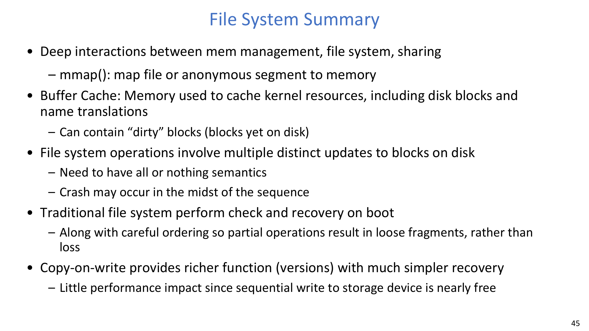

# Lecture 21: File System 3 - mmap, Buffer Cache, Durability, and Reliability

## Learning Objectives

By the end of this lecture, you should be able to:

1. Explain how `mmap()` turns file access into demand-paged memory access.
2. Trace buffer-cache behavior for `open`, `read`, `write`, and eviction.
3. Compare replacement, prefetching, and delayed-write policies in file-system caching.
4. Distinguish **availability**, **durability**, and **reliability** with system examples.
5. Derive RAID-5 parity recovery and explain why RAID-6 / erasure coding is needed.
6. Explain why durability alone is insufficient and how file-system consistency is preserved.

## 1. Bridge from Earlier File-System Designs to Reliability-Critical Execution

This lecture starts from a recap and then shifts focus from layout to correctness under failures.

- FAT, inode trees, FFS locality, and NTFS metadata all improve mapping and performance.
- But modern systems must also survive crashes, partial writes, and multi-block update interruption.
- So the focus expands from "where data is" to "what happens when execution stops halfway".

## 2. Memory-Mapped Files (`mmap`)

**Key definition:** **`mmap` maps a file (or anonymous region) into a process virtual address space.**

Once mapped:

- Access is via ordinary loads/stores to virtual addresses.
- Missing pages trigger page faults.
- The OS page-fault handler loads the required file-backed page and updates page-table entries.
- CPU retries the faulting instruction after mapping is installed.

**Key definition:** **`MAP_SHARED` allows updates to become visible across mappings and eventually to storage.**

:::remark Key Question: Why can `mmap` replace explicit `read`/`write` in some workloads?
**Question (original intent): If we map file pages into VAS, what work disappears from user code?**

Answer:
- User code no longer manually copies through explicit read buffers.
- Access path becomes demand paging plus memory reference.
- The kernel still performs I/O, but on page-fault path instead of explicit `read` syscall path.
:::

## 3. Buffer Cache Internals: `open`, `read`, `write`, and Eviction

**Key definition:** **Buffer cache is memory used to cache kernel file-system resources (data blocks, inodes, directory blocks, free-map metadata).**

Operationally:

- `open`: traverse directories, resolve `<name -> inumber>`, and build open-file state.
- `read`: resolve inode/index blocks, fetch data block, copy requested bytes to user buffer.
- `write`: update cache-resident blocks; may allocate new blocks and update metadata.
- Eviction: choose victim blocks when cache is full; dirty victims require writeback before reuse.

The slide sequence emphasizes transient block states (`free`, `in-use`, `being-read`, `dirty`, `being-written`) managed entirely in OS software.

:::warn Key Question: Why can `write()` return before data reaches disk?
**Question (original intent): When does data from a write syscall finally reach persistent media?**

Answer:
- Buffer cache is a write-back cache.
- `write()` often completes after copying into kernel cache.
- Flush happens later (periodic flush, pressure-driven eviction, explicit sync calls).
- This improves latency but creates a crash window.
:::

## 4. Caching Policy, Prefetching, and Delayed Writes

### 4.1 Replacement Policy

The lecture uses LRU as the baseline for file blocks.

- Strength: strong locality capture when working set fits memory.
- Weakness: one-pass scans can pollute cache and evict useful blocks.
- Practical systems often expose hints (for example, "use once") to mitigate scan pollution.

### 4.2 Cache Size Boundary

A core systems tradeoff:

- Too much memory for buffer cache starves virtual memory for processes.
- Too little memory for buffer cache increases disk I/O for file access.
- Good systems dynamically rebalance the boundary based on observed pressure.

### 4.3 Read-Ahead Prefetching

- Read-ahead exploits sequential access by fetching future blocks early.
- Too aggressive prefetching delays other workloads.
- Too conservative prefetching loses seek-merging opportunities.

### 4.4 Delayed Write Tradeoff

- Advantage: low write latency, better batching, better physical write ordering.
- Risk: dirty cache blocks can be lost on crash unless flushed/persisted safely.

:::tip Key Question: Why periodically flush dirty blocks even if recently used?
**Question (original intent): Why break pure LRU behavior in buffer cache?**

Answer:
- Pure recency does not capture durability risk.
- Periodic writeback bounds potential data loss window.
- So buffer-cache policy is jointly a performance and reliability policy.
:::

## 5. Important "ilities": Availability, Durability, Reliability

**Key definition:** **Availability is the probability that the system accepts and processes requests.**

**Key definition:** **Durability is the ability to recover previously stored data despite faults.**

**Key definition (IEEE intent in slide):** **Reliability is the ability to perform required functions correctly over time under stated conditions.**

Practical distinction:

- Availability answers "is it up now?"
- Durability answers "does data survive faults?"
- Reliability is broader: correctness + availability + security/fault tolerance dimensions.

## 6. Making File Systems More Durable: ECC, NVRAM, RAID, Erasure Codes

### 6.1 Short-Term Durability

- ECC in storage blocks helps recover from small media defects.
- Battery-backed non-volatile memory (NVRAM) can protect dirty data before flush.
- Replication avoids single-copy data loss.

### 6.2 RAID and Parity Recovery

RAID-5 stripe parity:

$$
P_0 = D_0 \oplus D_1 \oplus D_2 \oplus D_3
$$

If one data disk block is missing (for example `D_2`):

$$
D_2 = D_0 \oplus D_1 \oplus D_3 \oplus P_0
$$

### 6.3 Why RAID-6 / Erasure Coding

As capacity grows, rebuild windows get longer, so second failure risk increases during recovery.

General erasure-code view from the lecture:

$$
\text{parity fragments} = n-m
$$

$$
\text{failure tolerance} = n-m
$$

Example cited in class:

$$
m=4,\quad n=16
$$

Meaning: any 4 fragments can reconstruct the original object (MDS-style setting discussed in slide).

:::remark Key Question: Why does "multiple copies" alone not guarantee high durability?
**Question (original intent): What is the role of independence of failures?**

Answer:
- Copies on the same failure domain can fail together.
- True durability requires failure-domain separation (disk, controller, server, rack, region).
- Erasure coding plus geographic spread improves long-term survival probability.
:::

## 7. Reliability Beyond Durability: Crash Consistency Problem

A logical file operation can touch many physical blocks:

- inode / indirect blocks / data blocks / allocation bitmap / directory entries
- lower-level remapping may further split physical updates

If crash happens mid-sequence:

- some writes may persist while others are lost
- metadata pointers can become inconsistent
- reachable namespace and allocated blocks can diverge

This is why reliability requires consistency guarantees, not just redundancy.

:::error Key Question: Why is RAID not enough for file-system reliability?
**Question (original intent): If one disk in a RAID group is not written before crash, what happens?**

Answer:
- RAID protects against certain media/device failures.
- It does not automatically enforce multi-block atomicity of file-system updates.
- You can still persist a logically inconsistent state after interrupted update sequences.
:::

## 8. Two Reliability Approaches in File Systems

### 8.1 Careful Ordering + Recovery Scan (traditional FAT/FFS style)

- Construct updates in a safe order so partial completion is recoverable.
- Keep final "link into namespace" as last critical step.
- On reboot, recovery tool (`fsck`-style) scans for incomplete actions and repairs.

### 8.2 Versioning + Copy-on-Write (ZFS-style family)

- Build a new consistent version that references old unchanged blocks.
- Commit by atomically switching root/metadata pointer to new version.
- Recovery is simpler because old version remains valid until commit point.

:::tip Key Question: Why can copy-on-write simplify crash recovery?
**Question (original intent): Why is "declare new version ready" a powerful final step?**

Answer:
- Old committed state stays readable during construction.
- Crash before final pointer switch leaves old state intact.
- Crash after switch exposes fully connected new state.
:::

## Exam Review

### A. High-Value Definitions

- **`mmap`**: map file/anonymous region into VAS; page-fault path brings data on demand.
- **Buffer cache**: kernel-managed cache of file-system blocks and metadata.
- **Delayed write (write-back)**: `write()` completion before physical persistence.
- **Availability / Durability / Reliability**: up-ness / data survival / correct service over time.
- **RAID parity and erasure coding**: redundancy schemes trading capacity, performance, and failure tolerance.

### B. Mechanism Chains You Should Be Able to Reproduce

1. `mmap` access miss -> page fault -> OS handler -> disk read -> PT update -> retry.
2. `open` path lookup -> inode resolution -> fd state binding.
3. `write` -> dirty cache block -> periodic/pressure flush -> persistence (or crash window).
4. RAID-5 recovery by XOR when one block is missing.
5. Crash-consistency protection via ordered updates or COW version commit.

### C. Short-Answer Templates

- Why delayed writes?
  - Lower latency and better write scheduling; tradeoff is bounded crash window.
- Why not maximize buffer cache size?
  - Must balance process memory and file-cache hit rate dynamically.
- Why RAID is not full reliability?
  - Redundancy against disk loss is different from consistency across multi-block FS updates.
- Why COW helps?
  - Commit boundary converts many writes into one atomic visibility switch.

### D. Common Misconceptions

- "Durable means always available" -> false.
- "RAID means crash-safe metadata" -> false.
- "LRU alone is enough for buffer cache" -> false (durability-driven flush policy matters).

### E. Self-Check List

- Can you derive RAID-5 recovery equation from XOR properties?
- Can you explain one realistic inconsistency caused by interrupted metadata update?
- Can you compare fsck-style repair and COW-style commit in one minute?
- Can you justify when `mmap` is better than explicit `read`/`write`?
