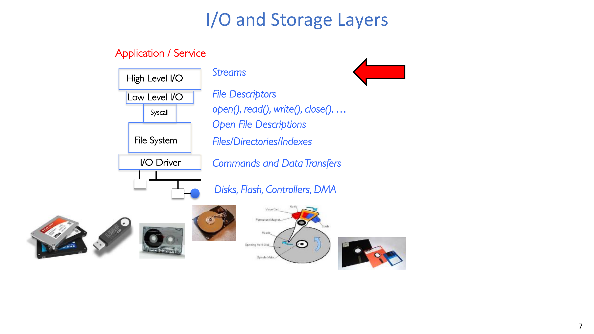
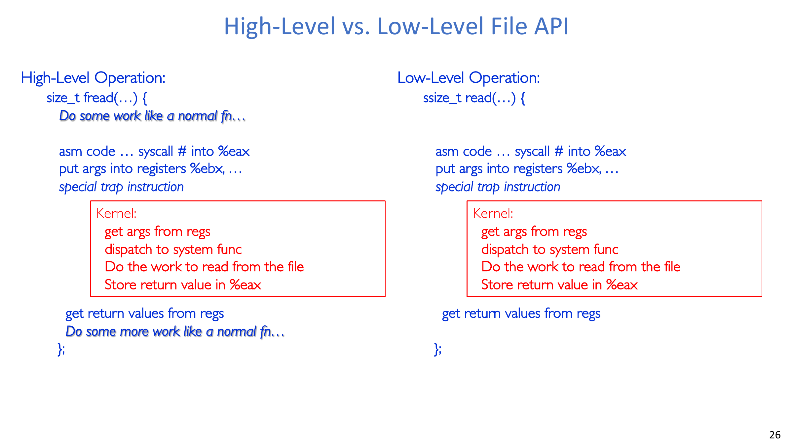
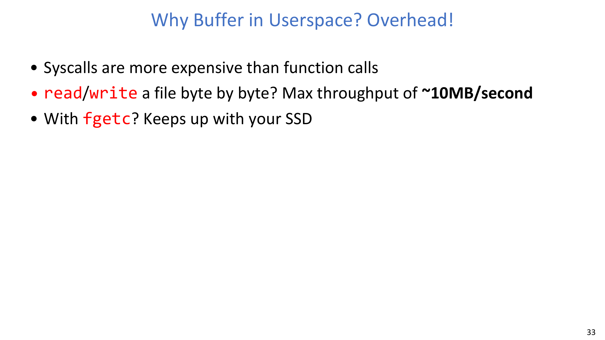
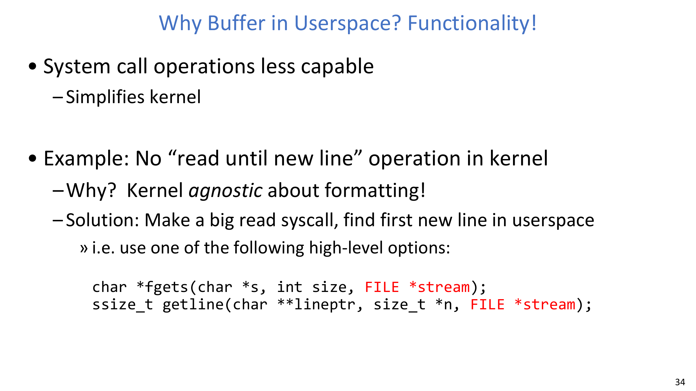
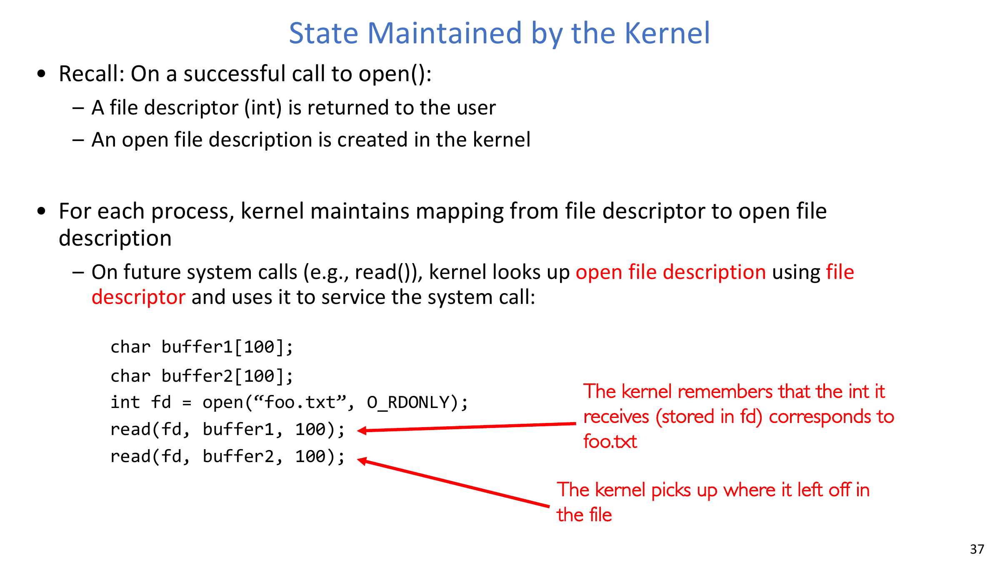
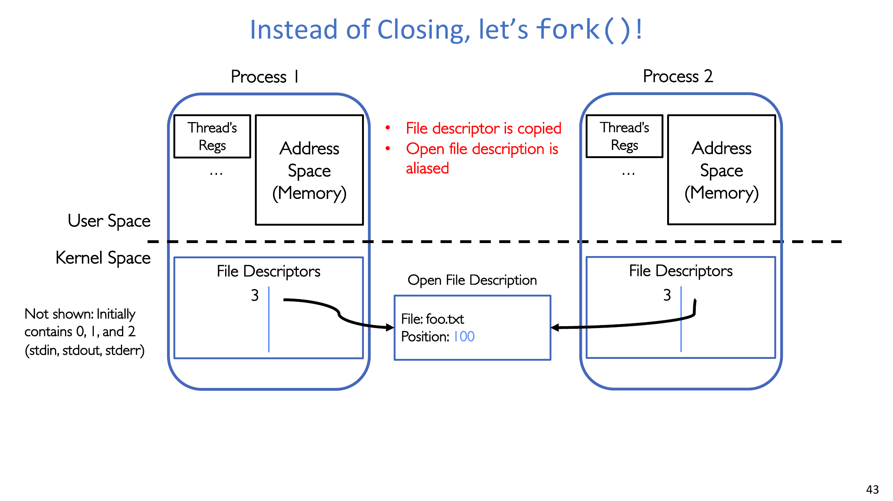
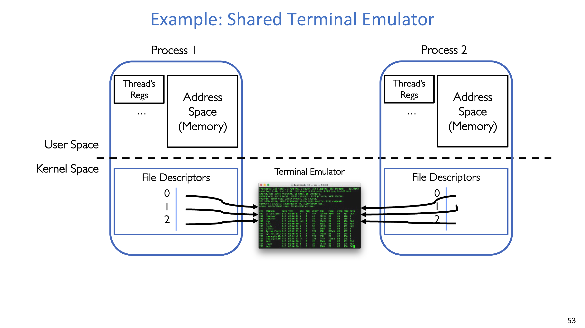
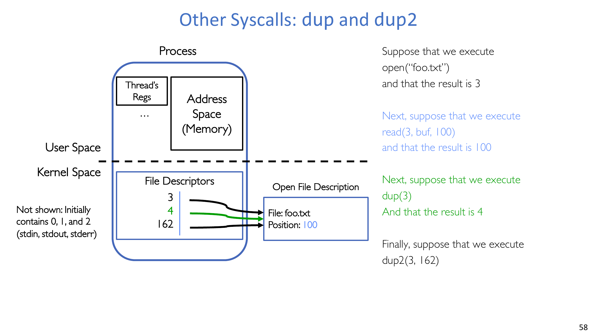
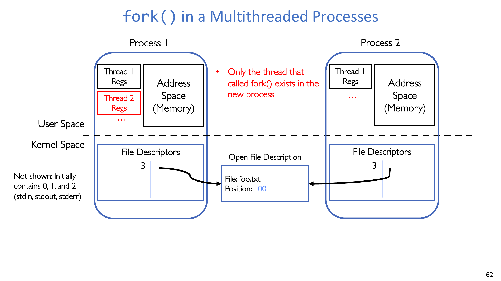
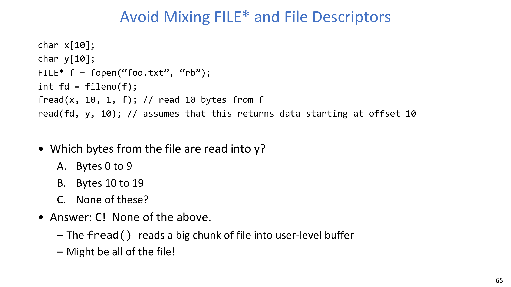

# 第 3 讲：抽象 2——文件与 I/O（程序员视角）

## 学习目标

学完本讲后，你应该能够：

1. 解释 POSIX 文件抽象，以及“万物皆文件”的意义。
2. 区分 C 语言高层流式 API（`FILE*`）与底层 POSIX 描述符 API（`int fd`）。
3. 理解使用流式 I/O 时，缓冲、可见性与正确性之间的关系。
4. 描述描述符 I/O 背后的内核状态模型。
5. 解释 `fork`、`dup`、`dup2` 下的“描述符复制 + 打开文件描述别名”语义。
6. 识别多线程场景下 `fork()` 的风险边界与安全用法。
7. 避免在同一底层文件上混用 `FILE*` 与原始 fd 所导致的正确性 bug。

## 1. 核心思想：万物皆文件

Unix/POSIX 的设计目标是接口统一：

- 磁盘文件，
- 设备（终端/打印机），
- socket/pipe，
- 以及许多其他 I/O 对象，

都尽量通过以 `open/read/write/close` 为中心的统一接口族来操作。

:::remark 关键问题：为什么“万物皆文件”是一个重要思想？
**问题（原意复述）：为什么要把磁盘文件、设备、网络端点这类不同对象统一成一种 API 风格？**

解答：
- 它显著降低了应用程序员的心智负担与实现复杂度。
- 它让程序组合（`producer | filter | consumer`）更自然，因为 I/O 端点语义一致。
- 它允许 OS 在抽象下做优化，而不需要改动上层代码结构。
:::

## 2. I/O 栈与两层 API

从上到下可分为：

- 应用/服务逻辑
- 高层流式 API（`FILE*`）
- 底层描述符 API（`int fd`）与系统调用边界
- 打开文件描述（OFD）与文件系统层
- 驱动与设备层

这也解释了为什么系统同时保留“易用 API”和“精确控制 API”。

## 3. 高层 API（`FILE*`）：流、易用性与语义

高层 C I/O（`stdio.h`）常见接口包括：

- `fopen/fclose`
- `fgetc/fputc`、`fgets/fputs`
- `fread/fwrite`
- `fprintf/fscanf`
- `fseek/ftell/rewind`

标准流是预打开的：

$$
\text{STDIN\_FILENO}=0,\quad \text{STDOUT\_FILENO}=1,\quad \text{STDERR\_FILENO}=2
$$

块操作的计量模型：

$$
\text{bytes requested by }\operatorname{fread}/\operatorname{fwrite}
= \text{size\_of\_elements}\times \text{number\_of\_elements}
$$

流位置模型（`fseek`）：

$$
\text{pos}_{\text{new}}=
\begin{cases}
\text{offset}, & \text{whence}=\text{SEEK\_SET}\\
\text{pos}_{\text{cur}}+\text{offset}, & \text{whence}=\text{SEEK\_CUR}\\
\text{pos}_{\text{end}}+\text{offset}, & \text{whence}=\text{SEEK\_END}
\end{cases}
$$

:::tip 关键问题：`FILE*` 作为“高层 API”到底多了什么？
**问题（原意复述）：如果最终都要进内核，为什么还要流式 API，而不直接全用 `read/write`？**

解答：
- 提供更好的可用性（格式化 I/O、按行读取、缓冲封装）。
- 在大量小 I/O 场景中，用户态缓冲通常有更好性能。
- 对文本与结构化 I/O 任务，接口表达更直接。
:::

## 4. 底层 API（`int fd`）：原始系统调用接口

底层 POSIX I/O 提供对描述符和内核偏移的精确控制：

$$
fd = \operatorname{open}(\text{filename},\text{flags}[,\text{mode}]),\quad
fd\ge 0\Rightarrow \text{success},\; fd<0\Rightarrow \text{error}
$$

$$
n = \operatorname{read}(fd,\text{buf},\text{maxsize}),\quad
n\in\{-1\}\cup[0,\text{maxsize}],\quad
n=0\Rightarrow \text{EOF},\; n=-1\Rightarrow \text{error}
$$

$$
m = \operatorname{write}(fd,\text{buf},\text{size}),\quad
m\in\{-1\}\cup[0,\text{size}]
$$

常见描述符相关接口还包括 `dup`、`dup2`、`pipe`、`fileno`、`fdopen`，以及设备相关的 `ioctl` 风格操作。

## 5. 高层 vs 底层：同一内核路径，不同语义契约

两类 API 最终都会 trap 到内核。

真正差别不在“是否进内核”，而在于：

- 谁管理缓冲与格式化等增强逻辑，
- 你是否需要精确控制 I/O 时机与偏移，
- 该代码路径是以易用性优先，还是以可控性优先。

## 6. 为什么需要用户态缓冲

主要有两个动机：

1. 降低开销：系统调用昂贵，批量化有助于吞吐。
2. 提升能力：内核保持通用字节语义，高层在用户态叠加丰富操作。

课件中的性能观察：

$$
\text{byte-by-byte syscall throughput}\approx 10\,\text{MB/s}
$$

关于 `FILE*` 的正确性规则：

- 不要假设数据可见性时机“天然正确”。
- 若协议要求某时刻可见，需要主动 `fflush`。
- `fclose` 会在关闭前 flush。

:::warn 关键问题：为什么两个 `FILE*` 打开同一文件时会出现“看起来反直觉”的结果？
**问题（原意复述）：为什么后续 `fread` 可能暂时看不到刚刚 `fwrite` 的数据？**

解答：
- 流写入可能还停留在用户态缓冲区。
- 另一个读取端看到新数据可能要等到 flush 发生。
- 只要顺序语义重要，就应显式建立 flush/sync 点。
:::

## 7. 内核状态模型：fd 到 OFD 的映射

关键区分：

- **File descriptor（fd）**：进程私有的整数句柄。
- **Open file description（OFD）**：内核对象，记录文件身份、当前偏移等状态。

成功读后的偏移推进：

$$
\text{pos}_{k+1}=\text{pos}_{k}+n_k,\quad n_k>0
$$

因此，连续 `read(fd, ...)` 会从上次结束位置继续。

## 8. `fork()`：fd 复制、OFD 别名与共享推进

在继承描述符的 `fork` 之后：

$$
\text{OFD}_{\text{parent}}\equiv\text{OFD}_{\text{child}}
$$

含义是：

- 描述符号值会复制到子进程描述符表，
- 两个进程可能引用同一个内核 OFD 状态，
- 一方推进偏移会影响另一方后续读取位置。

:::remark 关键问题：为什么 OFD 别名是有价值的，而不是默认彻底复制内核文件状态？
**问题（原意复述）：为什么不让 parent/child 默认拥有完全独立的文件状态？**

解答：
- `fork` 后常常正需要共享资源（管道、终端、继承文件）。
- 它支持低成本的进程协作与重定向模式。
- 生命周期语义清晰：最后一个引用该 OFD 的描述符关闭后才真正释放。
:::

## 9. 共享终端示例与描述符继承

典型行为：

- parent 与 child 都继承 `0/1/2`，
- 双方都可对同一终端端点读写，
- 一方关闭自己的 `0`，不会自动关闭另一方的 `0`。

这正是 shell 与 IPC 场景中常见行为的基础。

## 10. `dup` 与 `dup2`：显式复制描述符

核心关系：

$$
fd' = \operatorname{dup}(fd),\quad
\operatorname{dup2}(fd,fd_t)=fd_t,\quad
\text{OFD}(fd')\equiv\text{OFD}(fd_t)\equiv\text{OFD}(fd)
$$

解释：

- 新旧描述符号值不同，但底层 OFD 相同。
- 非常适合做 `stdin/stdout/stderr` 的重定向绑定。

## 11. 多线程 `fork()`：风险边界

关键事实：

$$
\#\text{threads in child after }\operatorname{fork}=1
$$

子进程只保留调用 `fork` 的那条线程，其他线程直接消失。

:::error 关键问题：为什么多线程进程里 `fork()` 容易出事？
**问题（原意复述）：如果消失的线程正持有锁或更新共享结构，会怎样？**

解答：
- 子进程可能继承到“锁状态不一致”的现场。
- 共享数据结构可能停在“更新到一半”的状态。
- 安全做法是在 child 中尽快 `exec()`（替换地址空间），除非你非常确定后续动作安全。
:::

## 12. 陷阱：不要随意混用 `FILE*` 与原始 fd

`FILE*` 自带用户态缓冲与策略。

因此下面这种直觉并不可靠：

- “`fread(..., f)` 之后，`read(fileno(f), ...)` 会从我预期的位置继续。”

课件示例中正确答案是“none of the above”，因为流层预取可能让你对偏移/可见性的直觉失效。

$$
\text{Do not assume }\operatorname{fread}(\cdot)\text{ advances visibility exactly as a subsequent }\operatorname{read}(fd,\cdot)\text{ expectation.}
$$

## 13. 设计建议：什么时候用哪一层 API

高层流式 API 更适合：

- 文本/按行/格式化 I/O 占主导，
- 以可读性和开发效率优先，
- 缓冲行为可接受或已被显式管理。

底层描述符 API 更适合：

- 需要精确偏移与时序控制，
- 需要与 `fork/exec/dup2/pipe` 深度组合，
- 实现运行时、shell、系统组件等底层模块。

:::tip 关键问题：真实系统里应该如何设计文件 API？
**问题（原意复述）：高层与底层不是二选一，如何组合才是好设计？**

解答：
- 保持一个稳定、简洁的底层核心（`open/read/write/close` + 描述符操作）。
- 在其上叠加高层封装，但要明确同步/flush 边界。
- 清楚写出可见性和缓冲契约，避免语义惊喜。
:::

## 14. 本讲结论

- POSIX 通过“文件抽象”统一了大量 I/O 对象。
- `FILE*` 与 `fd` 都能到达内核，但语义契约不同。
- 缓冲提升性能与功能，同时引入必须管理的可见性语义。
- 描述符复制会与 OFD 别名结合，能力强但细节微妙。
- 多线程场景中的 `fork` 需要非常严格的纪律。
- 在同一文件上盲目混用高层/底层 I/O 很容易产生隐蔽 bug。

## 15. Exam Review

### 15.1 Must-Know Definitions

- **File Descriptor（fd）**：进程私有的内核 I/O 整数句柄。
- **Open File Description（OFD）**：内核中的“已打开实例状态”（文件身份 + 当前偏移 + 相关标志/状态）。
- **Stream（`FILE*`）**：用户态封装，包含描述符、缓冲、元数据与并发保护。
- **Buffering（缓冲）**：通过批量搬运数据，减少 syscall 开销并提供高层功能。
- **Aliasing（本讲语境）**：多个描述符/进程引用同一个 OFD。

### 15.2 High-Value Short-Answer Templates

1. **为什么同时需要 `FILE*` 和 `fd` 两层 API？**  
   `FILE*` 提供易用性与常见场景性能，`fd` 提供精确控制并可与进程原语灵活组合。
2. **`fork` 后文件状态里“复制了什么、共享了什么”？**  
   描述符表项被复制，但可能别名同一个 OFD，所以偏移等状态会共享。
3. **为什么不建议在同一底层文件上混用 `fread` 与 `read`？**  
   `FILE*` 的用户态缓冲会破坏你对原始 fd 偏移与可见性的朴素假设。
4. **为什么多线程进程中 `fork` 风险高？**  
   child 只保留一条线程，消失线程留下的锁/数据不变量可能被破坏。

### 15.3 Common Pitfalls

- 误以为不 flush 时流写入也会立刻可见。
- 忽略 partial read/write 与返回值检查。
- 对 `fork/dup` 后“fd 复制 vs OFD 别名”理解不清。
- 未做同步策略就混用 `FILE*` 与原始 fd。
- 多线程进程 `fork` 后在 child 中做复杂逻辑而不是尽快 `exec`。

### 15.4 Self-Check

:::tip 自检 1
给定一个已打开文件和 `fork` 出来的两个进程，解释为什么其中一个进程的读取会影响另一个进程下一次读取结果。
:::

:::tip 自检 2
分别给出一个适合 `FILE*` 的场景和一个适合原始描述符 API 的场景，并各用一句话说明理由。
:::

:::tip 自检 3
你需要在 `exec` 前把 child 的 stdout 重定向到文件。说明为什么 `dup2` 是最自然的原语。
:::
