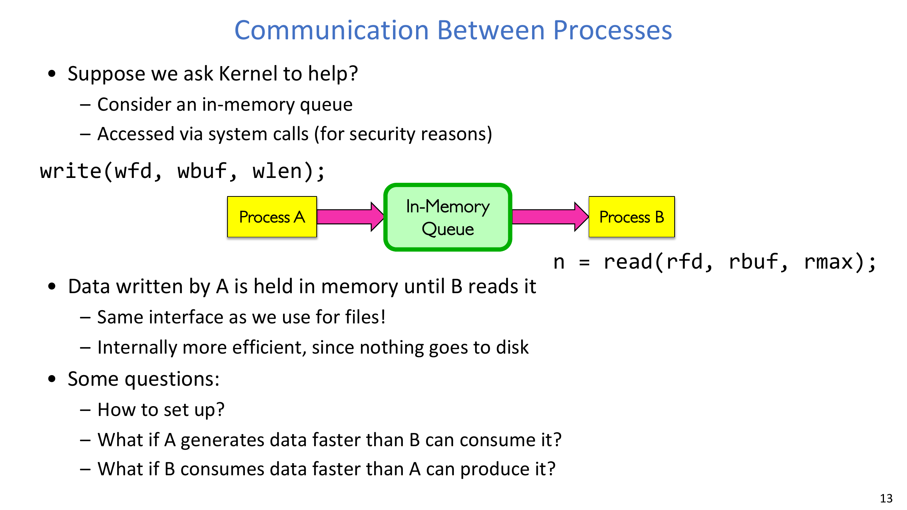
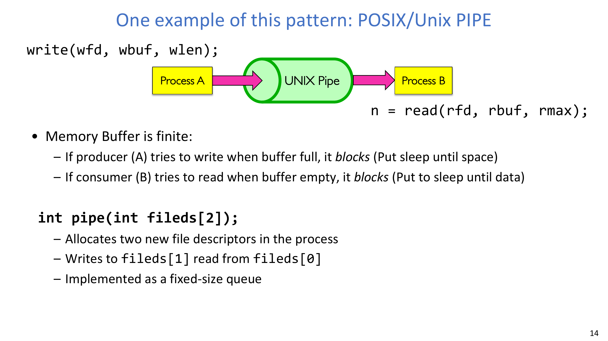
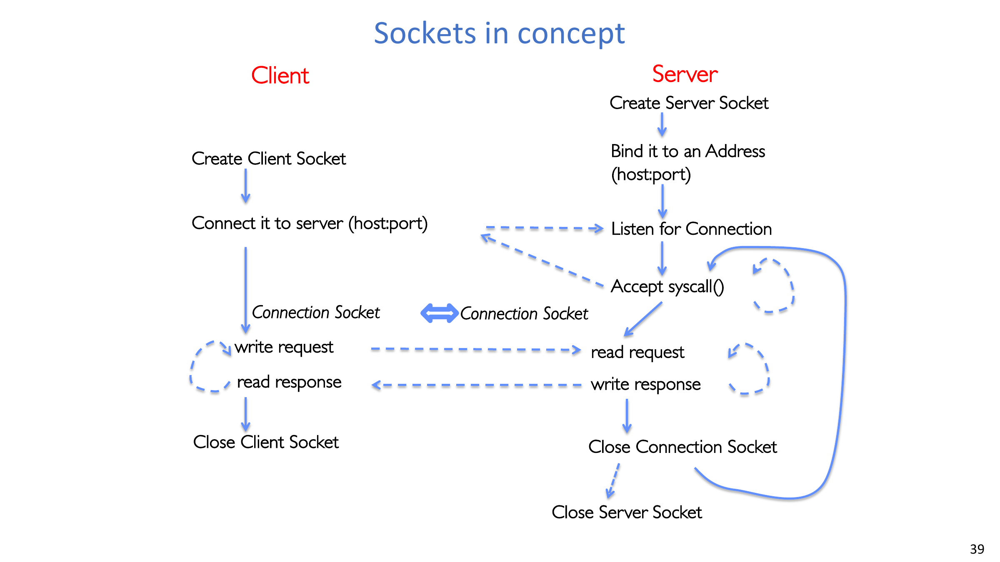
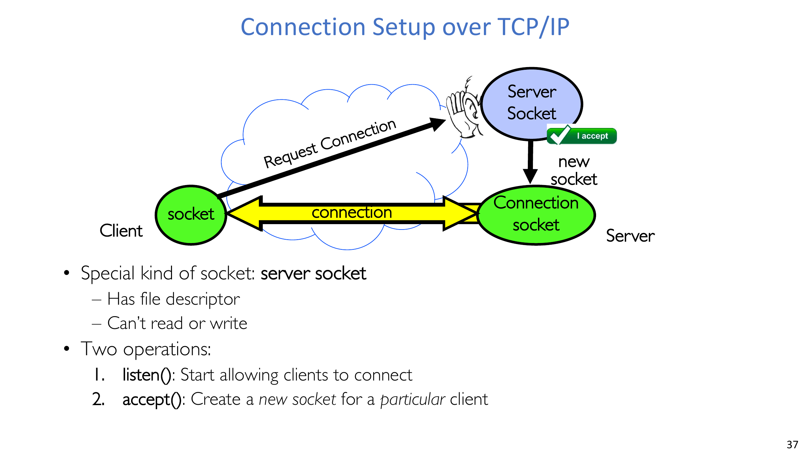
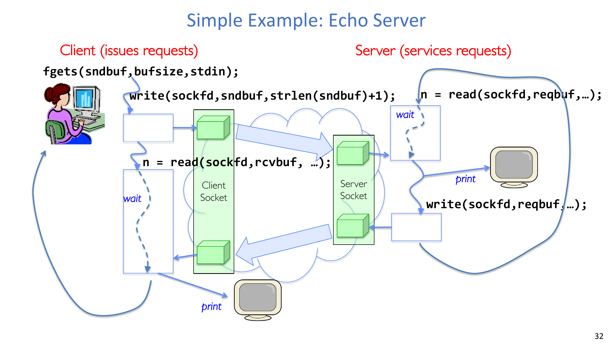
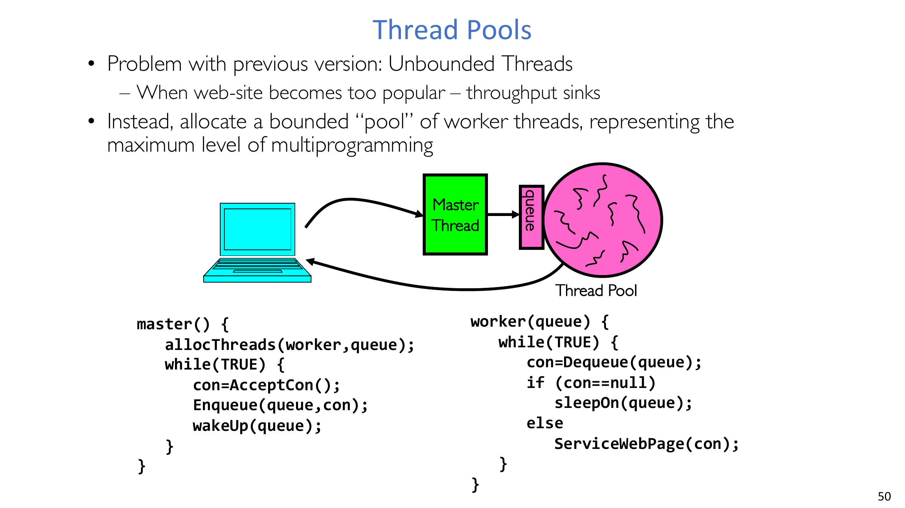

# 第 4 讲：抽象 3——IPC、管道与套接字（程序员视角）

## 学习目标

学完本讲后，你应该能够：

1. 解释 **进程间通信（IPC）**，并理解为什么进程隔离让它并不简单。
2. 对比基于文件通信、基于内存队列通信与 POSIX 管道通信。
3. 正确分析管道的阻塞行为、EOF 语义与 `SIGPIPE` 触发条件。
4. 从语法、语义和状态机角度定义“协议”。
5. 解释 socket 抽象为何能以“文件描述符 I/O”的方式支持网络通信。
6. 说明 TCP/IP 通信中的命名机制：主机名、IP 地址、端口号。
7. 走通 `socket/bind/listen/accept/connect` 的客户端/服务端建连流程。
8. 对比串行服务、每连接一进程、每连接一线程与线程池四类服务器模型。

## 1. 从文件 I/O 到 IPC

本讲延续了 Unix 的统一设计思路：

- 我们已经会用 `open/read/write/close` 操作文件。
- 现在希望“受保护进程之间的通信”也尽量保持同样的接口风格。
- 核心抽象目标没有变：字节流 + 清晰的系统调用边界。

所以 IPC 不是一个割裂章节，而是文件 I/O 世界观的自然延伸。

## 2. 为什么 IPC 既必要又困难

进程隔离是故意设计出来的：

- 隔离保护安全与容错边界。
- 隔离也意味着默认不能直接共享内存。

因此两个进程要协作，必须通过双方约定且由内核仲裁的通信机制。

:::remark 关键问题：既然隔离很重要，为什么还要开放 IPC？
**问题（原意复述）：操作系统为什么要允许受保护进程之间建立通信通道？**

解答：
- 真实系统由大量协作组件构成（shell 管道、服务器、工作进程、数据库）。
- 安全的目标是“可控通信”，而不是“绝对不通信”。
- IPC 就是隔离上的“窄口、显式、受内核约束”的通信孔。
:::

## 3. 通信方案：文件、内存队列、管道

最直接的做法是：一个进程写文件，另一个进程再读文件。

- 这在语义上可行，但对短生命周期通信通常很浪费。
- 若数据本来不需要持久化，落盘成本就显得多余。

更合适的模型是内核维护内存队列，通过系统调用读写。

POSIX/Unix pipe 就是这个模式的典型实现：

- 一条有界队列，
- 写端把字节压入，
- 读端把字节取出，
- 双方通过文件描述符交互。

## 4. 管道语义的关键细节

管道缓冲区是有限的：

- 写端在“满缓冲区”上写会阻塞。
- 读端在“空缓冲区”上读会阻塞。

典型创建语义：

$$
\operatorname{pipe}(\text{fds}) \Rightarrow \text{fds}[0]=\text{读端},\;\text{fds}[1]=\text{写端}
$$

`fork` 之后 parent/child 都会继承描述符，因此必须通过关闭不用的端点来落实方向性。

:::tip 关键问题：为什么每个进程都必须关闭自己不用的 pipe 端？
**问题（原意复述）：如果 parent/child 都把两个 fd 留着，会出什么问题？**

解答：
- EOF 依赖“最后一个写端关闭”和“最后一个读端关闭”的判定。
- 不正确的关闭会导致永久阻塞或迟迟不返回 EOF。
- 正确的 close 纪律本身就是通道方向设计的一部分。
:::

EOF 与 broken pipe 规则：

- 最后一个写端关闭后，读端最终返回 EOF（`0`）。
- 最后一个读端关闭后，写端触发 `SIGPIPE`（若处理/忽略信号则表现为 `EPIPE`）。

:::warn 关键问题：为什么“没有读者”的写入会触发 `SIGPIPE`？
**问题（原意复述）：为什么不直接静默丢弃这些数据？**

解答：
- “无人读取却继续写”通常是程序逻辑错误。
- 立刻抛出信号/错误可以避免静默数据丢失。
- 这种 fail-fast 行为对管道程序稳健性非常关键。
:::

## 5. 协议：不仅仅是传字节

通道建立后，仍然必须有协议。

协议至少包含：

- **语法（Syntax）**：消息格式与发送接收顺序。
- **语义（Semantics）**：每条消息代表什么、收到后做什么动作。
- **状态行为**：通常可用状态机或事务图描述。

人类电话交流和 Web 请求/响应本质上都是协议。

:::remark 关键问题：为什么“把字节发过去”还不够？
**问题（原意复述）：socket 已经能传字节，为什么应用层还要额外设计协议？**

解答：
- 接收方必须知道一条逻辑消息何时结束、下一条何时开始。
- 双方必须对同一 payload 的含义达成一致。
- 超时、重试、错误恢复属于协议层决策，不是传输层自动给出的。
:::

## 6. 客户端-服务端：跨机器的 IPC

在 client-server 模式里：

- 客户端通常是间歇在线（"sometimes on"）。
- 服务端通常要求持续在线（"always on"）。
- 多个客户端会并发访问同一服务端端点。

客户端发请求，服务端回响应，这就是跨机器 IPC。

## 7. Socket 抽象：看起来像文件 I/O 的网络端点

socket 是网络连接的一端。

- 它由文件描述符表示。
- `write` 把字节加入发往对端的输出队列。
- `read` 从对端发来的输入队列取字节。
- 某些文件操作（例如 `lseek`）不适用于 socket。

TCP 连接可抽象成两个有界队列（双向各一个），从而形成双向字节流。

## 8. 远端命名：Host + IP + Port

独立程序要“找到彼此”，需要 TCP/IP 命名机制：

- 主机名（如 `www.pku.edu.cn`）
- IP 地址（IPv4/IPv6）
- 端口号（主机上的服务入口）

端口分类：

$$
0 \le p \le 1023 \quad (\text{well-known/system})
$$
$$
1024 \le p \le 49151 \quad (\text{registered})
$$
$$
49152 \le p \le 65535 \quad (\text{dynamic/private})
$$

课件里给出的区间表达：

$$
49152 = 2^{15} + 2^{14}, \qquad 65535 = 2^{16} - 1
$$

## 9. TCP 建连与连接标识

核心建连流程：

- 服务端：`socket -> bind -> listen -> accept`
- 客户端：`socket -> connect`

`accept` 会为每个客户端返回一个新的 **connection socket**；监听 socket 继续用于后续连接。

一个 TCP 连接由 5 元组唯一标识：

$$
(\text{srcIP},\text{dstIP},\text{srcPort},\text{dstPort},\text{protocol})
$$

通常：

- 客户端源端口是系统分配的临时端口，
- 服务端目标端口是固定已知端口。

:::remark 关键问题：为什么服务端只用一个监听端口就能同时服务很多客户端？
**问题（原意复述）：既然大家都连同一个 server port，内核如何区分不同连接？**

解答：
- `accept` 产生彼此独立的已连接 socket。
- 内核用 5 元组跟踪每条流。
- 所以同一监听端点上可以并存大量连接。
:::

## 10. Echo 示例与隐藏假设

Echo 协议过程：

- client 读输入，
- client 发送请求，
- server 读取并原样写回，
- client 读取响应并打印。

课件强调的发送长度写法：

$$
\text{bytes sent} = \operatorname{strlen}(\text{sndbuf}) + 1
$$

该示例隐含的前提：

- 可靠传输（TCP 语境下），
- 字节流有序到达，
- 无数据时 `read` 可能阻塞。

## 11. 服务端设计演进：v1 到 v4

### v1：串行服务（单循环）

- `accept`
- `serve_client`
- close
- 再处理下一个连接

问题：一个慢连接会拖住后续连接。

### v2：每连接一进程（有保护）

- `accept`
- `fork`
- child 处理单连接
- parent 等待

优点：进程隔离强。
局限：若 parent 立刻等待，无法真正并发。

### v3：并发的每连接一进程

- 热路径移除阻塞 `wait(NULL)`
- parent 持续 `accept` 新连接

优点：多连接重叠执行。
代价：进程创建和切换成本更高。

### v4：每连接一线程

- 每次 `accept` 后创建线程处理连接
- 通常比进程模型创建/切换更轻量

权衡：隔离保护弱于多进程模型。

### 线程池优化

若无限制创建线程，高峰流量会压垮吞吐。

用“有界 worker 线程池 + 连接队列”改进：

- master 线程负责 `accept` 并入队，
- worker 线程出队并处理，
- 有界线程数控制系统多道并发上限。

:::tip 关键问题：为什么高负载时线程池通常比“来一个连一个线程”更稳？
**问题（原意复述）：既然线程很轻量，为什么不无限创建？**

解答：
- 无界线程会放大调度开销与内存压力。
- 队列 + 有界 worker 能稳定延迟与吞吐。
- 线程池通过背压控制过载，而不是让运行时崩溃式膨胀。
:::

## 12. 网络服务实现检查清单

写 client-server 代码时，至少检查：

1. 描述符生命周期：在正确进程/线程里关闭正确 fd。
2. 阻塞模型：明确哪些读写点会阻塞。
3. 消息分帧：在字节流上定义逻辑消息边界。
4. 失败策略：处理 EOF、`EPIPE`、超时与部分读写。
5. 并发策略：串行、多进程/多线程还是有界线程池。
6. 命名策略：host/IP/port 的选择与权限约束。

## 13. 本讲结论

- **IPC** 是跨受保护进程边界的受控通信能力。
- 管道提供“单队列单向通信”，常用于同机、继承 fd 的场景。
- socket 提供“双队列双向通信”，天然适配跨机器 client-server。
- TCP 建连围绕 `socket/bind/listen/accept/connect` 与 5 元组标识。
- 工程上服务端通常从串行走向“有界并发”（典型是线程池）。

## 14. Exam Review

### 14.1 Must-Know Definitions

- **Interprocess Communication (IPC)**：内核仲裁下的隔离进程通信机制。
- **Pipe**：通过两个 fd 暴露的一条单向有界内核缓冲队列。
- **Socket**：网络通信通道的一端，由 fd 表示。
- **Server socket (listening socket)**：用于接收新连接，不直接承担应用层收发。
- **Connection socket**：`accept` 产生的每客户端通信 socket。
- **5-tuple**：`(srcIP, dstIP, srcPort, dstPort, protocol)`，用于标识 TCP 流。

### 14.2 High-Value Short-Answer Templates

1. **为什么瞬时 IPC 不优先用普通文件？**
   文件偏持久化与落盘路径，短生命周期交换用内存队列/管道/socket 更低成本。
2. **管道如何判断通信结束？**
   只有所有写端都关闭后读端才会看到 EOF；所有读端关闭后写端会得到 `SIGPIPE/EPIPE`。
3. **为什么 `accept` 必须返回新 socket？**
   这样监听端点才能继续接新连接，同时每个客户端拥有独立通信通道。
4. **为什么从“每连接一进程”演进到线程池？**
   在保留并发能力的同时，避免无界创建导致的调度和资源开销失控。

### 14.3 Common Pitfalls

- `fork` 后忘记关闭继承来的无用 pipe/socket 描述符。
- 误以为字节流天然带消息边界。
- 把 listening socket 与 connected socket 的职责混淆。
- 高到达率下仍采用无界线程创建。
- 忽略部分读写与异常路径（`SIGPIPE`、`EPIPE`、EOF）。

### 14.4 Self-Check

:::tip 自检 1
parent 与 child 共享一条 pipe，parent 认为已结束写入，但 child 一直读不到 EOF。给出最可能的描述符生命周期错误。
:::

:::tip 自检 2
服务器监听 80 端口并服务 1 万客户端。若目标端口相同，解释内核如何区分这些流。
:::

:::tip 自检 3
分别给出一个“每连接一进程”优于“每连接一线程”的场景，以及一个“线程池”更优的场景。
:::
