# 第 5 讲：同步 1 - 并发、上下文切换与锁为何必需

## 学习目标

学完本讲后，你应该能够：

1. 解释操作系统如何通过 PCB/TCB 管理与上下文切换实现并发。
2. 区分自愿与非自愿上下文切换，并说明定时器中断的作用。
3. 说明线程并发为何让程序结构更清晰，但同时引入正确性风险。
4. 使用原子性、临界区、锁来分析线程安全问题。
5. 诊断有界缓冲区“朴素加锁”方案为什么失败，以及缺少什么同步原语。
6. 总结在低尾延迟系统中，微秒级抢占为何关键（Shinjuku 案例）。

## 1. 回顾：通信端点与阻塞语义

### 1.1 Pipe 与 Socket 都是“队列支撑”的抽象

讲义先回顾两个经典抽象：

- Pipe：本地 IPC，有限缓冲区语义。
- Socket：通信端点，把跨机器通信也抽象成类文件的读写。

两者都可能阻塞：

- 生产者在缓冲区满时阻塞。
- 消费者在缓冲区空时阻塞。

### 1.2 每连接一进程 vs 每连接一线程

Socket 回顾对比了两种常见设计：

- 每连接一进程：保护边界更强，但切换/共享开销更高。
- 每连接一线程：并发开销更低，共享数据更方便，但隔离更弱。

:::remark 📝 关键问题（回顾）
**Pipe 和 Socket 的相同点与不同点是什么？**

解答：
- 相同：都提供读写风格接口，都会在空/满队列条件下阻塞。
- 不同：Pipe 通常用于本地通信、命名空间更简单；Socket 面向网络、采用 host:port 命名，并且有连接建立过程。
:::

## 2. OS 并发内核：PCB/TCB、队列与调度循环

### 2.1 PCB、进程生命周期与“队列化调度”

内核用 PCB 记录进程状态，典型包含：状态位、寄存器上下文、身份信息、内存/IO 元数据、调度信息。

进程/线程在以下状态间迁移：

- `new`
- `ready`
- `running`
- `waiting`
- `terminated`

调度本质上是“在队列上执行策略”。

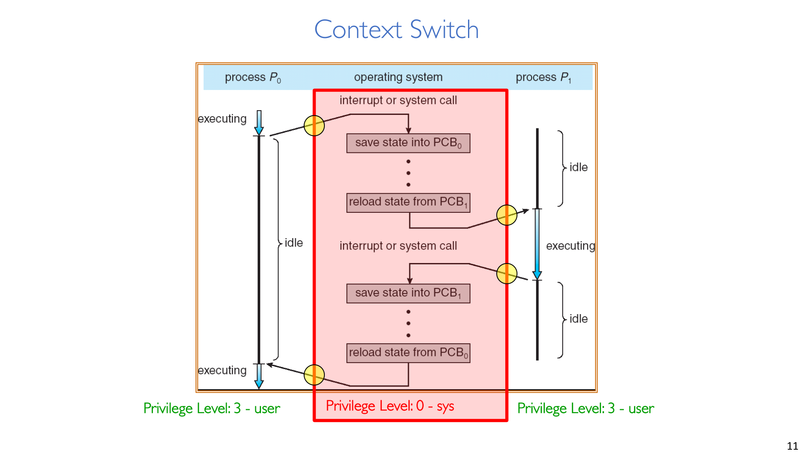

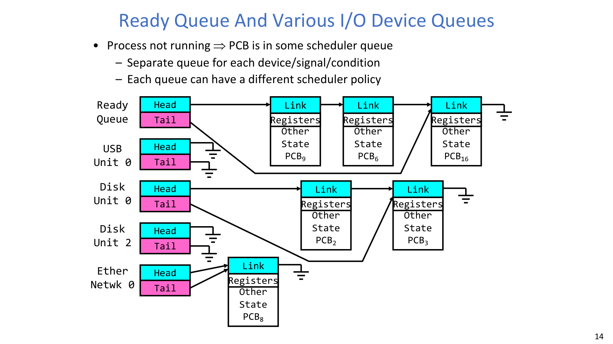

### 2.2 共享状态与线程私有状态

同一地址空间内：

- 共享：代码段、堆、全局变量。
- 线程私有：栈、保存寄存器、线程元数据（TCB 字段）。

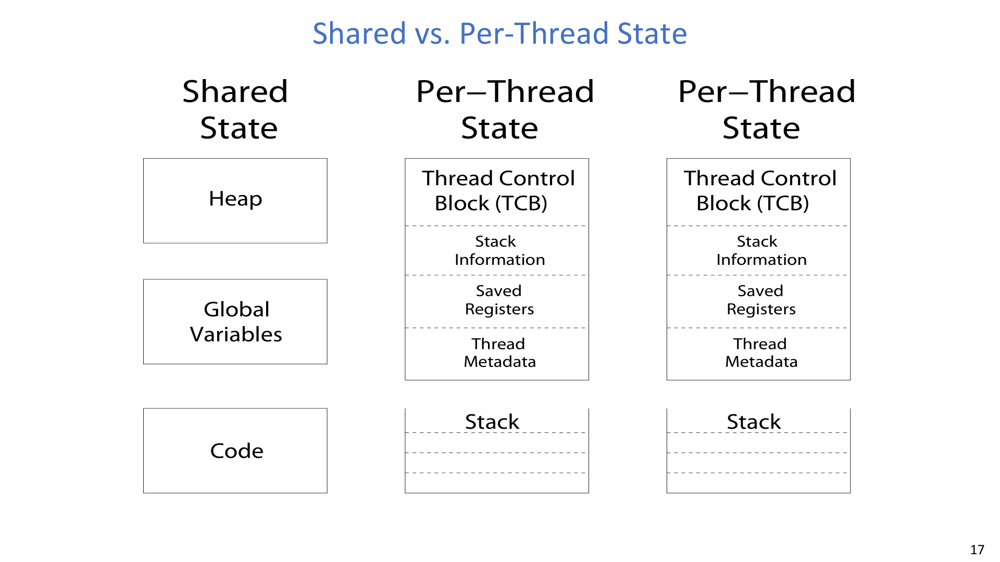

这是核心权衡：

- 共享内存让协作高效。
- 共享内存也让竞争条件成为可能。

### 2.3 调度循环是并发机制的最小核心

一个概念化的调度核心可写为：

$$
\texttt{Loop}\;\{\;
\texttt{RunThread();}\;
\texttt{ChooseNextThread();}\;
\texttt{SaveStateOfCPU(curTCB);}\;
\texttt{LoadStateOfCPU(newTCB);}\;
\}
$$

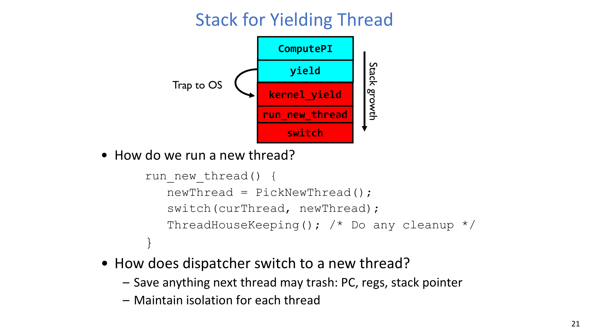

:::tip 💡 关键问题
**调度器如何从正在运行的线程手里拿回控制权？**

解答：
- 内部事件（自愿）：`yield()`、阻塞 I/O、等待同步事件。
- 外部事件（非自愿）：中断，尤其是定时器中断。
:::

## 3. 上下文切换与线程启动细节

### 3.1 `switch()` 的保存/恢复契约

上下文切换只有在“所有关键状态都正确保存并恢复”时才是正确的。

$$
\begin{aligned}
\texttt{TCB[tCur].regs.r7} &\leftarrow \texttt{CPU.r7}\\
\texttt{TCB[tCur].regs.r0} &\leftarrow \texttt{CPU.r0}\\
\texttt{TCB[tCur].regs.sp} &\leftarrow \texttt{CPU.sp}\\
\texttt{TCB[tCur].regs.retpc} &\leftarrow \texttt{CPU.retpc}
\end{aligned}
$$

$$
\begin{aligned}
\texttt{CPU.r7} &\leftarrow \texttt{TCB[tNew].regs.r7}\\
\texttt{CPU.r0} &\leftarrow \texttt{TCB[tNew].regs.r0}\\
\texttt{CPU.sp} &\leftarrow \texttt{TCB[tNew].regs.sp}\\
\texttt{CPU.retpc} &\leftarrow \texttt{TCB[tNew].regs.retpc}
\end{aligned}
$$

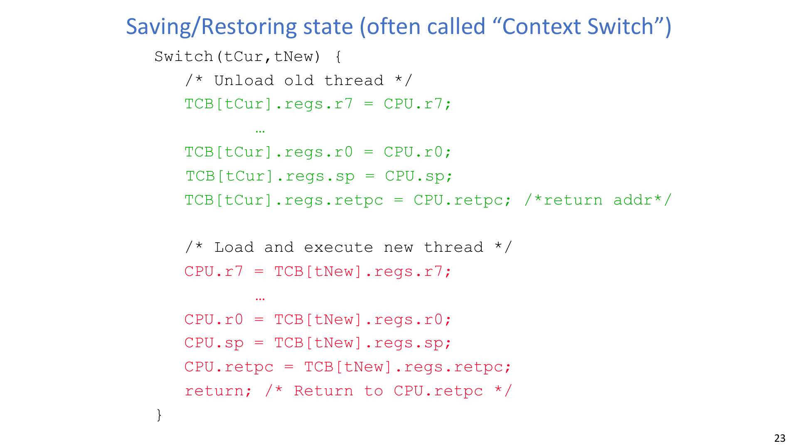

### 3.2 为什么 switch 的 bug 特别危险

讲义给出的工程警示非常典型：

- 少保存/恢复一个寄存器，就可能出现间歇性错误。
- 穷举测试几乎不可行，因为线程交错组合爆炸。
- “追求简单”是可靠性策略，不是风格偏好。

:::warn ⚠️ 关键问题
**能否设计一个穷举测试，彻底验证 switch 代码？**

解答：
- 实际上很难做到完全穷尽。
- 寄存器取值、中断时机、线程交错组合形成巨大状态空间。
- 工程上依赖分层保障：不变量、压力测试、架构定向测试、以及保守设计。
:::

### 3.3 自愿/非自愿切换与开销量级

课堂给出了典型数量级对比：

$$
\Delta t_{\text{switch interval}} \approx 10\text{--}100\,ms
$$

$$
\Delta t_{\text{ctx,proc}} \approx 3\text{--}4\,\mu s,\quad
\Delta t_{\text{ctx,thread}} \approx 100\,ns
$$

线程切换更便宜的核心原因是：不需要做完整地址空间切换。

### 3.4 定时器中断保障公平性

当线程永不主动让出 CPU 时，内核通过周期性中断强制拿回控制权：

$$
\texttt{TimerInterrupt()\;\{\;DoPeriodicHouseKeeping();\;run\_new\_thread();\;\}}
$$

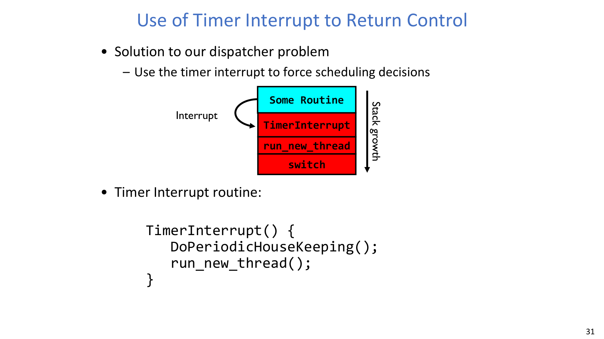

:::remark 📝 关键问题
**ComputePI 这类线程是否可能一直霸占处理器？**

解答：
- 如果没有非自愿抢占机制，确实可能。
- 定时器中断正是防止“非合作线程永久占用 CPU”的关键机制。
:::

### 3.5 新线程是如何启动的

线程创建是一个启动协议：

1. 构造 TCB 与初始栈。
2. 把栈指针、返回 PC 设到约定入口（`ThreadRoot` stub）。
3. 把函数指针和参数指针放入约定参数寄存器。
4. 等调度器选中该 TCB，返回落入 `ThreadRoot`。

$$
\begin{aligned}
\texttt{TCB[tNew].regs.sp} &\leftarrow \texttt{newStackPtr}\\
\texttt{TCB[tNew].regs.retpc} &\leftarrow \texttt{\&ThreadRoot}\\
\texttt{TCB[tNew].regs.r0} &\leftarrow \texttt{fcnPtr}\\
\texttt{TCB[tNew].regs.r1} &\leftarrow \texttt{fcnArgPtr}
\end{aligned}
$$

$$
\texttt{ThreadRoot(fcnPTR,fcnArgPtr)}:
\texttt{DoStartupHouseKeeping()} \rightarrow
\texttt{UserModeSwitch()} \rightarrow
\texttt{fcnPtr(fcnArgPtr)} \rightarrow
\texttt{ThreadFinish()}
$$

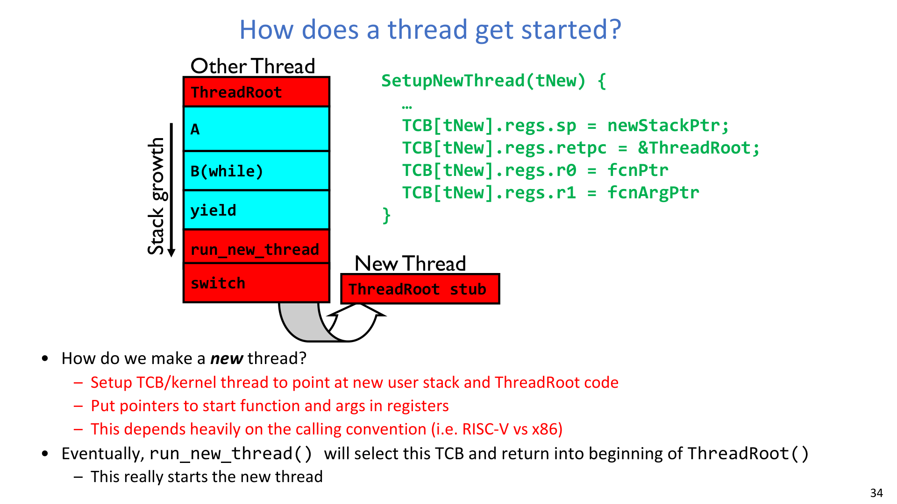

## 4. 阅读插曲：Keshav 三遍阅读法

本讲中段给出论文阅读方法：

- 第一遍（10 分钟）：识别类别、上下文、贡献、表达质量。
- 第二遍（约 1 小时）：理解逻辑与图表，暂不深挖证明细节。
- 第三遍（数小时）：在同假设下“脑内复现”，并主动挑战前提。

实践要点：按目标分配阅读深度，不要每篇都同一强度。

## 5. 现代上下文切换案例：Shinjuku

### 5.1 低尾延迟为什么难

高性能路径（OS bypass + polling + run-to-completion）虽然降低了系统调用开销，但会暴露调度病态：

- 分布式 FCFS（`d-FCFS`）出现队列不平衡，不是 work-conserving。
- 短请求会被长请求阻塞在后面。

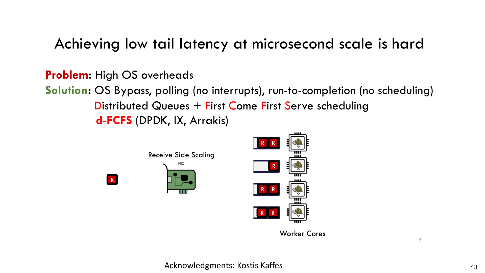

### 5.2 为什么“微秒级抢占”有决定性作用

粗粒度抢占（`PS-1ms`）依然可能导致延迟上升。
细粒度抢占（`PS-5us`）在该工作负载上更接近最优曲线。

$$
P(S=0.5\,\mu s)=99.5\%,\quad P(S=500\,\mu s)=0.5\%
$$

$$
q_{\text{preempt}} \approx 5\,\mu s
$$

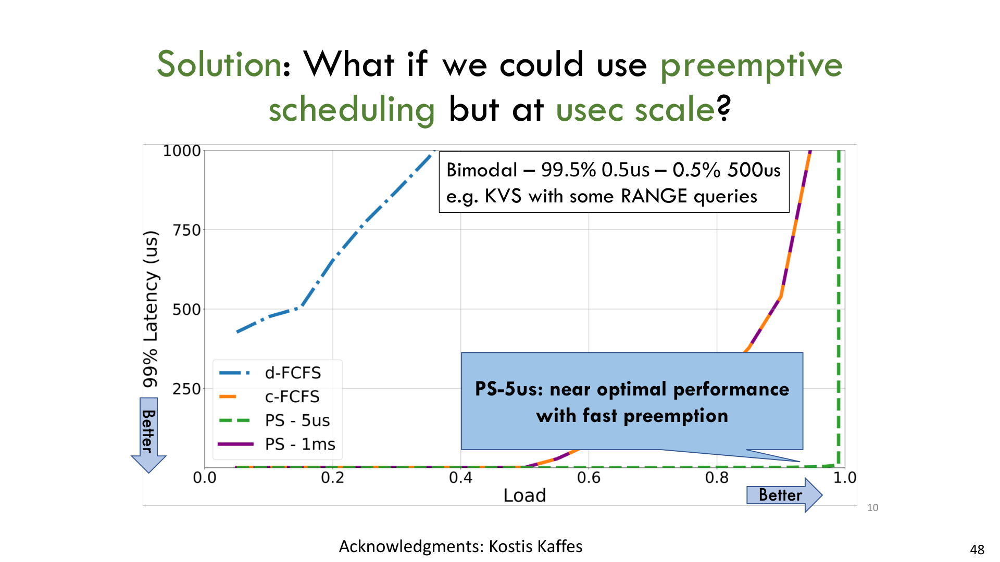

### 5.3 需要记住的关键陈述

**A single address-space operating system that achieves microsecond-scale tail latency for all types of workloads regardless of variability in task duration.**

对应实现要点：

- 专用调度/队列核心。
- 借助虚拟化硬件能力实现快速抢占。
- 用户态极快上下文切换。
- 调度策略与任务分布、延迟目标联合匹配。

## 6. 为什么同步不可回避

### 6.1 非确定性带来的正确性压力

并发系统中：

- 调度器可按任意顺序运行线程。
- 调度器可在任意时刻切换线程。
- 因此正确性必须“按设计保证”，不能依赖“测出来刚好没错”。

### 6.2 ATM 服务端作为动机场景

目标是同时满足：

- 高效处理请求。
- 不破坏账户数据库一致性。
- 不多发钱。

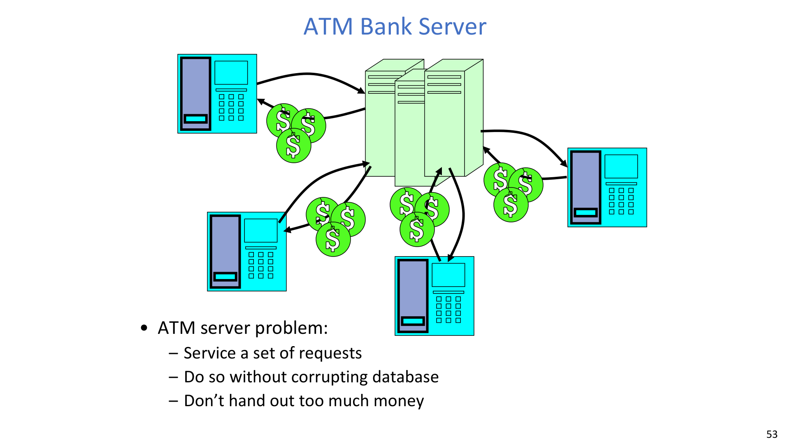

讲义对比了两种写法：

- 事件驱动拆分：重叠 I/O 和计算，但控制流被切得很碎。
- 每请求一线程：控制流直观，但共享状态风险上升。

### 6.3 线程化存款中的丢失更新

线程交错会破坏 `balance` 更新：

$$
\texttt{Thread 1:}\;r_1\leftarrow B;\;r_1\leftarrow r_1+a_1;\;B\leftarrow r_1
$$

$$
\texttt{Thread 2:}\;r_1\leftarrow B;\;r_1\leftarrow r_1+a_2;\;B\leftarrow r_1
$$

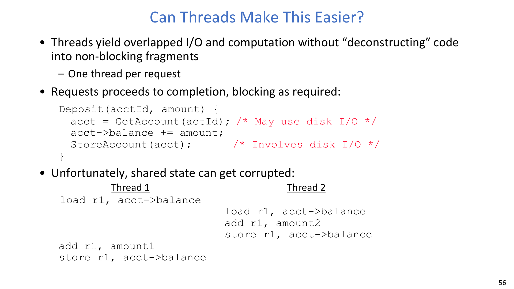

:::error ⛔ 关键问题
**每个请求处理函数看起来都“局部正确”，为什么最终余额仍可能错误？**

解答：
- 局部正确不等于并发正确。
- `load-add-store` 这个组合不是整体原子操作，两个线程可能互相覆盖更新结果。
:::

## 7. 原子性、锁与有界缓冲区陷阱

### 7.1 核心定义（必须记住）

- **Atomic Operation: an operation that always runs to completion or not at all.**
- **Synchronization: using atomic operations to ensure cooperation between threads.**
- **Mutual Exclusion: ensuring that only one thread does a particular thing at a time.**
- **Critical Section: piece of code that only one thread can execute at once.**

### 7.2 用锁修复银行竞争

把共享更新放进同一把锁保护的临界区，并在存款/取款等所有相关路径上使用同一把锁。

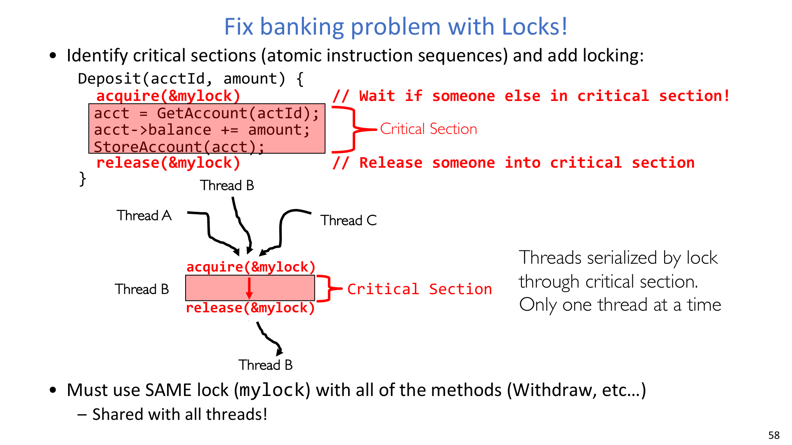

### 7.3 生产者-消费者有界缓冲区

讲义刻意按“先错后改”的教学顺序推进。

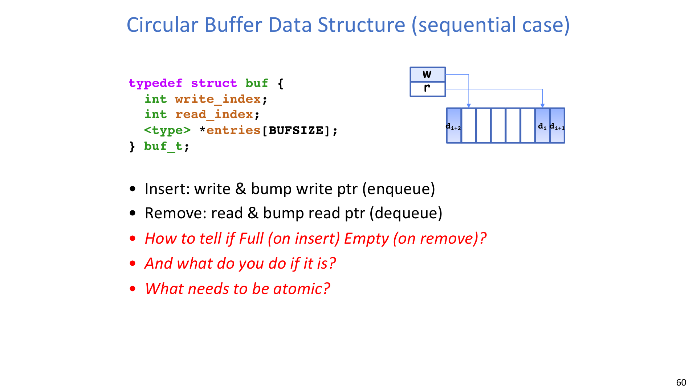

常见实现判定条件：

$$
\text{empty} \iff w=r
$$

$$
\text{full} \iff (w+1)\bmod \texttt{BUFSIZE}=r
$$

#### 第一版（持锁自旋等待）

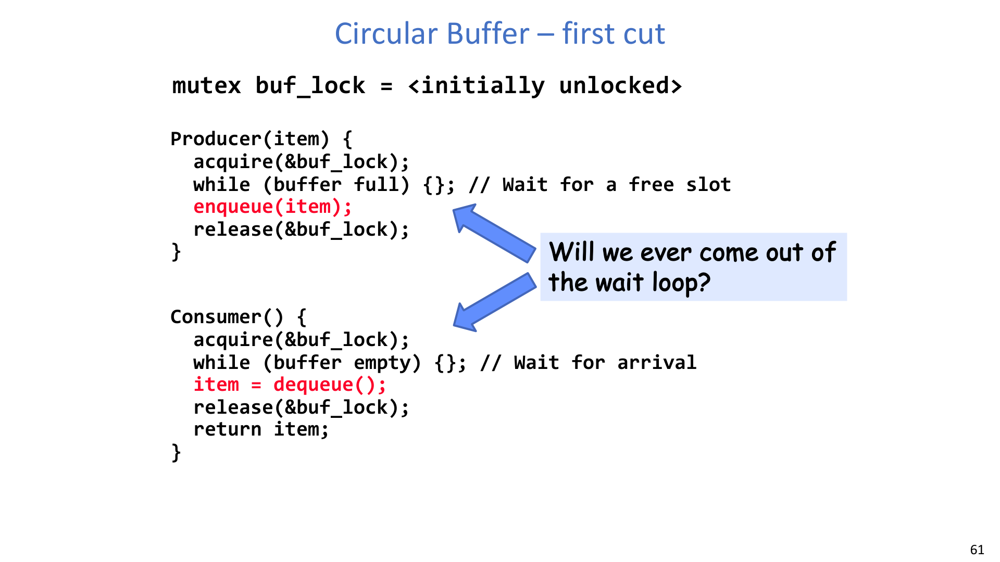

:::warn ⚠️ 关键问题
**Will we ever come out of the wait loop?**

解答：
- 不一定。
- 如果生产者在“缓冲区满”时持锁自旋，消费者无法进入临界区执行出队。
- 在“缓冲区空”场景也有对称的卡死/活锁风险。
:::

#### 第二版（解锁-再加锁忙等）

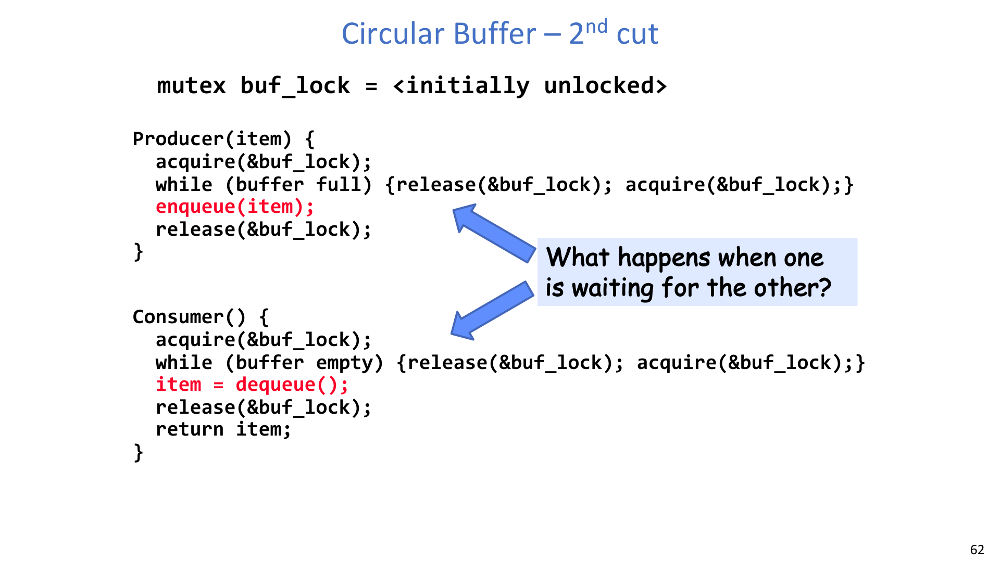

:::remark 📝 关键问题
**What happens when one is waiting for the other?**

解答：
- 正确性比第一版好一些（对方有机会运行），但效率很差，会忙等并造成高频锁竞争。
- 真正缺少的是“睡眠/唤醒”机制（信号量或条件变量），而不只是互斥锁本身。
:::

### 7.4 为什么“只有锁”还不够

Mutex 只能保证临界区互斥，但生产者-消费者还需要条件同步：

- 资源条件：not-full / not-empty。
- 阻塞唤醒：等待时不空转消耗 CPU。

这就是为什么标准方案是“锁 + 条件变量（或信号量）”。

## 8. 全链路心智模型

把本讲串起来看：

1. 并发来源于 CPU 时间复用。
2. 时间复用依赖上下文保存/恢复与调度策略。
3. 线程比事件拆分更利于表达阻塞式控制流。
4. 共享状态在非确定性交错下会触发竞争。
5. 原子性 + 互斥 + 条件同步共同保证正确性。

## 附录：Exam Review

### A. 必会定义

- PCB/TCB 及其状态字段含义。
- 自愿 vs 非自愿上下文切换。
- 原子操作、互斥、临界区、锁。

### B. 机制链路（要能口述）

1. `yield()` 或阻塞 I/O 触发陷入内核。
2. 内核把当前线程上下文保存到 TCB。
3. 调度器选择下一个可运行 TCB。
4. 内核恢复寄存器/栈/PC 并继续执行。
5. 定时器中断保证即使线程不让出，系统也能收回控制权。

### C. 简答题模板

- 为什么必须有定时器中断：
  - 没有非自愿抢占，非合作线程可能长期霸占 CPU。
- 为什么 switch 错误很隐蔽：
  - 稀有交错 + 不完整状态保存/恢复，会导致间歇性静默错误。
- 为什么每请求一线程仍要同步：
  - 控制流更直观，不代表共享状态更新自动原子。

### D. 常见误区

- 在持锁状态下轮询等待条件。
- 同一共享对象的不同操作使用不同锁。
- 误以为“测试跑过了”就覆盖了足够交错。
- 只优化平均延迟，忽略尾延迟。

### E. 自检清单

- 我能写出调度循环并解释每一步吗？
- 我能讲清 `ThreadRoot` 如何启动新线程吗？
- 我能证明为什么有界缓冲区第一版可能永久卡住吗？
- 我能区分互斥同步与条件同步吗？
- 我能解释为什么图中 `PS-5us` 明显改善尾延迟吗？
