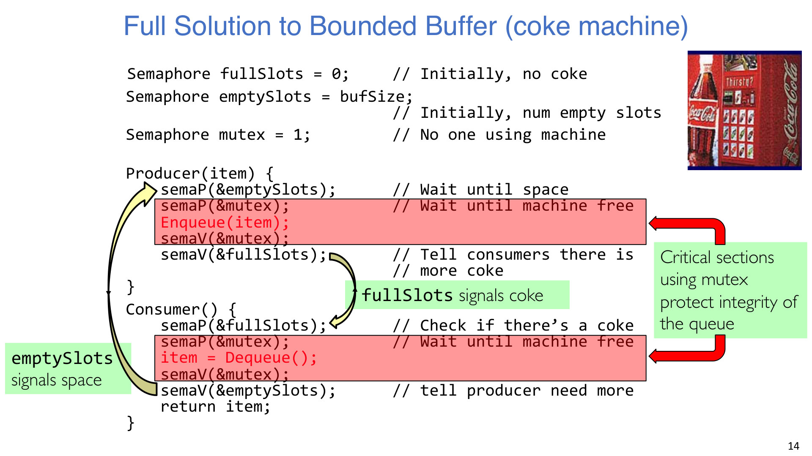
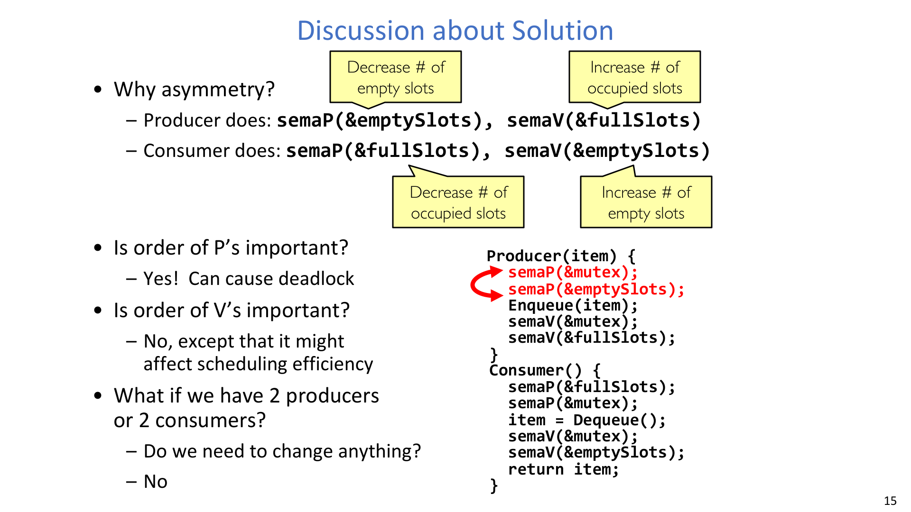
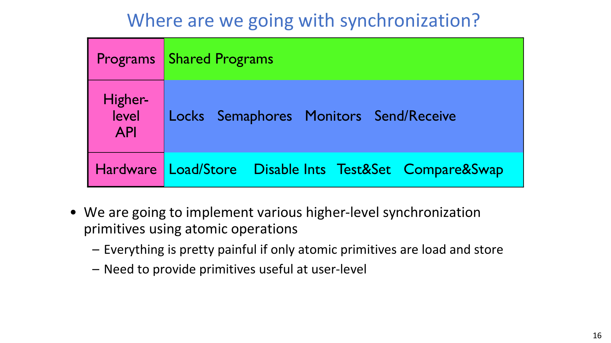
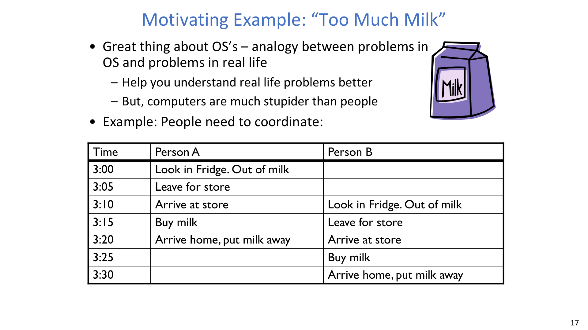
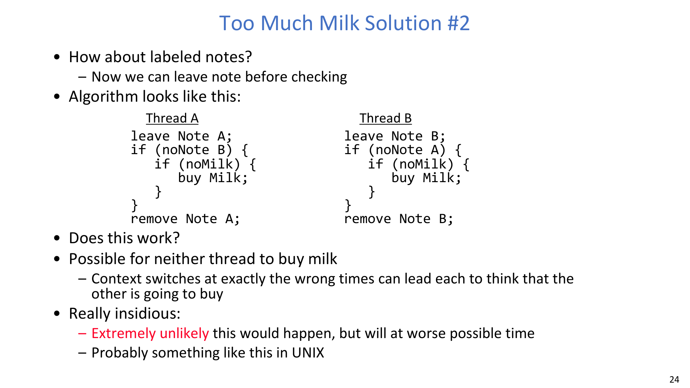
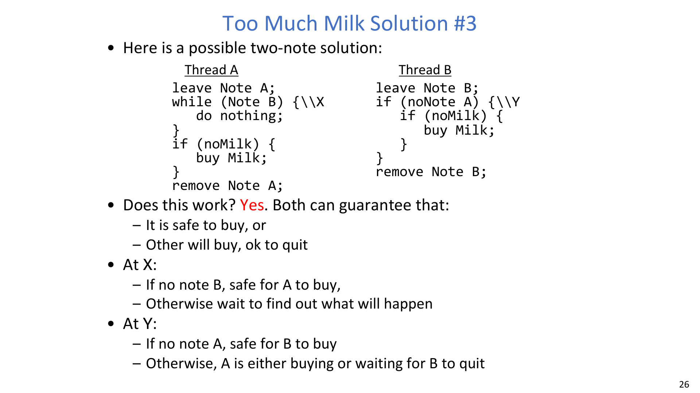
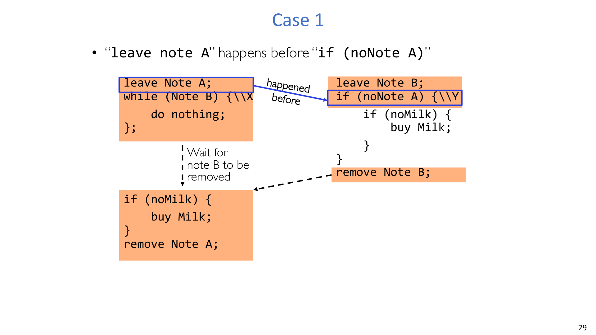
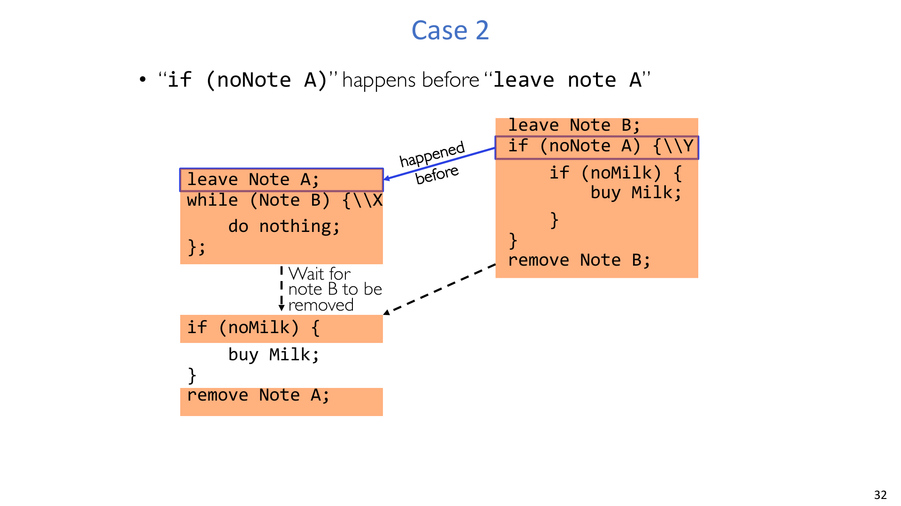

# 第 6 讲：同步 2 - 锁的实现

## 学习目标

学完本讲后，你应该能够：

1. 解释为什么仅靠互斥锁不足以完成有界缓冲区协调。
2. 准确给出信号量语义，并把 `P/Down`、`V/Up` 对应到等待/通知行为。
3. 用 `emptySlots`、`fullSlots`、`mutex` 构造完整生产者-消费者方案。
4. 分析信号量操作顺序的约束与死锁风险。
5. 从“Too Much Milk”案例中理解从失败方案到可行方案的推理路径。
6. 总结锁实现所依赖的同步核心概念与抽象层次。

## 1. 为什么“只有互斥锁”不够

### 1.1 有界缓冲区同时受多种约束

在生产者-消费者问题里，需要同时满足：

- 没有数据时，消费者必须等待。
- 缓冲区满时，生产者必须等待。
- 修改队列内部状态时，一次只能有一个线程进入。

单个 mutex 能保护队列完整性，但它本身不能高效表达“非空/非满”的条件等待。

:::warn ⚠️ 关键问题
**如果我们只做“基于锁的等待循环”，会出什么问题？**

解答：
- 持锁等待会把对方挡在临界区外，无法解除当前等待。
- 解锁再抢锁的忙等虽然可能不死锁，但会持续浪费 CPU。
- 需要一种同时支持“计数 + 阻塞唤醒”的原语。
:::

### 1.2 正确性约束清单

把设计写成清单会更稳：

1. 调度约束 A：若没有满槽位，消费者必须阻塞。
2. 调度约束 B：若没有空槽位，生产者必须阻塞。
3. 互斥约束：队列指针与数据更新必须原子化。

一个常用不变量是：

$$
\text{emptySlots}+\text{fullSlots}=\text{bufSize}
$$

## 2. 回顾：信号量是“广义锁”

讲义把信号量作为这类问题的核心原语。

- **信号量保存一个非负整数值。**
- **Down()/P()：等待值为正后减 1。**
- **Up()/V()：值加 1，并可能唤醒等待线程。**

按讲义语义整理为：

$$
s \in \mathbb{Z}_{\ge 0}
$$

$$
P(s):\ \text{wait until } s>0,\ s\leftarrow s-1
$$

$$
V(s):\ s\leftarrow s+1
$$

:::remark 📝 关键问题
**如何建立对 `P` 和 `V` 的直觉映射？**

解答：
- `P` 对应 wait/acquire，消耗一个可用资源令牌。
- `V` 对应 signal/release，归还一个资源令牌。
- 在有界缓冲区里，令牌分别代表空槽、满槽或互斥访问权。
:::

## 3. 有界缓冲区的完整信号量方案

### 3.1 初始化与角色分工

完整方案使用三个信号量：

$$
\text{fullSlots}=0,\quad \text{emptySlots}=\text{bufSize},\quad \text{mutex}=1
$$

- `fullSlots`：当前可消费元素数。
- `emptySlots`：当前可写入空位数。
- `mutex`：保护队列临界区的二值信号量。

### 3.2 生产者/消费者为何必须不对称

两边代码不应机械对称，因为资源流向相反：

- 生产者：消耗 `emptySlots`，发布 `fullSlots`。
- 消费者：消耗 `fullSlots`，发布 `emptySlots`。

:::tip 💡 关键问题
**为什么这里必须不对称？**

解答：
- 生产操作会减少空位、增加占用位。
- 消费操作会减少占用位、增加空位。
- 不对称正是资源守恒在代码层面的体现。
:::

### 3.3 操作顺序是否重要？

讲义强调了三个工程问题：

- **Is order of P's important?** 是，顺序错误可导致死锁。
- **Is order of V's important?** 通常不影响安全性，但会影响调度效率。
- **有 2 个生产者或 2 个消费者时要改吗？** 不需要，结构可直接扩展。

:::warn ⚠️ 关键问题
**为什么把 `P(mutex)` 放在 `P(emptySlots)` 前面会死锁？**

解答：
- 生产者可能先拿到 `mutex`，随后阻塞在 `emptySlots`。
- 本应释放空位的消费者无法进入临界区执行。
- 于是形成“持有一种资源、等待另一种资源”的循环等待。
:::

## 4. 同步机制的演进方向

讲义把同步放在分层视角下理解。

工程上的含义是：

- 硬件提供原子构件（load/store 及更强原子指令）。
- OS/运行时在其上构造 locks/semaphores/monitors/send-receive。
- 应用层优先使用更高层原语，而不是手搓底层细节。

:::remark 📝 关键问题
**Where are we going with synchronization?**

解答：
- 在原子操作之上构建稳定、可复用的高层同步抽象。
- 避免让每个程序都从最底层 load/store 重新拼正确性。
:::

## 5. 动机案例：Too Much Milk

### 5.1 现实时间线与正确性目标

这个案例把日常协作映射成并发同步问题。

任何方案都必须满足：

1. 需要买奶时，不能两个人都去买。
2. 需要买奶时，至少要有人去买。

:::tip 💡 关键问题
**这个问题的正确性目标到底是什么？**

解答：
- Safety：不要重复购买。
- Liveness：需要购买时不能出现“谁都不买”。
:::

### 5.2 方案 #1：检查后再贴共享便签

思路：先检查状态，再围绕购买动作贴/移除便签。

问题：在线程切换落在检查与更新之间时，仍会间歇性失败。

:::error ⛔ 关键问题
**Result of Solution #1?**

解答：
- 仍然可能“买多了”，只是低概率出现。
- 间歇性错误最危险，因为重现和调试都很困难。
:::

### 5.3 方案 #1.5：先贴便签再检查

改法：先贴便签，再做后续检查。

问题：会走向另一种失败，即“可能谁都不买”。

:::warn ⚠️ 关键问题
**把便签前置后会发生什么？**

解答：
- 双方都可能根据便签状态选择放弃购买。
- 活性被破坏，导致需要买时却没人买。
:::

### 5.4 方案 #2：带标签便签

思路：每个线程贴自己的便签（`A` 或 `B`），并检查对方便签。

问题：在不利交错下，双方都可能以为“对方会买”，从而长期不前进，属于 starvation/lockup。

:::error ⛔ 关键问题
**Does labeled-note Solution #2 fully work?**

解答：
- 不能。
- 它仍可能破坏活性，让两边都一直让步。
:::

### 5.5 方案 #3：双便签等待协议

该版本引入了显式等待逻辑（如一侧 `while(Note B)`）和配套条件判断。

讲义随后用两类交错进行论证：

- Case 1：`leave note A` 先于 `if(noNote A)`。
- Case 2：`if(noNote A)` 先于 `leave note A`。

:::tip 💡 关键问题
**为什么方案 #3 最终是正确的？**

解答：
- 在每种交错下，线程都能落入两种安全结论之一：
  - 现在我买是安全的；
  - 对方一定会买，我可以安全退出。
- 因而同时满足 safety 和 liveness。
:::

### 5.6 为什么方案 #3 仍不理想

虽然正确，但工程上依然不满意：

- 对于简单任务，逻辑过于复杂。
- A/B 代码不对称，扩展到多线程很难维护。
- 等待方持续占用 CPU，属于 busy waiting。

:::warn ⚠️ 关键问题
**从方案 #3 讨论中应当记住什么？**

解答：
- 仅有“正确”还不够，还要考虑可读性、可扩展性和等待效率。
- 这也是我们需要更高层同步抽象的根本原因。
:::

## 6. 必记核心定义

- **Synchronization: using atomic operations to ensure cooperation between threads.**
- **Mutual Exclusion: ensuring that only one thread does a particular thing at a time.**
- **Critical Section: piece of code that only one thread can execute at once.**
- **Locks: synchronization mechanism for enforcing mutual exclusion on critical sections.**
- **Semaphores: synchronization mechanism for enforcing resource constraints.**
- **Atomic Operation: an operation that runs to completion or not at all.**

## 附录：Exam Review

### A. 必会定义

- Semaphore、mutex、mutual exclusion、critical section、atomic operation。
- 并发算法中的 safety 与 liveness。
- busy waiting 及其代价。

### B. 机制链路（有界缓冲区）

1. 生产者先等待 `emptySlots`，再进入队列临界区。
2. 生产者获取 `mutex`，入队后释放 `mutex`。
3. 生产者 `V(fullSlots)` 通知可消费。
4. 消费者等待 `fullSlots`，获取 `mutex` 后出队并释放 `mutex`。
5. 消费者 `V(emptySlots)` 归还空位令牌。

### C. 简答题模板

- 为什么要三个信号量？
  - 把计数约束与互斥约束分离，语义清晰、验证更简单。
- 为什么 `P` 顺序敏感？
  - 错误顺序会造成“占着一种资源等待另一种资源”。
- 为什么“人类直觉可行”的协议在计算机上会失败？
  - 上下文切换暴露了人脑不易覆盖的交错路径。

### D. 常见误区

- 用 mutex 同时承担“互斥保护”和“条件同步”。
- 在锁内忙等，或高频解锁加锁造成抖动。
- 未先写 safety/liveness 目标就直接编码。

### E. 自检清单

- 我能不背代码而推导 `emptySlots`、`fullSlots`、`mutex` 的职责吗？
- 我能精确解释 `P` 顺序为何可能导致死锁吗？
- 我能完整复述 Too-Much-Milk 的两条正确性目标吗？
- 我能说明为什么方案 #3 正确但仍不是好 API 方案吗？

