# 第 7 讲：同步 3 - 锁的实现、原子指令与监视器

## 学习目标

学完本讲后，你应该能够：

1. 解释为什么锁 API 必须依赖真正原子的 `acquire/release` 行为。
2. 分析基于中断控制的锁实现，并定位 missed wakeup（丢失唤醒）问题。
3. 使用原子读-改-写指令（`test&set`、`swap`、`compare&swap`）推理锁设计。
4. 比较简单自旋锁与“短自旋 + 睡眠等待”改进锁的差异。
5. 解释监视器模型中的条件变量（`Wait`、`Signal`、`Broadcast`）。
6. 区分 Mesa 与 Hoare 语义，并说明 `wait` 后必须用 `while` 复查条件的原因。

## 1. 从生产者-消费者到锁抽象

### 1.1 为什么仅有锁不足以解决有界缓冲区

有界缓冲区同时需要两类保证：

- 互斥：保护队列结构不被并发破坏。
- 条件等待：在 `not empty` / `not full` 成立前阻塞线程。

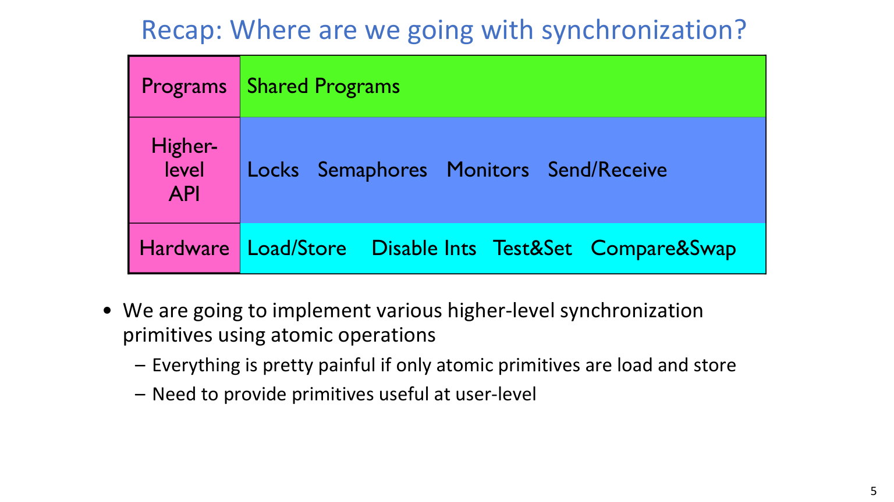

:::remark 关键问题：仅靠锁为什么不够
**问题（课件原意）：为什么有界缓冲区不能只靠一把锁解决？**

解答：
- 锁只能串行化“访问共享数据”的时刻。
- 生产者和消费者还需要“条件未满足时睡眠等待”。
- 若只靠自旋，会浪费 CPU；若不等待就继续，会破坏正确性。
:::

### 1.2 从 Too Much Milk 收敛到标准锁接口

课程把便签式协议收敛为标准接口：

- **`acquire(&milklock)`：等待锁空闲后再原子获取。**
- **`release(&milklock)`：释放锁并唤醒等待者。**

这两个操作都必须对竞争线程表现为原子行为。

## 2. 用中断控制实现锁

### 2.1 朴素开关中断方案及其风险

第一种思路是：通过关中断把多条指令包成“不可被打断”的原子区。

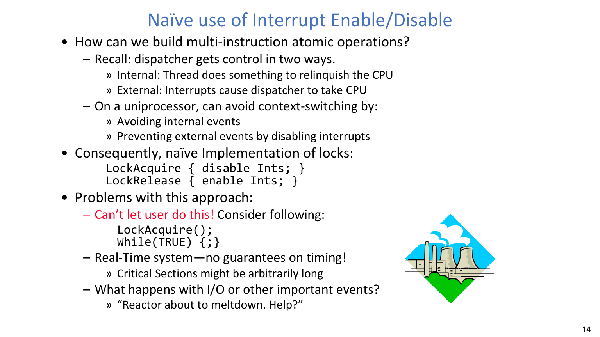

:::error 关键问题：能否让用户代码关中断
**问题（课件原话）：What happens with I/O or other important events?**

解答：
- 若用户代码可长期关中断，系统可能失去响应。
- 关键区一长，实时性与时延保证会崩溃。
- 重要外部事件可能被危险地延迟处理。
:::

### 2.2 更合理的内核侧结构：锁变量 + 等待队列

改进方案是在“锁元数据变更”这段短路径才关中断：

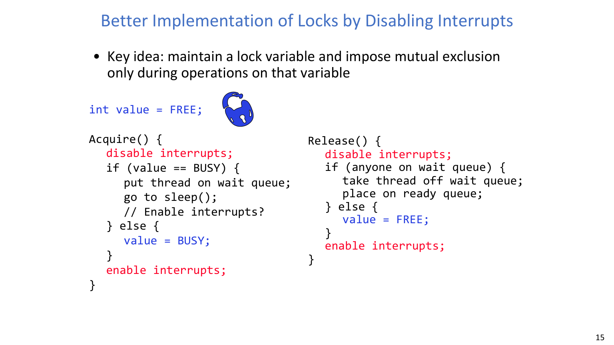

1. 进入很短的原子区。
2. 若锁忙，入等待队列并睡眠。
3. 若锁空闲，标记为忙并继续。
4. 释放时唤醒一个等待线程，或把锁置空闲。

这样可以显著缩短关中断窗口。

### 2.3 睡眠前后何时开中断最容易出错

最容易出 bug 的位置，是“入队”与“真正睡眠”之间的边界。

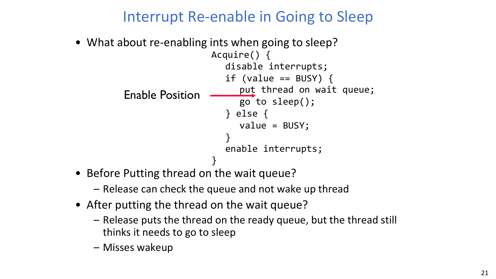
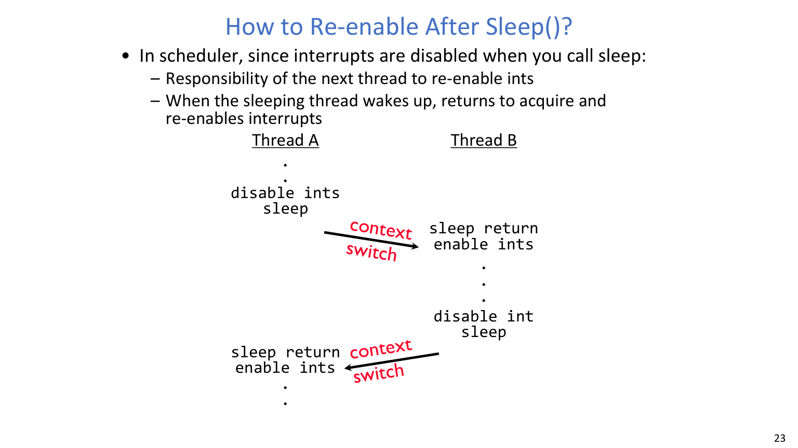

:::warn 关键问题：missed wakeup 的根因
**问题（课件原话）：What about re-enabling ints when going to sleep?**

解答：
- 开中断太早：释放线程可能看不到等待者，导致不唤醒。
- 开中断位置不对：线程可能先被放回 ready，再继续执行到 sleep。
- 结果是丢失唤醒（missed wakeup）。

本讲给出的安全思路：
- 在该路径下调用 `sleep()` 时仍保持中断关闭语义；
- 由调度器/下一线程路径负责恢复中断状态；
- 被唤醒线程返回 `acquire` 路径后再恢复到期望状态。
:::

## 3. 原子读-改-写指令（RMW）

### 3.1 为什么必须使用硬件原子原语

仅靠关中断不适合用户态，也难以在多核上高效扩展。

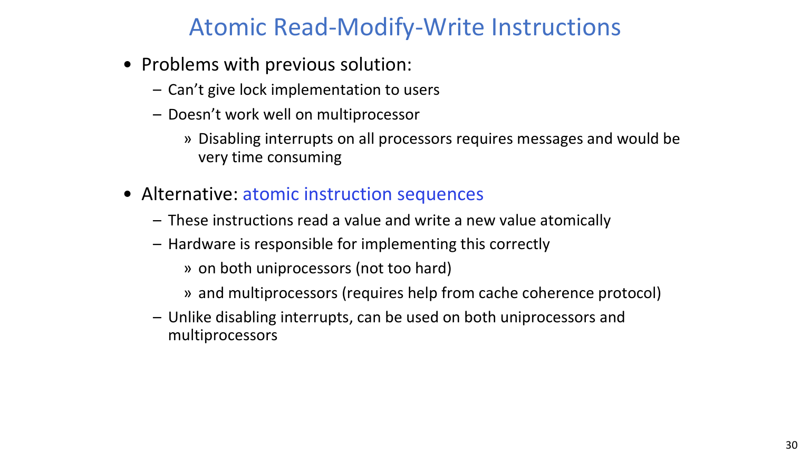

硬件提供的 RMW 指令，是构建高层锁算法的基础。

### 3.2 核心 RMW 语义（按课件整理）

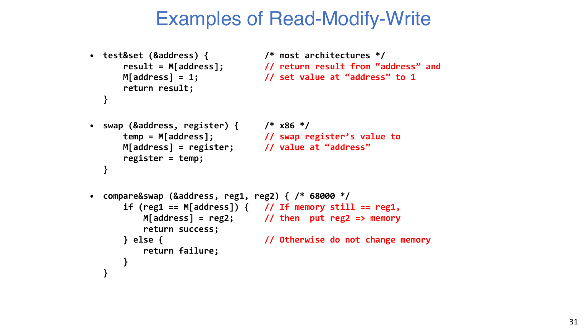

$$
\texttt{test\&set}(a):\ r \leftarrow M[a],\ M[a] \leftarrow 1,\ \text{return } r
$$

$$
\texttt{swap}(a, r):\ t \leftarrow M[a],\ M[a] \leftarrow r,\ r \leftarrow t
$$

$$
\texttt{compare\&swap}(a, r_1, r_2)=
\begin{cases}
\text{success},\ M[a] \leftarrow r_2 & \text{if } M[a]=r_1\\
\text{failure},\ M[a] \text{ unchanged} & \text{otherwise}
\end{cases}
$$

### 3.3 朴素 `test&set` 锁与 busy-wait 代价

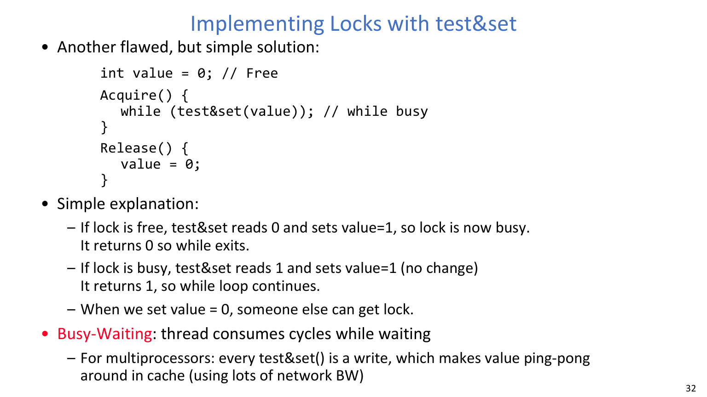

$$
\texttt{Acquire}:\ \texttt{while(test\&set(value));}
$$

$$
\texttt{Release}:\ \texttt{value} \leftarrow 0
$$

它在互斥正确性上直接有效，但性能问题明显：

- 等待线程持续占用 CPU 周期。
- 多核下反复写同一缓存行，造成 ping-pong。
- 高竞争时会恶化延迟与系统吞吐。

:::warn 关键问题：正确但不好用
**问题（课件原意）：为什么这个锁“正确”却依然可能是坏设计？**

解答：
- 它保证了安全性，但代价是资源浪费。
- 在真实负载下，长时间自旋会拖慢整体系统表现。
:::

## 4. 改进 `test&set` 锁：短自旋 + 睡眠

### 4.1 引入 `guard` 保护锁元数据

改进实现引入两个变量：

- `value`：锁状态（`FREE`/`BUSY`）
- `guard`：用于短时原子保护锁元数据

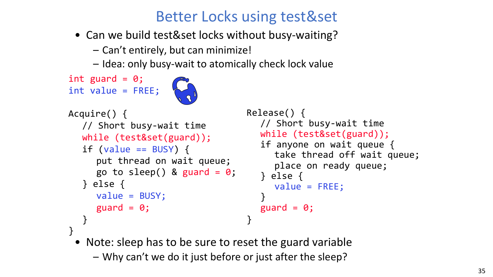

核心思想：
- 仅在 `guard` 上做短自旋。
- 若真正锁忙，则入队并睡眠，而不是长期自旋。

### 4.2 为什么 guard 与 sleep 路径必须原子配合

:::tip 关键问题：能否完全消除自旋
**问题（课件原话）：Can we build test&set locks without busy-waiting?**

解答：
- 不能彻底消除。
- 但可以把自旋限制在极短的元数据临界窗口。
- `guard` 的释放必须与睡眠切换严密配合，否则会重新引入竞态窗口。
:::

## 5. 监视器与条件变量

### 5.1 为什么监视器比“只用信号量”更清晰

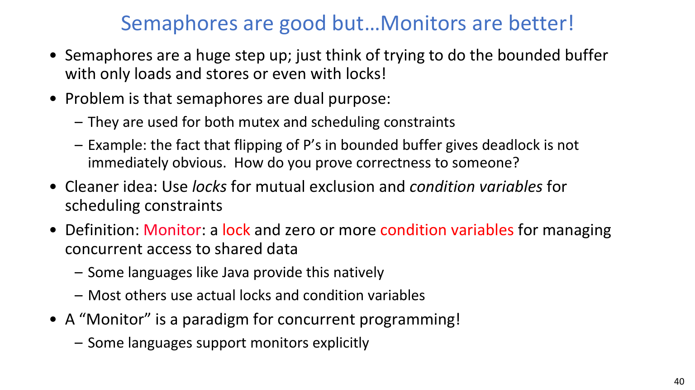

监视器把职责拆分得更清楚：

- 锁负责互斥。
- 条件变量负责调度约束。

**关键定义（课件原话）：Monitor: a lock and zero or more condition variables for managing concurrent access to shared data.**

### 5.2 条件变量语义与使用规则

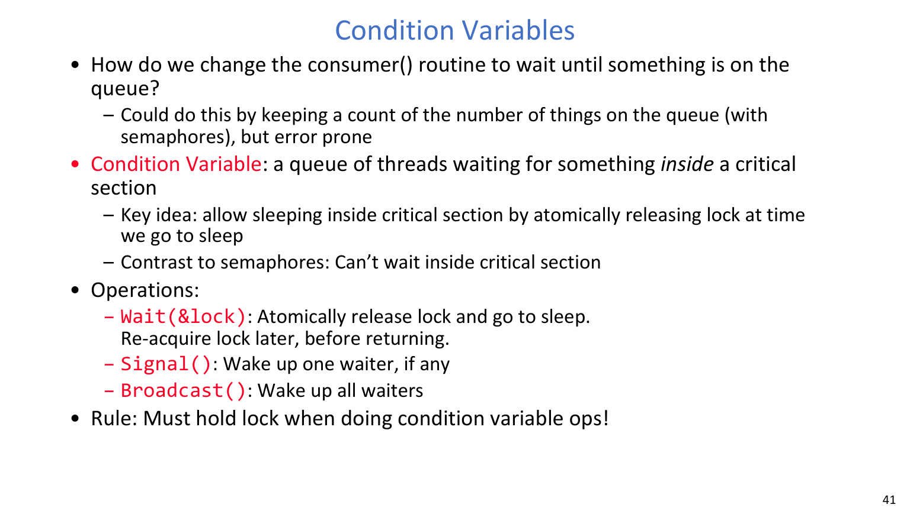

$$
\texttt{Wait(lock)}:\ \text{atomically release lock and sleep; re-acquire lock before return}
$$

- `Signal()`：若有等待者，唤醒一个。
- `Broadcast()`：唤醒全部等待者。
- 规则：执行条件变量操作时必须持有对应锁。

### 5.3 Mesa vs. Hoare 语义与 `while` 必要性

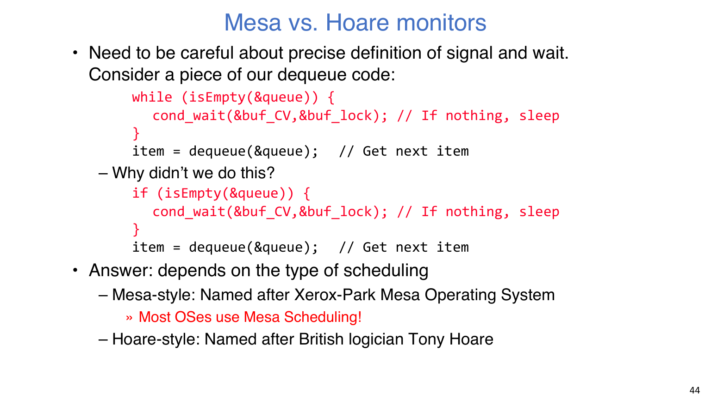
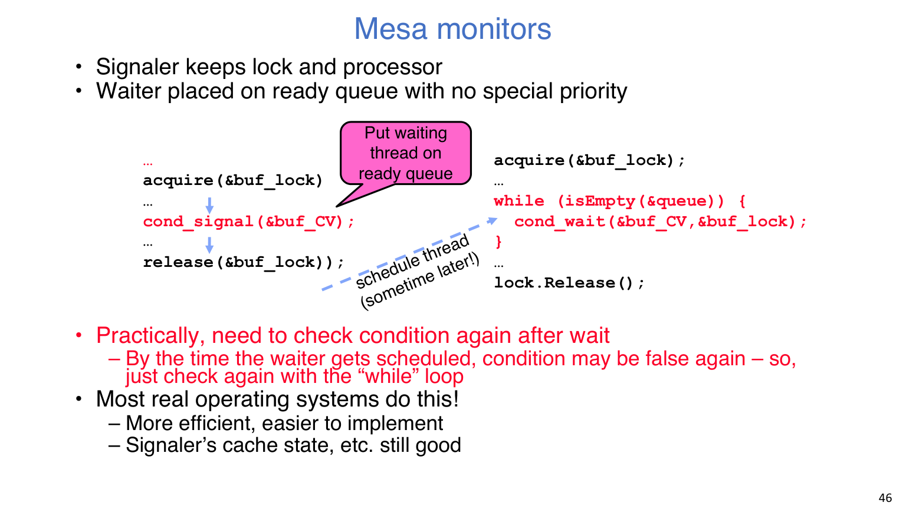

- Hoare：发信号线程立即把锁和 CPU 交给等待者。
- Mesa：发信号线程继续运行，等待者仅进入 ready 队列。

:::remark 关键问题：为什么不能写成 if
**问题（课件原话）：Why didn't we do this?**

解答：
- 在 Mesa 语义下，唤醒不代表马上运行。
- 等等待线程真正被调度时，条件可能再次变为假。
- 所以应写成 `while (condition) wait(...)`，而不是 `if (...) wait(...)`。
:::

### 5.4 有界缓冲区第三版（monitor 风格）

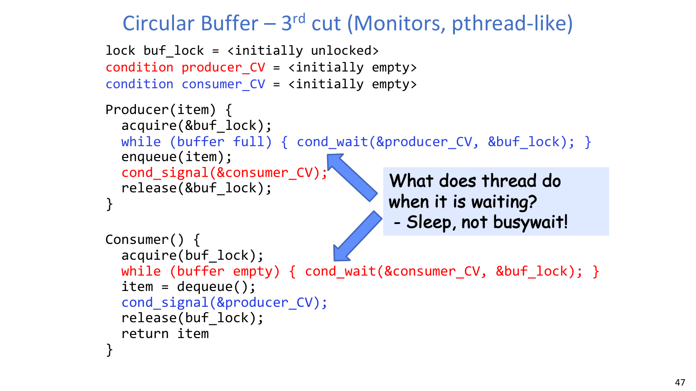

这一版组合了：

- 一把互斥锁保护缓冲区结构。
- 两个条件变量（`producer_CV`、`consumer_CV`）。
- 以睡眠等待替代长期 busy-wait。

## 6. Exam Review

### 6.1 必背定义

- **原子操作**：要么完整执行，要么完全不执行。
- **自旋锁**：通过反复原子重试实现互斥（等待时占 CPU）。
- **监视器**：锁 + 条件变量构成的结构化并发抽象。
- **条件变量**：与锁绑定的等待队列，用于“条件不满足先睡眠”。

### 6.2 高频简答模板

1. **为什么不把关中断作为用户态通用锁 API？**
   因为会破坏系统响应性、延迟关键中断，而且不适合作为用户可控原语。
2. **为什么多数系统里 `cond_wait` 后要用 `while` 重查？**
   因为 Mesa 语义只是让等待者变为 ready，真正运行时条件可能已变化。
3. **为什么 `test&set` 锁可能“对但不好”？**
   因为正确性不等于高效性，自旋等待会消耗 CPU/缓存/总线资源。

### 6.3 常见误区清单

- 把“互斥”与“条件等待”混为同一种机制。
- 忽略 `Wait(lock)` 的“原子释放锁并睡眠”语义。
- 在 Mesa 语义下把 `while` 误写成 `if`。
- 高竞争场景仍选择重自旋方案。

### 6.4 自检题

:::tip 自检 1
请给出一个具体线程交错，说明睡眠前后开中断位置错误如何导致 missed wakeup。
:::

:::tip 自检 2
请比较 lock-only、semaphore、monitor 三种有界缓冲区实现在可读性、证明难度与性能上的差异。
:::
