# Lecture 8: Synchronization 4 - Readers/Writers

## Learning Objectives

By the end of this lecture, you should be able to:

1. Explain the Readers/Writers concurrency goal and why a single coarse lock is not ideal.
2. Use monitor state variables (`AR`, `WR`, `AW`, `WW`) to reason about correctness.
3. Read and explain a monitor-style Reader/Writer implementation with condition variables.
4. Trace a concrete execution (`R1, R2, W1, R3`) and justify each block/unblock step.
5. Analyze starvation and signaling-policy trade-offs (writer priority vs. reader fairness).
6. Explain why condition variables are not equivalent to semaphores.
7. Connect monitor ideas to real language mechanisms in C/C++/Python/Java.

## 1. Problem Setup: Why Readers/Writers Exists

The scenario is a shared database with two classes of users:

- Readers: read-only operations.
- Writers: read + modify operations.

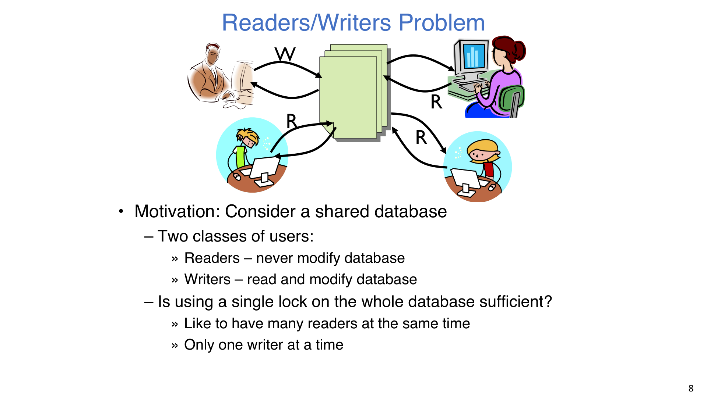

The target policy is:

- Many readers may run concurrently.
- At most one writer runs at a time.
- No reader may overlap with an active writer.

:::remark Key Question: one lock for whole database?
**Question (slide wording): Is using a single lock on the whole database sufficient?**

Answer:
- A single lock is correct for safety, but it is overly restrictive.
- It prevents safe read-read parallelism.
- Readers/Writers synchronization aims to keep correctness while allowing higher read concurrency.
:::

## 2. Monitor State and Correctness Conditions

The monitor solution tracks four counters protected by one mutex lock:

- `AR`: active readers
- `WR`: waiting readers
- `AW`: active writers
- `WW`: waiting writers

It also uses two condition variables:

- `okToRead`
- `okToWrite`

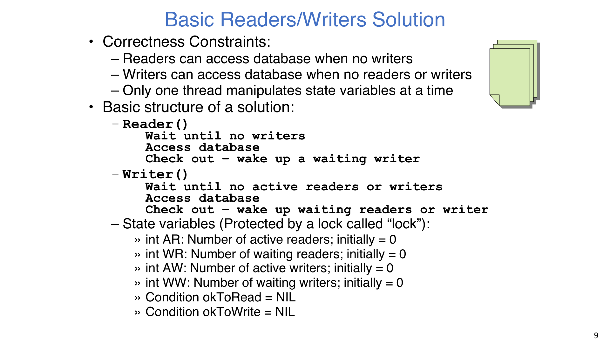

Key predicates from the code:

$$
(AW + WW) > 0
$$

$$
(AW + AR) > 0
$$

Interpretation:

- A reader must wait when there is an active writer or waiting writer.
- A writer must wait when there is any active reader or active writer.

## 3. Reader and Writer Monitor Code

### 3.1 Reader path

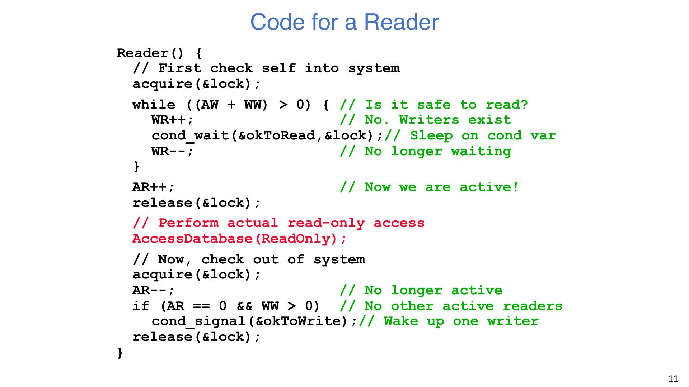

Core logic:

1. Acquire lock and test read-admission condition.
2. If unsafe, increment `WR`, sleep on `okToRead`, then decrement `WR` after wake.
3. On admission, increment `AR` and release lock.
4. Perform read-only database access outside the monitor lock.
5. On exit, decrement `AR`; if this was the last reader and writers are waiting, wake one writer.

Reader exit wake-up condition:

$$
AR = 0 \land WW > 0
$$

### 3.2 Writer path

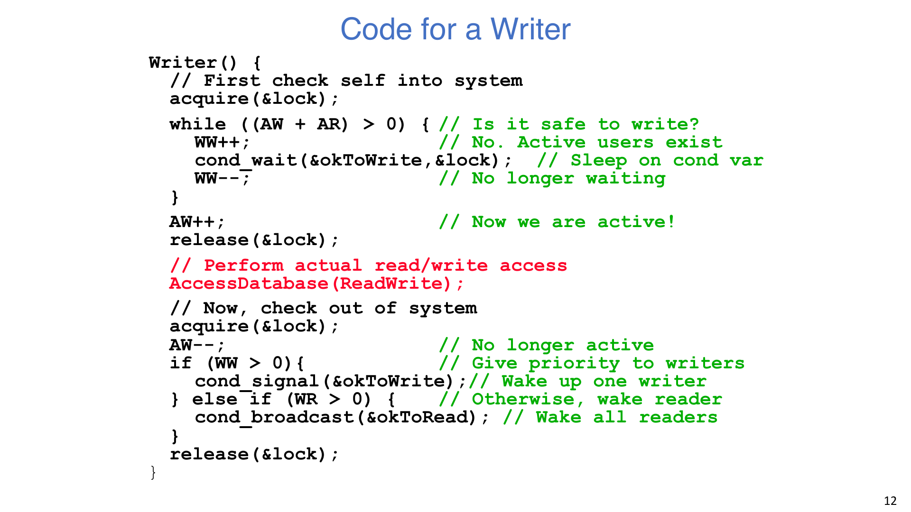

Core logic:

1. Acquire lock and test write-admission condition.
2. If unsafe, increment `WW`, sleep on `okToWrite`, then decrement `WW` after wake.
3. On admission, increment `AW`, release lock, and perform read/write access.
4. On exit, decrement `AW` and choose who to wake:
  - If `WW > 0`, wake one writer (writer-priority path).
  - Else if `WR > 0`, broadcast to readers.

$$
WW > 0
$$

$$
WR > 0
$$

:::tip Key Question: why does Reader wait on waiting writers too?
**Question (code intent): Why check `AW + WW` instead of only `AW` in Reader entry?**

Answer:
- Checking `WW` gives pending writers priority.
- Without this, a steady stream of incoming readers can indefinitely postpone a waiting writer.
:::

## 4. Simulation: Sequence R1, R2, W1, R3

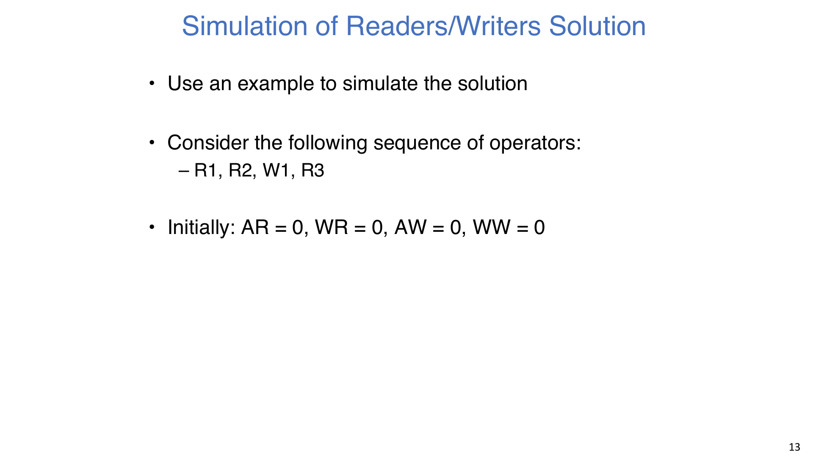

The lecture simulates the interleaving:

1. `R1` enters, reads (`AR=1`).
2. `R2` also enters, reads concurrently (`AR=2`).
3. `W1` arrives, cannot proceed, sleeps on `okToWrite` (`WW=1`).
4. `R3` arrives, also blocked because `WW>0`, sleeps on `okToRead` (`WR=1`).

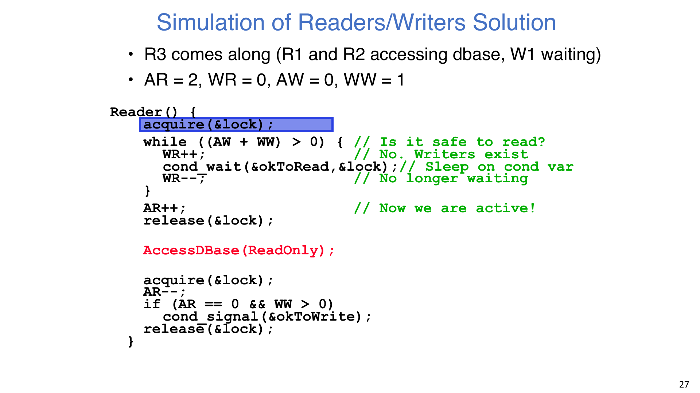

Then exits happen:

5. `R2` exits first; not last reader, so no writer wake yet.
6. `R1` exits; now `AR` becomes 0 and a waiting writer exists, so `W1` is signaled.

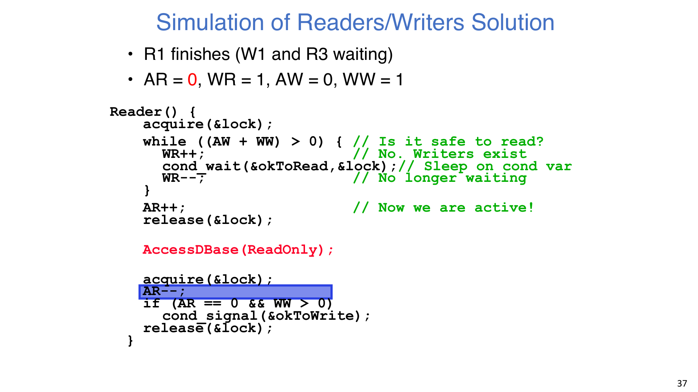

After writer completes:

7. `W1` exits; if no more waiting writers but waiting readers exist, readers are awakened.
8. `R3` eventually runs and reads.

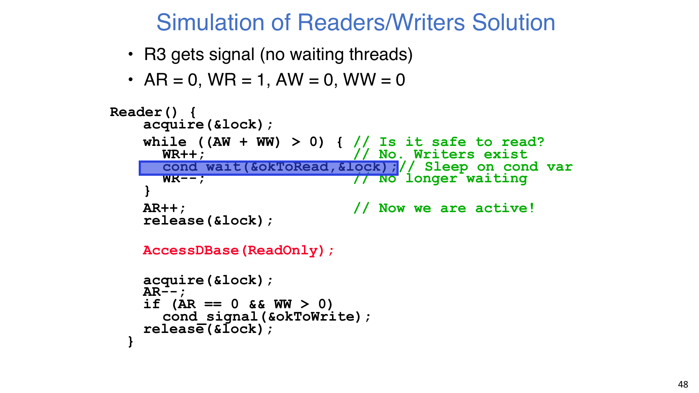

Useful state tuple notation:

$$
(AR, WR, AW, WW)
$$

:::remark Key Question: what does simulation prove?
**Question (lecture intent): What does this simulation validate beyond mutual exclusion?**

Answer:
- It validates policy, not only safety.
- The design enforces writer priority when writers are queued.
- It also validates that wake-up decisions match queue/counter state transitions.
:::

## 5. Discussion: Starvation and Single-CV Variant

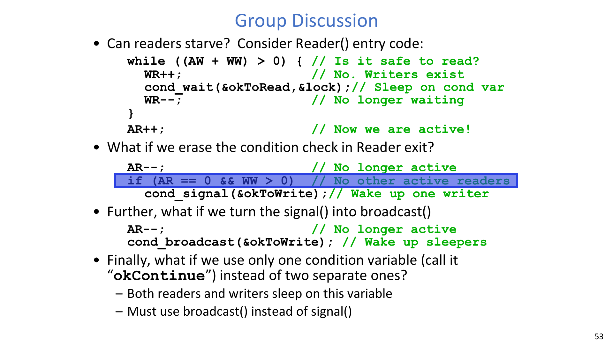

Important discussion points:

1. Can readers starve?
  - Yes, under strict writer-priority policy, readers may wait a long time if writers keep arriving.
2. Why keep the Reader exit check `if (AR==0 && WW>0)`?
  - Removing this guard can cause incorrect or redundant wake-ups.
3. What if we use one condition variable (`okContinue`) instead of two?
  - It can work, but typically needs `broadcast`, causing extra wakeups and lower efficiency.

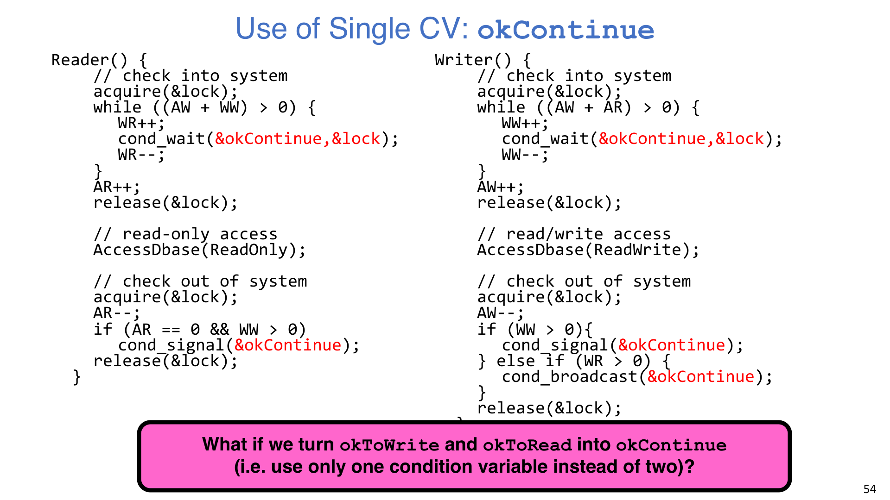

:::warn Key Question: one CV or two CVs?
**Question (slide wording): What if we turn `okToWrite` and `okToRead` into `okContinue`?**

Answer:
- Correctness is still possible with careful checks and usually broadcast-based wakeup.
- But precision is worse: both reader and writer waiters wake more often than necessary.
- Two CVs encode intent more clearly and reduce pointless wakeups.
:::

## 6. Can We Construct Monitors from Semaphores?

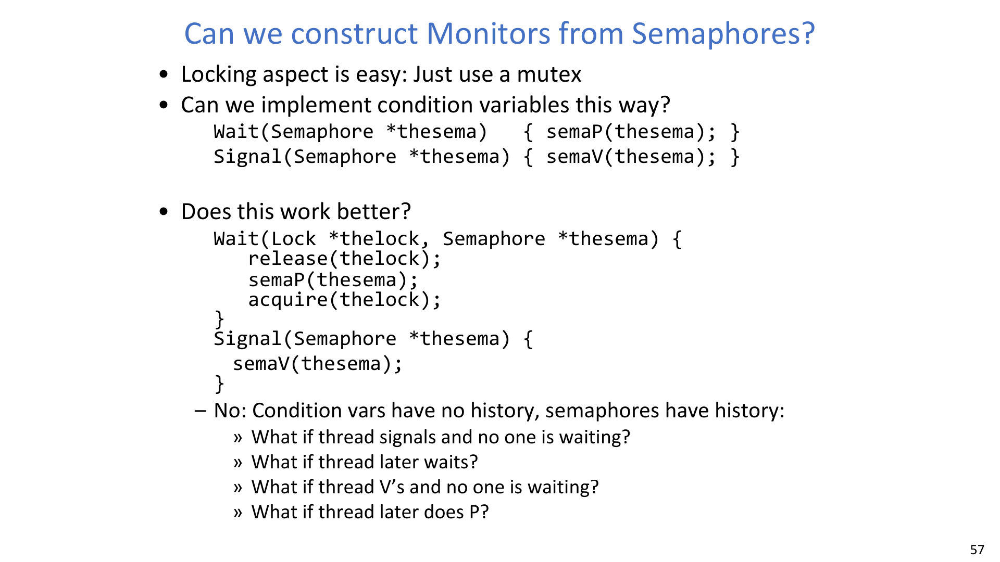

Naive attempts:

- `Wait(sema){ P(sema); }`
- `Signal(sema){ V(sema); }`

fail for monitor condition semantics.

Why:

- Condition variables have no memory/history.
- Semaphores do have accumulated history.
- A `Signal` when nobody waits is a no-op for CV, but increments semaphore state for `V`.

Even a refined attempt (`release lock; P; re-acquire`) still has race hazards.

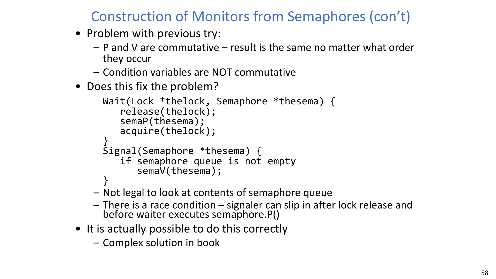

:::error Key Question: why not just use semaphore queue introspection?
**Question (slide wording): Does checking whether semaphore queue is empty fix it?**

Answer:
- No. It is not a legal abstraction boundary in general APIs.
- More importantly, a race exists between lock release and waiter sleep point.
- Correct construction is possible but significantly more complex than this naive translation.
:::

## 7. Monitor Programming Pattern and Language Support

### 7.1 Mesa monitor programming template

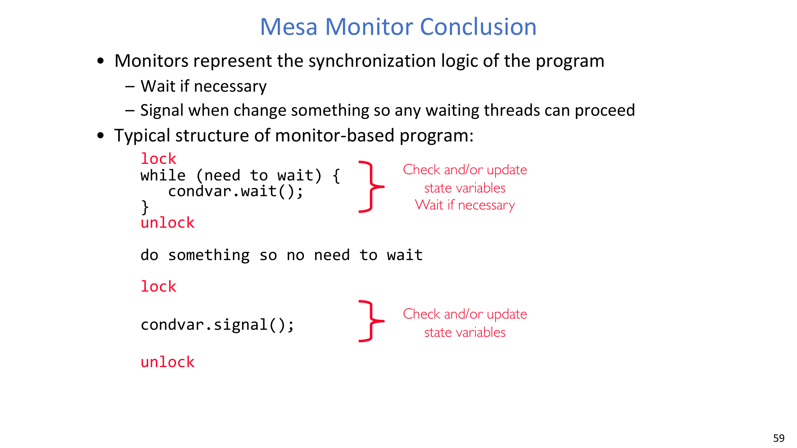

Canonical structure:

1. Hold lock.
2. `while (need_to_wait) condvar.wait();`
3. Release lock, do external work.
4. Re-acquire lock, update state, `signal/broadcast`, release.

### 7.2 C: all exit paths must release locks

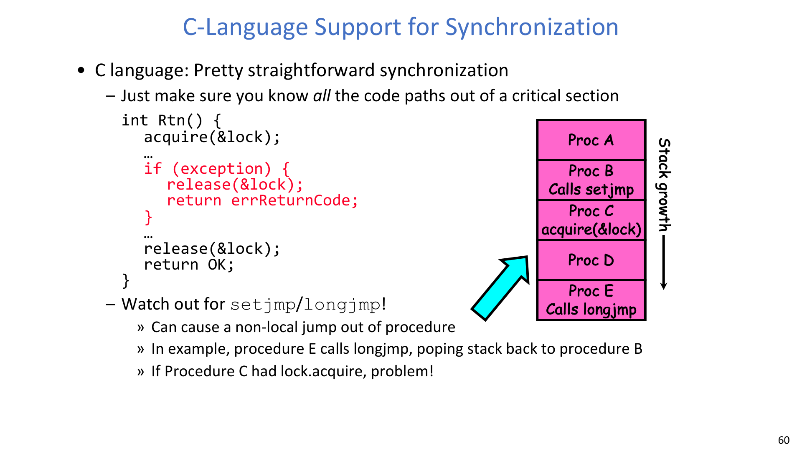
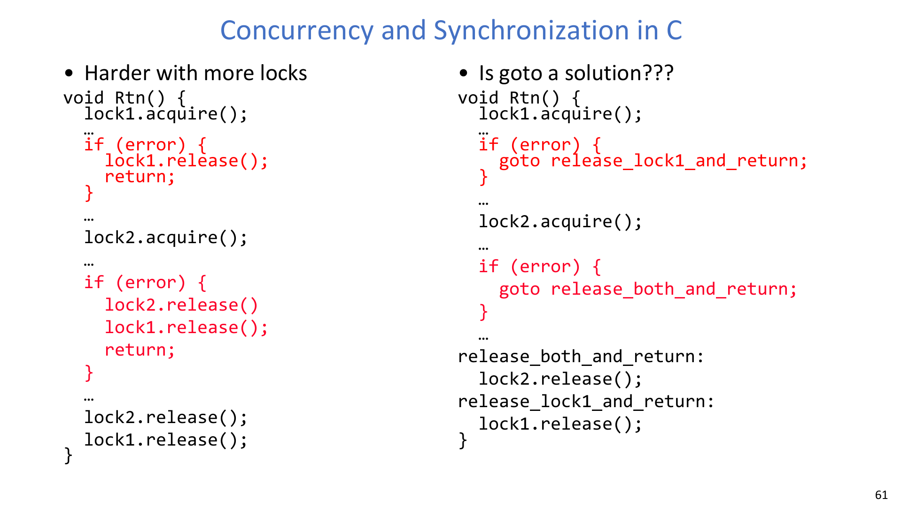

In C, lock correctness is a control-flow discipline problem:

- Every return/error path must release all held locks.
- Non-local control transfer (`setjmp/longjmp`) can bypass expected release points.

### 7.3 C++: exceptions + RAII

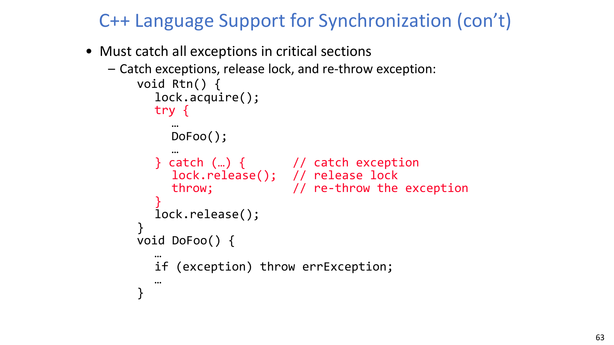
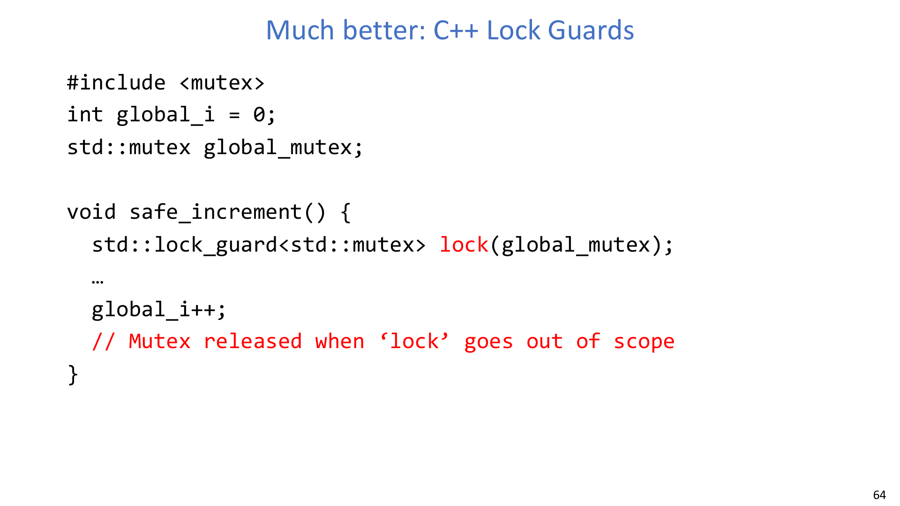

For exception-heavy code:

- Manual `try/catch/rethrow` is workable but verbose.
- RAII (`std::lock_guard`) is cleaner and safer: release happens automatically on scope exit.

### 7.4 Python and Java monitor support

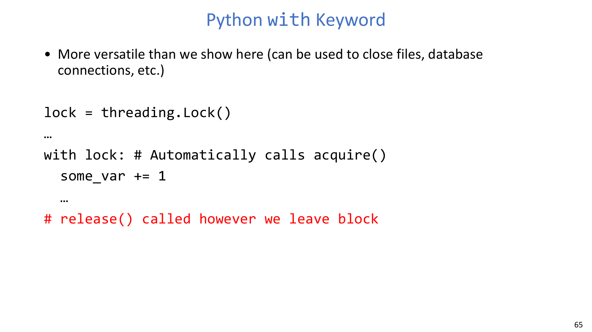
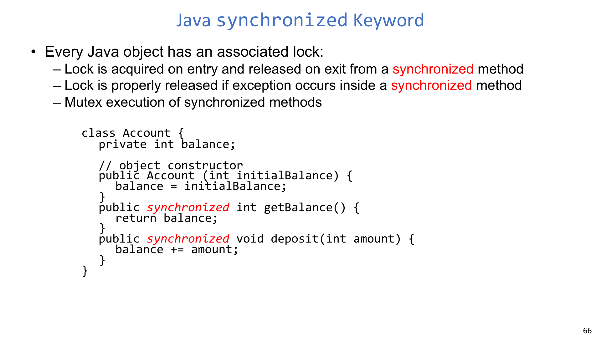
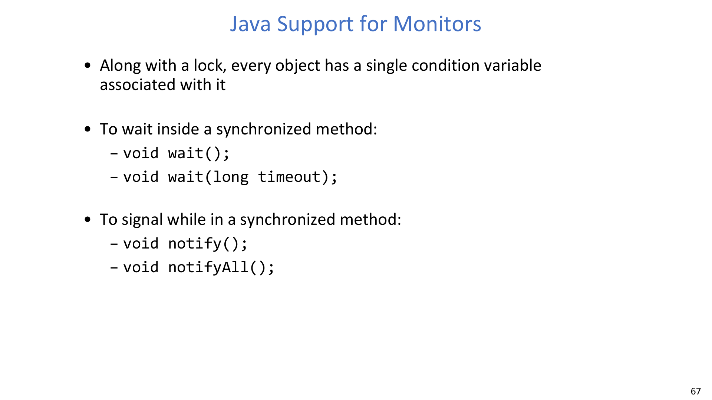

Language-level support ideas:

- Python `with lock:` ensures acquire/release pairing.
- Java `synchronized` binds lock lifecycle to method/block scope.
- Java objects expose monitor-style wait/notify APIs.

## 8. Beyond a Single Machine: Chubby Example

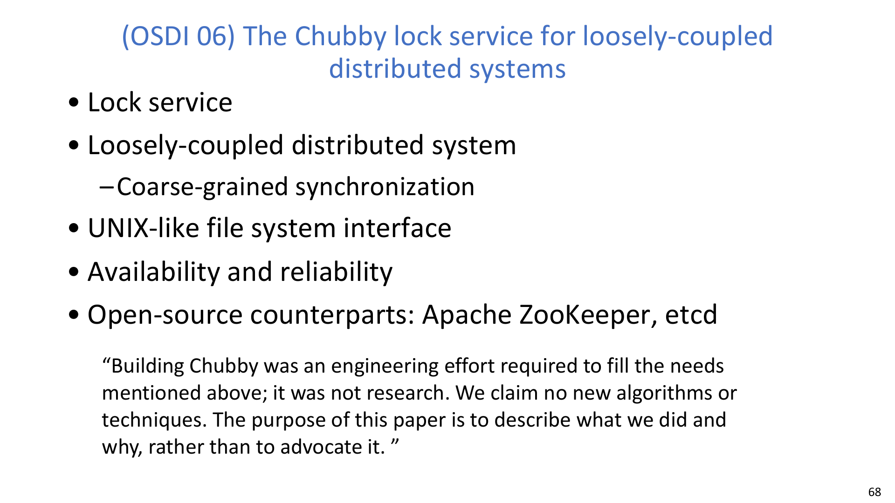

The lecture briefly points to distributed lock service design:

- Coarse-grained synchronization in loosely-coupled distributed systems.
- Reliability/availability and API design are as important as lock semantics.
- Typical open-source counterparts include ZooKeeper/etcd-style coordination services.

## 9. Exam Review

### 9.1 Must-know definitions

- **Readers/Writers policy**: allow concurrent readers, serialize writers, and forbid reader-writer overlap.
- **Writer-priority variant**: block new readers when writers are queued.
- **Monitor**: lock + condition variables, with lock-protected state transitions.

### 9.2 High-value short-answer templates

1. **Why does Reader wait on `AW + WW > 0`?**  
   To preserve writer priority and prevent indefinite writer delay under sustained read traffic.
2. **Why can’t condition variables be replaced by semaphores directly?**  
   CV wake semantics are non-historical and tied to monitor lock invariants; semaphore `P/V` history differs.
3. **Why is RAII important in lock-heavy systems code?**  
   It prevents forgotten unlocks on exceptional/early-return control paths.

### 9.3 Common pitfalls

- Using `if` instead of `while` around condition waits.
- Forgetting to update wait counters around `cond_wait`.
- Losing lock-release paths on errors/exceptions.
- Mixing policy goals (fairness vs throughput) without explicit wake-up strategy.

### 9.4 Self-check

:::tip Self-check 1
Given the sequence `R1, R2, W1, R3`, can you explain exactly why `R3` must block before `W1` runs?
:::

:::tip Self-check 2
If we switch from two CVs (`okToRead`, `okToWrite`) to one CV (`okContinue`), what extra wakeups appear and why?
:::

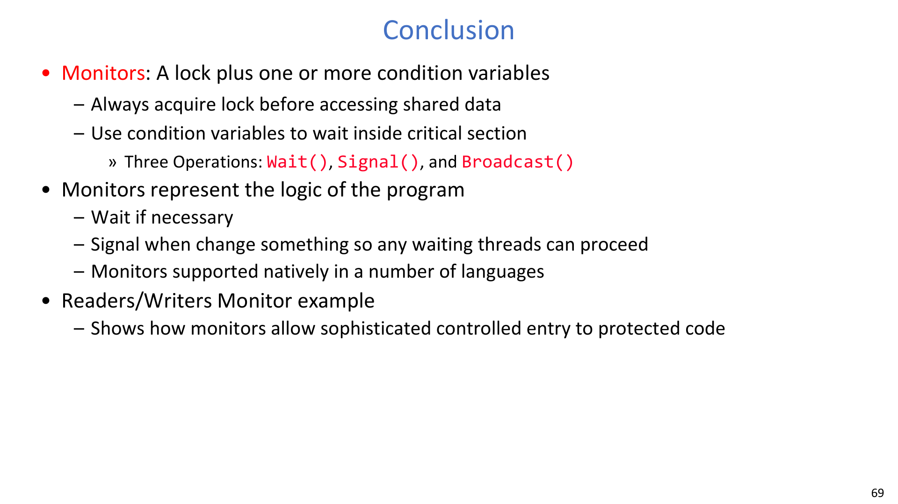
